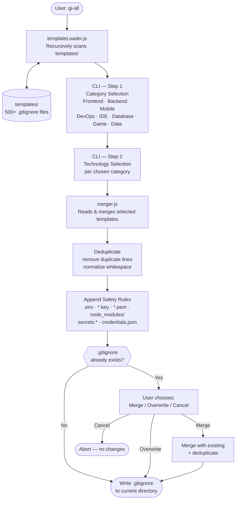

# gi-all

> **اقرأ هذا الملف بلغتك:**  
> [English](../README.md) · [Türkçe](README.tr.md) · [Azərbaycan](README.az.md) · [O'zbekcha](README.uz.md) · [Қазақша](README.kk.md) · [Кыргызча](README.ky.md) · [Türkmençe](README.tk.md) · [Deutsch](README.de.md) · [Français](README.fr.md) · [Español](README.es.md) · [Português](README.pt.md) · [Italiano](README.it.md) · [Română](README.ro.md) · [Nederlands](README.nl.md) · [Polski](README.pl.md) · [Русский](README.ru.md) · [Українська](README.uk.md) · [Svenska](README.sv.md) · [Tiếng Việt](README.vi.md) · [Bahasa Indonesia](README.id.md) · [ภาษาไทย](README.th.md) · [فارسی](README.fa.md) · **العربية** · [हिन्दी](README.hi.md) · [বাংলা](README.bn.md) · [日本語](README.ja.md) · [한국어](README.ko.md) · [简体中文](README.zh.md)

## 🌟 المولّد الوحيد لـ `.gitignore` الذي ستحتاجه

`gi-all` هو **مولّد `.gitignore` معياري وقائم على الفئات** للفرق الحديثة والمطورين المستقلين الطموحين.

بدلاً من ملف "kitchen sink" منتفخ واحد، يوفر لك `gi-all` **مكتبة منتقاة من مئات القوالب المركّزة** (Angular، Unity، Android، Flutter، Node.js، Laravel، Docker والمزيد) لتأليف ملف `.gitignore` المثالي في ثوانٍ.

[](https://www.npmjs.com/package/gi-all)
[](https://www.npmjs.com/package/gi-all)
[](https://github.com/qafaraz/gi-all/stargazers)
[](https://github.com/qafaraz/gi-all/commits)
[](https://github.com/qafaraz/gi-all/commits)
[](https://github.com/qafaraz/gi-all/blob/main/LICENSE)
[](https://badge.socket.dev/npm/package/gi-all/2.1.0)

---

## 💡 لماذا gi-all؟

تقع معظم مولّدات `.gitignore` في أحد هذين الفخّين:

- **صغيرة جداً**: تختار لغةً واحدة وتنتهي بإدراج إعدادات IDE أو مخرجات البناء أو نفايات المنصة في المستودع.
- **كبيرة جداً**: تنسخ "mega.gitignore" عشوائياً من الإنترنت وترث **آلاف القواعد غير ذات الصلة** التي لا تفهمها.

يتّبع `gi-all` نهجاً مختلفاً:

- **معياري بالتصميم** – كل تقنية تعيش في قالبها المخصص ضمن `templates/`.
- **فهرسة ديناميكية** – يفحص CLI مجلد `templates/` عند التشغيل، لذا **كل ملف قالب مدعوم تلقائياً**.
- **تجربة مستخدم قائمة على الفئات** – اختر أولاً المجالات العليا (Frontend، Backend، Mobile، DevOps & Cloud، IDE & Editor، Database، Game & 3D، Data & Science، Other)، ثم التقنيات الدقيقة.
- **صفر دمج يدوي** – اختر مجموعتك التقنية و`gi-all` سيقوم بـ:
  - قراءة جميع قوالب `.gitignore` المحددة
  - دمجها في ملف `.gitignore` واحد ذكي
  - إزالة الأسطر المكررة والمسافات الزائدة
  - إضافة قواعد أمان إلزامية للملفات السرية الشائعة

ستحصل على `.gitignore` **نظيف وبسيط ودقيق** مصمم خصيصاً لمجموعتك التقنية.

---

## 🛠️ مكتبة قوالب ضخمة (500+ قالب)

يأتي `gi-all` مع **مئات القوالب المخصصة** تحت `templates/`، بما فيها:

- **Frontend & Web**: React، Next.js، Angular، Vue، Svelte، Astro، Remix، Gatsby، Webpack، Vite، Tailwind CSS، Storybook…
- **Mobile & Cross‑platform**: Android، iOS، React Native، Flutter، Ionic، Capacitor، NativeScript…
- **Backend & APIs**: Node.js، Express، NestJS، Django، Flask، Laravel، Symfony، Spring، Rails، FastAPI…
- **Game & 3D**: Unity، Unreal Engine، Godot، libGDX، FlaxEngine، MonoGame، PICO‑8…
- **Cloud & DevOps**: Docker، Kubernetes، Terraform، Ansible، Vagrant، Cloudflare، Snap/Snapcraft…
- **المحررات وبيئات التطوير**: VS Code، JetBrains IDEs (WebStorm، Rider، إلخ)، Vim، Emacs، Sublime، Xcode، Android Studio، NetBeans…
- **قواعد البيانات**: Redis، PostgreSQL، MySQL، MongoDB، MSSQL…
- **الأدوات والمعرفة**: تصديرات Obsidian/Notion، أنظمة ERP، لغات نادرة…

---

## 🛡️ الأمان أولاً

تسريب ملفات `.env` أو المفاتيح الخاصة إلى Git خطأ مكلف.

يدمج `gi-all` الأمان افتراضياً:

- `.env`، `.env.*`، `*.env` والمتغيرات البيئية الشائعة
- المفاتيح الخاصة والشهادات: `*.key`، `*.pem`، `*.p12`، `*.cert`، `*.crt`، `*.pfx`، `id_rsa*`، `id_ed25519`، إلخ
- بيانات اعتماد المطور والسحابة: `.envrc`، `.npmrc`، `.netrc`، `.aws/`، `credentials.json`
- أسرار البنية التحتية والموبايل: `*.tfstate`، `*.tfvars`، `*.tfplan`، `*.mobileprovision`، `GoogleService-Info.plist`
- مخازن الأسرار العامة: `secrets.*`، `*.kdbx`، `serviceAccountKey.json`، `firebase-adminsdk*.json`
- `node_modules/` وسجلات التصحيح الشائعة
- ضوضاء نظام التشغيل/المحرر مثل `.DS_Store`

---

## ⚙️ كيف يعمل

- **الفحص**: عند البدء، يفحص `gi-all` مجلد `templates/` بشكل تكراري ويبني فهرساً.
- **الخطوة 1 – الفئات**: يسأل CLI عن المجالات التي يستخدمها مشروعك.
- **الخطوة 2 – التقنيات**: للفئات المختارة، تحدد التقنيات الدقيقة.
- **المعالجة**: يقرأ، يدمج، يزيل التكرار، ويضيف قواعد الأمان.
- **المخرجات**: يكتب النتيجة في ملف `.gitignore` واحد في **دليل العمل الحالي**.
- **التعارضات**: إذا كان `.gitignore` موجوداً، يسأل `gi-all`: **Merge** أو **Overwrite** أو **Cancel**.

---

## 📦 التثبيت

يتطلب Node.js `>=22.0.0` (Node 22 أو 24 LTS موصى به).

### استخدام لمرة واحدة (موصى به)

```bash
npx gi-all
```

### التثبيت العالمي

```bash
npm install -g gi-all
```

ثم شغّل ببساطة:

```bash
gi-all
```

---

## 🧪 الاستخدام

من جذر مشروعك:

```bash
gi-all
```

ستُرشَد لاختيار الفئات والتقنيات. سيقرأ `gi-all` القوالب المناسبة، يدمجها، يضيف قواعد الأمان ويكتب ملف `.gitignore`.

---

## Architecture



### Module Responsibilities

| Module | Responsibility |
|---|---|
| `src/cli.js` | User-facing entry point. Two-step interactive UI (categories → technologies). Conflict resolution. |
| `src/core/templateLoader.js` | Scans `templates/` recursively. Indexes every `.gitignore` file. Assigns category by filename. |
| `src/core/merger.js` | Merges multiple templates. Deduplicates lines. Appends mandatory safety rules. |

---

## 🤝 المساهمة

`gi-all` مصمم ليكون **كتالوجاً مجتمعياً** لأفضل ممارسات `.gitignore`.

📚 الويكي: 
https://github.com/qafaraz/gi-all/discussions
### إضافة قالب جديد

1. **Fork** المستودع
2. أنشئ ملف `.gitignore` جديداً تحت `templates/`
3. أضف قواعد مركّزة وعالية الجودة لتلك التقنية
4. افتح pull request مع وصف موجز

---

## 📜 الترخيص

[MIT](../LICENSE) — صُنع لمجتمع المصدر المفتوح بواسطة **[Qafar](https://github.com/qafaraz)**.
