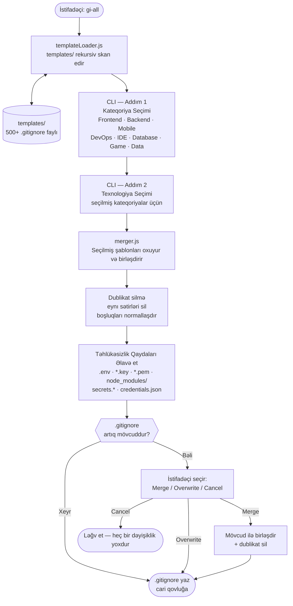

# gi-all

> **Bu README-ni öz dilinizdə oxuyun:**  
> [English](../README.md) · [Türkçe](README.tr.md) · **Azərbaycan** · [Deutsch](README.de.md) · [Français](README.fr.md) · [Español](README.es.md) · [Português](README.pt.md) · [Italiano](README.it.md) · [Nederlands](README.nl.md) · [Polski](README.pl.md) · [Русский](README.ru.md) · [Українська](README.uk.md) · [العربية](README.ar.md) · [日本語](README.ja.md) · [한국어](README.ko.md) · [简体中文](README.zh.md) · [Svenska](README.sv.md) · [हिन्दी](README.hi.md) · [Bahasa Indonesia](README.id.md)

## Ehtiyac duyacağınız tək `.gitignore` generatoru

`gi-all` — müasir komandalar və iddialı tək inkişafçılar üçün nəzərdə tutulmuş **modul, kateqoriyaya əsaslanan `.gitignore` generatorudur**.

Şişirilmiş tək "kitchen sink" faylı əvəzinə, `gi-all` sizə **yüzlərlə fokuslanmış şablondan ibarət küratlanmış kitabxana** (Angular, Unity, Android, Flutter, Node.js, Laravel, Docker və daha çoxu) təqdim edir — saniyələr ərzində mükəmməl `.gitignore` hazırlamağa imkan verir.

[](https://www.npmjs.com/package/gi-all)
[](https://www.npmjs.com/package/gi-all)
[](https://github.com/qafaraz/gi-all/stargazers)
[](https://github.com/qafaraz/gi-all/commits)
[](https://github.com/qafaraz/gi-all/commits)
[](https://github.com/qafaraz/gi-all/blob/main/LICENSE)
[](https://badge.socket.dev/npm/package/gi-all/2.1.0)

---

## Niyə gi-all?

`.gitignore` generatorlarının əksəriyyəti aşağıdakı iki tələdən birinə düşür:

- **Çox kiçik**: Tək bir dil seçirsiniz, amma yenə də IDE konfiqurasiyaları, build artefaktları və ya platform zibili repoya daxil olur.
- **Çox böyük**: İnternetdən təsadüfi "mega.gitignore" kopyalayırsınız və başa düşmədiyiniz **minlərlə əlaqəsiz qayda** miras alırsınız.

`gi-all` fərqli yanaşma tətbiq edir:

- **Modul dizayn** — Hər texnologiya `templates/` daxilindəki öz xüsusi şablon faylında yaşayır.
- **Dinamik indeksləmə** — CLI işə başlayarkən `templates/` qovluğunu skan edir, buna görə **hər şablon faylı avtomatik olaraq dəstəklənir**. Yeni fayl əlavə edin — o dərhal istifadəçilər üçün əlçatan olur.
- **Kateqoriyaya əsaslanan UX** — Əvvəlcə yüksək səviyyəli sahələri seçin (Frontend, Backend, Mobile, DevOps & Cloud, IDE & Editor, Database, Game & 3D, Data & Science, Other), sonra dəqiq texnologiyaları.
- **Əl ilə birləşdirmə yoxdur** — Öz stack'inizi seçin, `gi-all`:
  - Seçilmiş bütün `.gitignore` şablonlarını oxuyur
  - Onları tək ağıllı `.gitignore`-da birləşdirir
  - Dublikat sətirləri və artıq boşluqları silir
  - Ümumi gizli və etimadnamə faylları üçün məcburi təhlükəsizlik qaydaları əlavə edir

Öz stack'inizə uyğunlaşdırılmış **təmiz, minimal və dəqiq** `.gitignore` əldə edirsiniz.

---

## Nəhəng şablon kitabxanası (500+ şablon)

`gi-all` `templates/` altında **yüzlərlə xüsusi şablon** ilə birlikdə gəlir, o cümlədən:

- **Frontend & Web**: React, Next.js, Angular, Vue, Svelte, Astro, Remix, Gatsby, Webpack, Vite, Tailwind CSS, Storybook…
- **Mobile & Cross‑platform**: Android, iOS, React Native, Flutter, Ionic, Capacitor, NativeScript…
- **Backend & API**: Node.js, Express, NestJS, Django, Flask, Laravel, Symfony, Spring, Rails, FastAPI…
- **Game & 3D**: Unity, Unreal Engine, Godot, libGDX, FlaxEngine, MonoGame, PICO‑8…
- **Cloud & DevOps**: Docker, Kubernetes, Terraform, Ansible, Vagrant, Cloudflare, Snap/Snapcraft…
- **Redaktorlar & IDE**: VS Code, JetBrains IDE-ləri (WebStorm, Rider və s.), Vim, Emacs, Sublime, Xcode, Android Studio, NetBeans…
- **Verilənlər bazası**: Redis, PostgreSQL, MySQL, MongoDB, MSSQL…
- **Alətlər & Bilik**: Obsidian/Notion ixracları, ERP sistemləri, ekzotik dillər…

---

## Təhlükəsizlik birinci

`.env` fayllarını və ya şəxsi açarları Git-ə səhvən commit etmək baha başa gələn səhvdir.

`gi-all` təhlükəsizliyi standart olaraq daxil edir:

- `.env`, `.env.*`, `*.env` və ümumi mühit variantları
- Şəxsi açarlar və sertifikatlar: `*.key`, `*.pem`, `*.p12`, `*.cert`, `*.crt`, `*.pfx`, `id_rsa*`, `id_ed25519` və s.
- İnkişafçı və bulud etimadnaməsi: `.envrc`, `.npmrc`, `.netrc`, `.aws/`, `credentials.json`
- İnfrastruktur və mobil sirlər: `*.tfstate`, `*.tfvars`, `*.tfplan`, `*.mobileprovision`, `GoogleService-Info.plist`
- Ümumi gizli anbarlar: `secrets.*`, `*.kdbx`, `serviceAccountKey.json`, `firebase-adminsdk*.json`
- `node_modules/` və ümumi debug logları
- `.DS_Store` kimi OS/redaktor küyü

---

## Necə işləyir

- **Skan**: Başlayanda `gi-all` `templates/` qovluğunu dinamik olaraq skan edir və kataloq qurur.
- **Addım 1 — Kateqoriyalar**: CLI layihənizin hansı sahələrdən istifadə etdiyini soruşur.
- **Addım 2 — Texnologiyalar**: Seçilmiş kateqoriyalar üçün dəqiq texnologiyaları seçirsiniz.
- **Emal**: oxuyur, birləşdirir, dublikatları silir, təhlükəsizlik qaydaları əlavə edir.
- **Çıxış**: Nəticəni **cari iş qovluğunda** tək `.gitignore` faylına yazır.
- **Münaqişələr**: `.gitignore` artıq mövcuddursa, `gi-all` soruşur: **Merge**, **Overwrite** və ya **Cancel**.

---

## Memarlıq



### Modul Məsuliyyətləri

| Modul | Məsuliyyət |
|---|---|
| `src/cli.js` | İstifadəçi tərəfli giriş nöqtəsi. İki addımlı interaktiv UI (kateqoriyalar → texnologiyalar). Münaqişə həlli. |
| `src/core/templateLoader.js` | `templates/`-i rekursiv skan edir. Hər `.gitignore` faylını indeksləyir. Fayl adına görə kateqoriya müəyyən edir. |
| `src/core/merger.js` | Şablonları birləşdirir. Dublikatları silir. Məcburi təhlükəsizlik qaydaları əlavə edir. |

---

## Quraşdırma

Node.js `>=22.0.0` tələb olunur (Node 22 və ya 24 LTS tövsiyə edilir).

### Bir dəfəlik istifadə (tövsiyə edilir)

```bash
npx gi-all
```

### Qlobal quraşdırma

```bash
npm install -g gi-all
```

Sonra sadəcə işə salın:

```bash
gi-all
```

---

## İstifadə

Layihənizin kök qovluğundan:

```bash
gi-all
```

Kateqoriya və texnologiyaları seçmək üçün istiqamətləndiriləcəksiniz. `gi-all` müvafiq şablonları oxuyacaq, birləşdirəcək, təhlükəsizlik qaydaları əlavə edəcək və `.gitignore` faylını yazacaq.

---

## Töhfə

`gi-all` `.gitignore` ən yaxşı təcrübələrinin **icma tərəfindən idarə olunan kataloqu** kimi nəzərdə tutulmuşdur.

📚 Wiki: https://github.com/qafaraz/gi-all/wiki  
💬 Müzakirələr: https://github.com/qafaraz/gi-all/discussions

### Yeni şablon əlavə etmək

1. Reponu **Fork** edin
2. `templates/` altında yeni `.gitignore` faylı yaradın
3. Həmin texnologiya üçün fokuslanmış, yüksək keyfiyyətli qaydalar əlavə edin
4. Qısa təsvir ilə pull request açın

---

## Lisenziya

[MIT](../LICENSE) — açıq mənbə icması üçün **[Qafar](https://github.com/qafaraz)** tərəfindən hazırlanmışdır.
