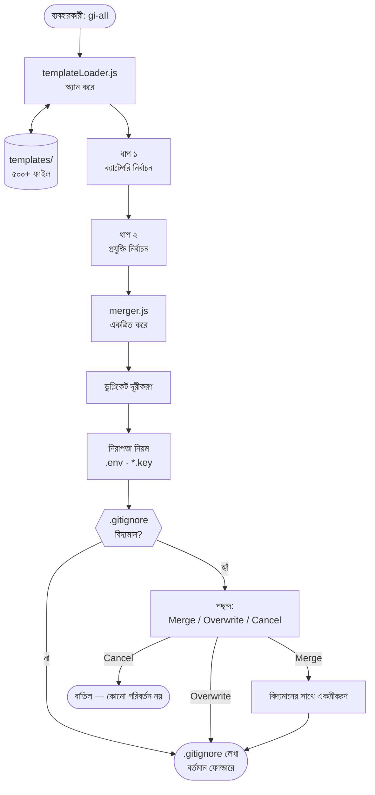

# gi-all

> **আপনার নিজের ভাষায় এই README পড়ুন:**  
> [English](../README.md) · [Türkçe](README.tr.md) · [Azərbaycan](README.az.md) · [O'zbekcha](README.uz.md) · [Қазақша](README.kk.md) · [Кыргызча](README.ky.md) · [Türkmençe](README.tk.md) · [Deutsch](README.de.md) · [Français](README.fr.md) · [Español](README.es.md) · [Português](README.pt.md) · [Italiano](README.it.md) · [Română](README.ro.md) · [Nederlands](README.nl.md) · [Polski](README.pl.md) · [Русский](README.ru.md) · [Українська](README.uk.md) · [Svenska](README.sv.md) · [Tiếng Việt](README.vi.md) · [Bahasa Indonesia](README.id.md) · [ภาษาไทย](README.th.md) · [فارسی](README.fa.md) · [العربية](README.ar.md) · [हिन्दी](README.hi.md) · **বাংলা** · [日本語](README.ja.md) · [한국어](README.ko.md) · [简体中文](README.zh.md)

## 🌟 আপনার প্রয়োজনীয় একমাত্র `.gitignore` জেনারেটর

`gi-all` হলো আধুনিক দল এবং ডেভেলপারদের জন্য একটি **মডুলার, বিভাগ-ভিত্তিক .gitignore জেনারেটর**।

একটি বিশৃঙ্খল "mega.gitignore" ফাইলের পরিবর্তে, `gi-all` আপনাকে **শত শত ডেডিকেটেড টেমপ্লেটের একটি সমৃদ্ধ লাইব্রেরি** (Angular, Unity, Android, Flutter, Node.js, Laravel, Docker ইত্যাদি) সরবরাহ করে এবং কয়েক সেকেন্ডের মধ্যে আপনার স্ট্যাক অনুযায়ী নিখুঁত `.gitignore` তৈরি করতে সহায়তা করে।

[](https://www.npmjs.com/package/gi-all)
[](https://www.npmjs.com/package/gi-all)
[](https://github.com/qafaraz/gi-all/stargazers)
[](https://github.com/qafaraz/gi-all/commits)
[](https://github.com/qafaraz/gi-all/commits)
[](https://github.com/qafaraz/gi-all/blob/main/LICENSE)
[](https://badge.socket.dev/npm/package/gi-all/2.1.0)

---

## 💡 কেন gi-all?

- **খুব ছোট**: আপনি একটি একক ভাষা নির্বাচন করেন, কিন্তু IDE কনফিগারেশন বা বিল্ড ফাইল তবুও রিপোজিটরিতে চলে যায়।
- **খুব বড়**: ইন্টারনেট থেকে একটি ফাইল কপি করেন এবং **হাজার হাজার অপ্রাসঙ্গিক নিয়ম** প্রোজেক্টে যুক্ত হয়ে যায়।

`gi-all` সম্পূর্ণ ভিন্ন একটি পদ্ধতি অনুসরণ করে:

- **মডুলার ডিজাইন** – প্রতিটি প্রযুক্তি `templates/` ফোল্ডারে তার নিজস্ব `.gitignore` ফাইলে থাকে।
- **ডাইনামিক ইনডেক্সিং** – সিএলআই রানটাইমে `templates/` ডিরেক্টরি স্ক্যান করে; প্রতিটি ফাইল স্বয়ংক্রিয়ভাবে সমর্থিত হয়।
- **ক্যাটেগরি ভিত্তিক অভিজ্ঞতা** – প্রথমে মূল ক্ষেত্রগুলি নির্বাচন করুন, তারপর নির্দিষ্ট প্রযুক্তিগুলো বেছে নিন।
- **ম্যানুয়াল মার্জিং নেই** – আপনার স্ট্যাক বেছে নিন, `gi-all` সবকিছু একত্রিত করবে এবং ডুপ্লিকেট লাইন পরিষ্কার করবে।
  - নির্বাচিত সব `.gitignore` টেমপ্লেট পড়ে
  - একটি স্মার্ট `.gitignore` ফাইলে একত্রিত করে
  - ডুপ্লিকেট লাইন এবং অতিরিক্ত ফাঁকা স্থান মুছে ফেলে
  - গোপনীয় এবং সংবেদনশীল তথ্যের জন্য বাধ্যতামূলক নিরাপত্তা নিয়ম যুক্ত করে

ফলাফল: আপনার প্রযুক্তির জন্য **পরিচ্ছন্ন, সংক্ষিপ্ত এবং নির্ভুল** `.gitignore`।

---

## 🛠️ বিশাল টেমপ্লেট লাইব্রেরি (৫০০+ টেমপ্লেট)

`gi-all` এর সাথে `templates/` এ **শত শত ডেডিকেটেড টেমপ্লেট** রয়েছে:

- **ফ্রন্ট-এন্ড ও ওয়েব**: React, Next.js, Angular, Vue, Svelte, Astro, Remix, Gatsby, Webpack, Vite, Tailwind CSS, Storybook…
- **মোবাইল**: Android, iOS, React Native, Flutter, Ionic, Capacitor, NativeScript…
- **ব্যাক-এন্ড ও এপিআই**: Node.js, Express, NestJS, Django, Flask, Laravel, Symfony, Spring, Rails, FastAPI…
- **গেম ও থ্রিডি**: Unity, Unreal Engine, Godot, libGDX, FlaxEngine, MonoGame, PICO‑8…
- **ক্লাউড ও ডেভঅপস**: Docker, Kubernetes, Terraform, Ansible, Vagrant, Cloudflare, Snap/Snapcraft…
- **এডিটর ও আইডিই**: VS Code, JetBrains IDEs, Vim, Emacs, Sublime, Xcode, Android Studio, NetBeans…
- **ডাটাবেস**: Redis, PostgreSQL, MySQL, MongoDB, MSSQL…
- **টুলস ও নলেজ বেস**: Obsidian/Notion এক্সপোর্ট, ইআরপি সিস্টেম, বিশেষ প্রোগ্রামিং ভাষা…

প্রতিটি প্রযুক্তির **নিজস্ব `.gitignore` ফাইল** রয়েছে। সিএলআই প্রতিটি ফাইল ইনডেক্স করে।

---

## 🛡️ ডিফল্ট নিরাপত্তা স্তর

ভুলবশত `.env` ফাইল বা প্রাইভেট কি গিট-এ পুশ করা একটি মারাত্মক ভুল। `gi-all` শুরু থেকেই নিরাপত্তা নিশ্চিত করে:

- `.env`, `.env.*`, `*.env` এবং পরিবেশ ভেরিয়েবল
- প্রাইভেট কি এবং সার্টিফিকেট: `*.key`, `*.pem`, `*.p12`, `*.cert`, `*.crt`, `*.pfx`, `id_rsa*`, `id_ed25519` ইত্যাদি
- ডেভেলপার ও ক্লাউড ক্রেডেনশিয়াল: `.envrc`, `.npmrc`, `.netrc`, `.aws/`, `credentials.json`
- ইনফ্রাস্ট্রাকচার ও মোবাইল সিক্রেট: `*.tfstate`, `*.tfvars`, `*.tfplan`, `*.mobileprovision`, `GoogleService-Info.plist`
- সিক্রেট স্টোর: `secrets.*`, `*.kdbx`, `serviceAccountKey.json`, `firebase-adminsdk*.json`
- `node_modules/` এবং ডিবাগ লগ
- সিস্টেম ফাইল: `.DS_Store` ইত্যাদি

> `gi-all` সংবেদনশীল ফাইল কমিট করার ঝুঁকি উল্লেখযোগ্যভাবে হ্রাস করে, তবে প্রোজেক্টের গোপনীয় ফাইলগুলো নিজে যাচাই করা ভালো।

---

## ⚙️ কীভাবে কাজ করে

- **স্ক্যানিং**: রান করার সময় `templates/` ফোল্ডার স্ক্যান করে সমস্ত `.gitignore` ফাইল খুঁজে বের করে।
- **ধাপ ১ – ক্যাটেগরি নির্বাচন**: আপনার প্রোজেক্টে ব্যবহৃত ক্ষেত্রগুলো নির্বাচন করুন।
- **ধাপ ২ – প্রযুক্তি নির্বাচন**: সেই ক্যাটেগরির মধ্য থেকে নির্দিষ্ট প্রযুক্তিগুলো বেছে নিন।
- **প্রক্রিয়াকরণ**: টেমপ্লেট একত্রিত করে, ডুপ্লিকেট দূর করে এবং নিরাপত্তা নিয়ম যুক্ত করে।
- **আউটপুট**: বর্তমান ডিরেক্টরিতে একটি `.gitignore` ফাইলে ফলাফল লিখে দেয়।
- **দ্বন্দ্ব সমাধান:**
    - **Merge**: বিদ্যমান নিয়মের সাথে যুক্ত করা।
    - **Overwrite**: ফাইলটি সম্পূর্ণ প্রতিস্থাপন করা।
    - **Cancel**: কোনো পরিবর্তন ছাড়াই বের হওয়া।
  - নিরাপত্তার জন্য `gi-all` সিম্বলিক লিঙ্কে লেখার অনুমতি দেয় না।

---

## 📦 ইনস্টলেশন

Node.js `>=22.0.0` প্রয়োজন (Node 22 বা 24 LTS প্রস্তাবিত)।

### One‑shot

```bash
# npm
npx gi-all

# yarn
yarn dlx gi-all

# pnpm
pnpm dlx gi-all

# bun
bunx gi-all
```

### Global install

```bash
# npm
npm install -g gi-all

# yarn
yarn global add gi-all

# pnpm
pnpm install -g gi-all

# bun
bun add -g gi-all
```

```bash
gi-all
```

---

## 🧪 ব্যবহার: কয়েক সেকেন্ডের মধ্যে `.gitignore` তৈরি করুন

আপনার প্রোজেক্টের রুট ডিরেক্টরিতে এই কমান্ডটি চালান:

```bash
gi-all
```

১. **ক্যাটেগরি নির্বাচন** (Frontend, Backend, Mobile, DevOps, IDE, Database, Game, Data, Other)
২. সেই ক্যাটেগরির মধ্য থেকে **প্রযুক্তি নির্বাচন**

`gi-all` নিম্নলিখিত কাজগুলো করে:

১. প্রয়োজনীয় টেমপ্লেটগুলো পড়ে
২. নিয়মগুলো একত্রিত ও ডুপ্লিকেট দূর করে
৩. নিরাপত্তা নিয়ম যুক্ত করে
৪. বর্তমান ডিরেক্টরিতে **`.gitignore`** ফাইলে সেভ করে

---

## আর্কিটেকচার



### মডিউল দায়িত্বসমূহ

| মডিউল | দায়িত্ব |
|---|---|
| `src/cli.js` | ইউজার ইন্টারফেস এবং দ্বন্দ্ব সমাধান। |
| `src/core/templateLoader.js` | `templates/` স্ক্যান এবং ইনডেক্সিং। |
| `src/core/merger.js` | টেমপ্লেট একত্রীকরণ এবং নিরাপত্তা স্তর যুক্ত করা। |

---

## 🤝 অবদান

`gi-all` একটি উন্মুক্ত কমিউনিটি প্রজেক্ট।

📚 Wiki: https://github.com/qafaraz/gi-all/wiki  
💬 আলোচনা: https://github.com/qafaraz/gi-all/discussions

### নতুন টেমপ্লেট যুক্ত করা

১. রিপোজিটরিটি **Fork** করুন
২. `templates/` ফোল্ডারে একটি নতুন `.gitignore` ফাইল তৈরি করুন
৩. সুনির্দিষ্ট নিয়মাবলি যোগ করুন
৪. একটি Pull Request তৈরি করুন

সিএলআই স্বয়ংক্রিয়ভাবে নতুন ফাইল খুঁজে পায়; `src/` এ পরিবর্তনের প্রয়োজন নেই।

---

## 📜 লাইসেন্স

[MIT](../LICENSE) — **[Qafar](https://github.com/qafaraz)** দ্বারা নির্মিত।
