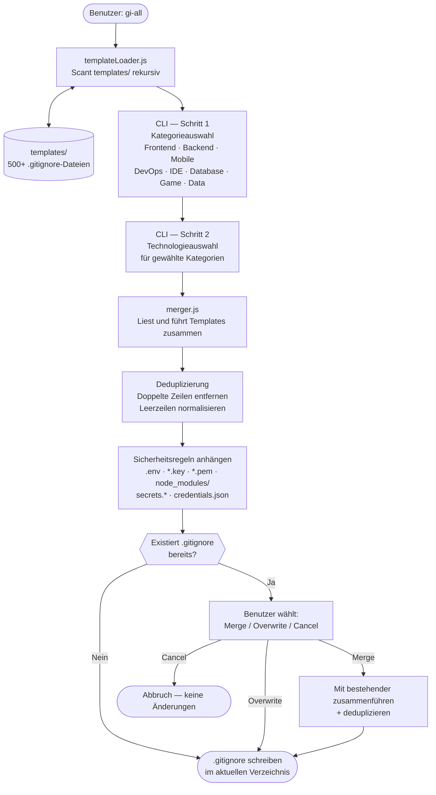

# gi-all

> **Lies diese README in deiner Sprache:**  
> [English](../README.md) · [Türkçe](README.tr.md) · [Azərbaycan](README.az.md) · [O'zbekcha](README.uz.md) · [Қазақша](README.kk.md) · [Кыргызча](README.ky.md) · [Türkmençe](README.tk.md) · **Deutsch** · [Français](README.fr.md) · [Español](README.es.md) · [Português](README.pt.md) · [Italiano](README.it.md) · [Română](README.ro.md) · [Nederlands](README.nl.md) · [Polski](README.pl.md) · [Русский](README.ru.md) · [Українська](README.uk.md) · [Svenska](README.sv.md) · [Tiếng Việt](README.vi.md) · [Bahasa Indonesia](README.id.md) · [ภาษาไทย](README.th.md) · [فارسی](README.fa.md) · [العربية](README.ar.md) · [हिन्दी](README.hi.md) · [বাংলা](README.bn.md) · [日本語](README.ja.md) · [한국어](README.ko.md) · [简体中文](README.zh.md)

## 🌟 Der einzige `.gitignore`-Generator, den du je brauchen wirst

`gi-all` ist ein **modularer, kategoriebasierter `.gitignore`-Generator** für moderne Teams und ambitionierte Solo-Entwickler.

Statt einer einzigen aufgeblähten „Kitchen-Sink"-Datei bietet `gi-all` eine **kuratierte Bibliothek mit Hunderten fokussierter Templates** (Angular, Unity, Android, Flutter, Node.js, Laravel, Docker und viele mehr) — und lässt dich in Sekunden das perfekte `.gitignore` zusammenstellen.

[](https://www.npmjs.com/package/gi-all)
[](https://www.npmjs.com/package/gi-all)
[](https://github.com/qafaraz/gi-all/stargazers)
[](https://github.com/qafaraz/gi-all/commits)
[](https://github.com/qafaraz/gi-all/commits)
[](https://github.com/qafaraz/gi-all/blob/main/LICENSE)
[](https://badge.socket.dev/npm/package/gi-all/2.1.0)

---

## 💡 Warum gi-all?

Die meisten `.gitignore`-Generatoren fallen in eine von zwei Fallen:

- **Zu klein**: Du wählst eine einzige Sprache und commitest trotzdem IDE-Konfigurationen, Build-Artefakte oder Plattform-Müll.
- **Zu groß**: Du kopierst ein zufälliges „mega.gitignore" aus dem Internet und erbst **Tausende irrelevanter Regeln**, die du nicht verstehst.

`gi-all` verfolgt einen anderen Ansatz:

- **Modular by design** – Jede Technologie lebt in ihrer eigenen dedizierten Template-Datei unter `templates/`.
- **Dynamische Indizierung** – Das CLI scannt den `templates/`-Ordner zur Laufzeit, sodass **jede einzelne Template-Datei automatisch unterstützt wird**. Füge eine Datei zu `templates/` hinzu, und sie ist sofort für Nutzer verfügbar.
- **Kategoriebasierte UX** – Wähle zuerst übergeordnete Bereiche (Frontend, Backend, Mobile, DevOps & Cloud, IDE & Editor, Database, Game & 3D, Data & Science, Other), dann die genauen Technologien.
- **Kein manuelles Mergen** – Wähle deinen Stack (Angular + Node + Android + Unity + Docker + VS Code…) und `gi-all`:
  - Liest alle ausgewählten `.gitignore`-Templates
  - Führt sie zu einem einzigen smarten `.gitignore` zusammen
  - Entfernt doppelte Zeilen und überflüssige Leerzeilen
  - Fügt verpflichtende Sicherheitsregeln für gängige Secret- und Credential-Dateien hinzu

Du erhältst ein **sauberes, minimales und präzises** `.gitignore`, das auf deinen Stack zugeschnitten ist — nicht auf den eines anderen.

---

## 🛠️ Riesige Template-Bibliothek (500+ Templates)

Direkt nach der Installation bringt `gi-all` **Hunderte dedizierter Templates** unter `templates/` mit, darunter:

- **Frontend & Web**: React, Next.js, Angular, Vue, Svelte, Astro, Remix, Gatsby, Webpack, Vite, Tailwind CSS, Storybook…
- **Mobile & Cross‑platform**: Android, iOS, React Native, Flutter, Ionic, Capacitor, NativeScript…
- **Backend & APIs**: Node.js, Express, NestJS, Django, Flask, Laravel, Symfony, Spring, Rails, FastAPI…
- **Game & 3D**: Unity, Unreal Engine, Godot, libGDX, FlaxEngine, MonoGame, PICO‑8…
- **Cloud & DevOps**: Docker, Kubernetes, Terraform, Ansible, Vagrant, Cloudflare, Snap/Snapcraft…
- **Editors & IDEs**: VS Code, JetBrains IDEs (WebStorm, Rider usw.), Vim, Emacs, Sublime, Xcode, Android Studio, NetBeans…
- **Datenbanken**: Redis, PostgreSQL, MySQL, MongoDB, MSSQL…
- **Wissen & Tools**: Obsidian/Notion-Exporte, ERP-Systeme, exotische Sprachen und Laufzeiten…

---

## 🛡️ Sicherheit zuerst (Gängige Secret-Dateien standardmäßig geschützt)

Das versehentliche Committen von `.env`-Dateien oder privaten Schlüsseln in Git ist ein kostspieliger Fehler.

`gi-all` baut Sicherheit von Grund auf ein:

- `.env`, `.env.*`, `*.env` und gängige Umgebungsvarianten
- Private Schlüssel & Zertifikate: `*.key`, `*.pem`, `*.p12`, `*.cert`, `*.crt`, `*.pfx`, `id_rsa*`, `id_ed25519` usw.
- Entwickler- und Cloud-Zugangsdaten wie `.envrc`, `.npmrc`, `.netrc`, `.aws/`, `credentials.json`
- Infrastruktur- und Mobile-Secrets wie `*.tfstate`, `*.tfvars`, `*.tfplan`, `*.mobileprovision`, `GoogleService-Info.plist`
- Generische Secret-Stores wie `secrets.*`, `*.kdbx`, `serviceAccountKey.json`, `firebase-adminsdk*.json`
- `node_modules/` und gängige Debug-Logs
- OS/Editor-Rauschen wie `.DS_Store`

---

## Architektur



### Modulverantwortlichkeiten

| Modul | Verantwortung |
|---|---|
| `src/cli.js` | Benutzerseitiger Einstiegspunkt. Zweistufige interaktive UI (Kategorien → Technologien). Konfliktlösung. |
| `src/core/templateLoader.js` | Scant `templates/` rekursiv. Indiziert jede `.gitignore`-Datei. Bestimmt Kategorie nach Dateiname. |
| `src/core/merger.js` | Führt Templates zusammen. Entfernt Duplikate. Fügt Sicherheitsregeln hinzu. |

---

## 📦 Installation

Erfordert Node.js `>=22.0.0` (Node 22 oder 24 LTS empfohlen).

### Einmalige Nutzung (empfohlen)

```bash
npx gi-all
```

### Globale Installation

```bash
npm install -g gi-all
```

Dann einfach ausführen:

```bash
gi-all
```

---

## 🧪 Verwendung

Aus dem Stammverzeichnis deines Projekts:

```bash
gi-all
```

Du wirst durch die Auswahl der Kategorien und Technologien geführt. `gi-all` liest die entsprechenden Templates, führt sie zusammen, fügt Sicherheitsregeln hinzu und schreibt die `.gitignore`-Datei.

---

## 🤝 Beitragen

`gi-all` ist als **community-getriebener Katalog** von `.gitignore`-Best-Practices konzipiert.

📚 Wiki: https://github.com/qafaraz/gi-all/wiki  
💬 Diskussionen: https://github.com/qafaraz/gi-all/discussions

### Neues Template hinzufügen

1. **Fork** das Repo
2. Erstelle eine neue `.gitignore`-Datei unter `templates/`
3. Füge fokussierte, hochwertige Regeln für diese Technologie hinzu
4. Öffne einen Pull Request mit einer kurzen Beschreibung

---

## 📜 Lizenz

[MIT](../LICENSE) — für die Open-Source-Community erstellt von **[Qafar](https://github.com/qafaraz)**.
