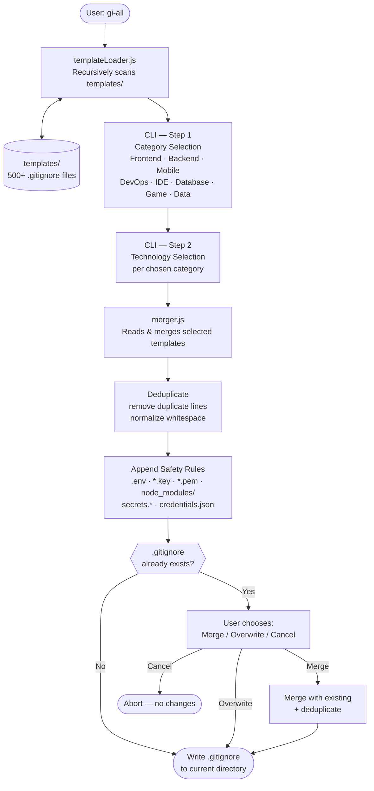

# gi-all

> **Lee este README en tu idioma:**  
> [English](../README.md) · [Türkçe](README.tr.md) · [Azərbaycan](README.az.md) · [Deutsch](README.de.md) · [Français](README.fr.md) · **Español** · [Português](README.pt.md) · [Italiano](README.it.md) · [Nederlands](README.nl.md) · [Polski](README.pl.md) · [Русский](README.ru.md) · [Українська](README.uk.md) · [العربية](README.ar.md) · [日本語](README.ja.md) · [한국어](README.ko.md) · [简体中文](README.zh.md) · [Svenska](README.sv.md) · [हिन्दी](README.hi.md) · [Bahasa Indonesia](README.id.md)

## 🌟 El único generador de `.gitignore` que jamás necesitarás

`gi-all` es un **generador de `.gitignore` modular y basado en categorías** para equipos modernos y desarrolladores en solitario ambiciosos.

En lugar de un único archivo "kitchen sink" inflado, `gi-all` te ofrece una **biblioteca curada de cientos de templates enfocados** (Angular, Unity, Android, Flutter, Node.js, Laravel, Docker y muchos más) para componer el `.gitignore` perfecto en segundos.

[](https://www.npmjs.com/package/gi-all)
[](https://www.npmjs.com/package/gi-all)
[](https://github.com/qafaraz/gi-all/stargazers)
[](https://github.com/qafaraz/gi-all/commits)
[](https://github.com/qafaraz/gi-all/commits)
[](https://github.com/qafaraz/gi-all/blob/main/LICENSE)
[](https://badge.socket.dev/npm/package/gi-all/2.1.0)

---

## 💡 ¿Por qué gi-all?

La mayoría de los generadores de `.gitignore` caen en una de estas dos trampas:

- **Demasiado pequeño**: eliges un solo lenguaje y aún terminas commiteando configuraciones de IDE, artefactos de build o basura de plataforma.
- **Demasiado grande**: copias un "mega.gitignore" aleatorio de internet y heredas **miles de reglas irrelevantes** que no entiendes.

`gi-all` adopta un enfoque diferente:

- **Modular por diseño** – Cada tecnología vive en su propio template dedicado en `templates/`.
- **Indexación dinámica** – El CLI escanea la carpeta `templates/` en tiempo de ejecución, por lo que **cada archivo de template es automáticamente compatible**.
- **UX basada en categorías** – Primero seleccionas áreas de alto nivel (Frontend, Backend, Mobile, DevOps & Cloud, IDE & Editor, Database, Game & 3D, Data & Science, Other), luego las tecnologías exactas.
- **Cero fusión manual** – Elige tu stack y `gi-all`:
  - Lee todos los templates `.gitignore` seleccionados
  - Los fusiona en un único `.gitignore` inteligente
  - Elimina líneas duplicadas y espacios innecesarios
  - Añade reglas de seguridad obligatorias para archivos secretos comunes

Obtienes un `.gitignore` **limpio, mínimo y preciso** adaptado a tu stack.

---

## 🛠️ Enorme biblioteca de templates (500+)

`gi-all` viene con **cientos de templates dedicados** bajo `templates/`, incluyendo:

- **Frontend & Web**: React, Next.js, Angular, Vue, Svelte, Astro, Remix, Gatsby, Webpack, Vite, Tailwind CSS, Storybook…
- **Mobile & Cross‑platform**: Android, iOS, React Native, Flutter, Ionic, Capacitor, NativeScript…
- **Backend & APIs**: Node.js, Express, NestJS, Django, Flask, Laravel, Symfony, Spring, Rails, FastAPI…
- **Game & 3D**: Unity, Unreal Engine, Godot, libGDX, FlaxEngine, MonoGame, PICO‑8…
- **Cloud & DevOps**: Docker, Kubernetes, Terraform, Ansible, Vagrant, Cloudflare, Snap/Snapcraft…
- **Editores & IDEs**: VS Code, JetBrains IDEs (WebStorm, Rider, etc.), Vim, Emacs, Sublime, Xcode, Android Studio, NetBeans…
- **Bases de datos**: Redis, PostgreSQL, MySQL, MongoDB, MSSQL…
- **Herramientas & Conocimiento**: Exportaciones de Obsidian/Notion, sistemas ERP, lenguajes exóticos…

---

## 🛡️ La seguridad primero

Filtrar archivos `.env` o claves privadas en Git es un error costoso.

`gi-all` integra la seguridad por defecto:

- `.env`, `.env.*`, `*.env` y variantes de entorno comunes
- Claves privadas y certificados: `*.key`, `*.pem`, `*.p12`, `*.cert`, `*.crt`, `*.pfx`, `id_rsa*`, `id_ed25519`, etc.
- Credenciales de desarrollador y cloud: `.envrc`, `.npmrc`, `.netrc`, `.aws/`, `credentials.json`
- Secretos de infraestructura y móvil: `*.tfstate`, `*.tfvars`, `*.tfplan`, `*.mobileprovision`, `GoogleService-Info.plist`
- Almacenes de secretos: `secrets.*`, `*.kdbx`, `serviceAccountKey.json`, `firebase-adminsdk*.json`
- `node_modules/` y logs de depuración comunes
- Ruido de OS/editor como `.DS_Store`

---

## ⚙️ Cómo funciona

- **Escaneo**: al iniciar, `gi-all` escanea dinámicamente la carpeta `templates/` y construye un catálogo.
- **Paso 1 – Categorías**: el CLI pregunta qué áreas usa tu proyecto.
- **Paso 2 – Tecnologías**: para las categorías elegidas, seleccionas las tecnologías exactas.
- **Procesamiento**: lee, fusiona, deduplica y añade reglas de seguridad.
- **Salida**: escribe el resultado en un único archivo `.gitignore` en tu **directorio de trabajo actual**.
- **Conflictos**: si ya existe un `.gitignore`, `gi-all` pregunta: **Merge**, **Overwrite** o **Cancel**.

---

## 📦 Instalación

Requiere Node.js `>=22.0.0` (Node 22 o 24 LTS recomendado).

### Uso único (recomendado)

```bash
npx gi-all
```

### Instalación global

```bash
npm install -g gi-all
```

Luego simplemente ejecuta:

```bash
gi-all
```

---

## 🧪 Uso

Desde la raíz de tu proyecto:

```bash
gi-all
```

Serás guiado para elegir categorías y tecnologías. `gi-all` leerá los templates correspondientes, los fusionará, añadirá reglas de seguridad y escribirá el archivo `.gitignore`.

---

## Architecture



### Module Responsibilities

| Module | Responsibility |
|---|---|
| `src/cli.js` | User-facing entry point. Two-step interactive UI (categories → technologies). Conflict resolution. |
| `src/core/templateLoader.js` | Scans `templates/` recursively. Indexes every `.gitignore` file. Assigns category by filename. |
| `src/core/merger.js` | Merges multiple templates. Deduplicates lines. Appends mandatory safety rules. |

---

## 🤝 Contribuir

`gi-all` está diseñado para ser un **catálogo impulsado por la comunidad** de mejores prácticas de `.gitignore`.

📚 Wiki: 
https://github.com/qafaraz/gi-all/discussions
### Añadir un nuevo template

1. **Haz un fork** del repositorio
2. Crea un nuevo archivo `.gitignore` bajo `templates/`
3. Añade reglas enfocadas y de alta calidad para esa tecnología
4. Abre un pull request con una breve descripción

---

## 📜 Licencia

[MIT](../LICENSE) — creado para la comunidad open source por **[Qafar](https://github.com/qafaraz)**.
