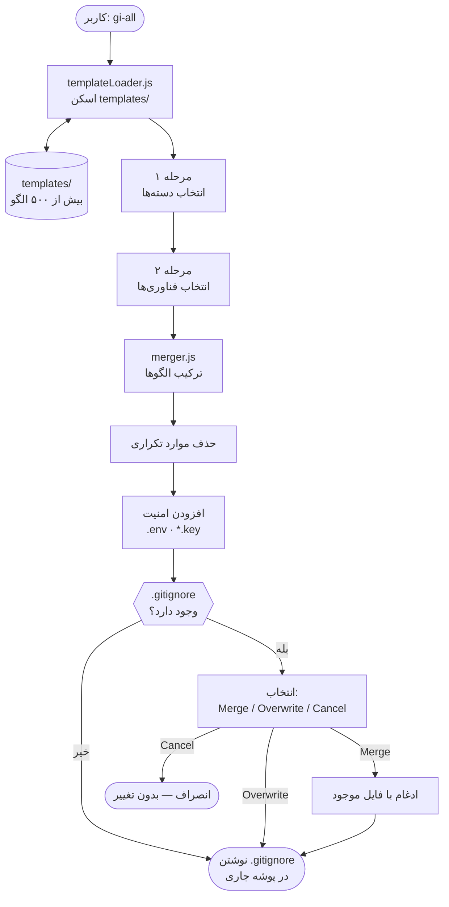

# gi-all

> **این README را به زبان خود بخوانید:**  
> [English](../README.md) · [Türkçe](README.tr.md) · [Azərbaycan](README.az.md) · [O'zbekcha](README.uz.md) · [Қазақша](README.kk.md) · [Кыргызча](README.ky.md) · [Türkmençe](README.tk.md) · [Deutsch](README.de.md) · [Français](README.fr.md) · [Español](README.es.md) · [Português](README.pt.md) · [Italiano](README.it.md) · [Română](README.ro.md) · [Nederlands](README.nl.md) · [Polski](README.pl.md) · [Русский](README.ru.md) · [Українська](README.uk.md) · [Svenska](README.sv.md) · [Tiếng Việt](README.vi.md) · [Bahasa Indonesia](README.id.md) · [ภาษาไทย](README.th.md) · **فارسی** · [العربية](README.ar.md) · [हिन्दी](README.hi.md) · [বাংলা](README.bn.md) · [日本語](README.ja.md) · [한국어](README.ko.md) · [简体中文](README.zh.md)

## 🌟 تنها ابزار ساخت `.gitignore` که تا ابد به آن نیاز خواهید داشت

ابزار `gi-all` یک **سازنده مدولار و دسته‌بندی‌شده .gitignore** برای تیم‌های مدرن و توسعه‌دهندگان مستقل است.

به جای یک فایل شلوغ و گیج‌کننده، `gi-all` یک **کتابخانه دسته‌بندی‌شده از صدها الگوی تخصصی** (Angular, Unity, Android, Flutter, Node.js, Laravel, Docker و بسیاری دیگر) در اختیارتان می‌گذارد تا ظرف چند ثانیه فایل `.gitignore` ایده‌آل خود را بسازید.

[](https://www.npmjs.com/package/gi-all)
[](https://www.npmjs.com/package/gi-all)
[](https://github.com/qafaraz/gi-all/stargazers)
[](https://github.com/qafaraz/gi-all/commits)
[](https://github.com/qafaraz/gi-all/commits)
[](https://github.com/qafaraz/gi-all/blob/main/LICENSE)
[](https://badge.socket.dev/npm/package/gi-all/2.1.0)

---

## 💡 چرا gi-all؟

- **بسیار کوچک**: تنها یک زبان را انتخاب می‌کنید، اما تنظیمات IDE و فایل‌های اضافی همچنان وارد ریپازیتوری می‌شوند.
- **بسیار بزرگ**: یک فایل تصادفی را از اینترنت کپی می‌کنید و **هزاران قانون نامربوط** وارد پروژه شما می‌شود.

ابزار `gi-all` رویکردی کاملاً متفاوت ارائه می‌دهد:

- **طراحی ماژولار** – هر فناوری فایل الگوی `.gitignore` اختصاصی خود را در `templates/` دارد.
- **نمایه‌سازی پویا** – خط فرمان در هنگام اجرا پوشه `templates/` را اسکن می‌کند؛ هر فایل جدید فوراً پشتیبانی می‌شود.
- **تجربه کاربری دسته‌بندی‌شده** – ابتدا حوزه‌های کلی را انتخاب می‌کنید، سپس فناوری‌های مورد استفاده را علامت می‌زنید.
- **بدون نیاز به ادغام دستی** – استک خود را انتخاب کنید، `gi-all` الگوها را ترکیب کرده و خطوط تکراری را حذف می‌کند.
  - تمام الگوهای `.gitignore` انتخاب‌شده را می‌خواند
  - آن‌ها را در یک فایل هوشمند واحد ترکیب می‌کند
  - خطوط تکراری و فاصله‌های اضافی را پاکسازی می‌کند
  - قوانین امنیتی اجباری برای فایل‌های محرمانه و اطلاعات حساس اضافه می‌کند

نتیجه: یک فایل `.gitignore` **تمیز، حداقلی و دقیق** متناسب با ابزارهای پروژه شما.

---

## 🛠️ کتابخانه عظیم الگوها (بیش از ۵۰۰ الگو)

ابزار `gi-all` به طور پیش‌فرض با **صدها الگوی تخصصی** در `templates/` عرضه می‌شود:

- **فرانت‌اند و وب**: React, Next.js, Angular, Vue, Svelte, Astro, Remix, Gatsby, Webpack, Vite, Tailwind CSS, Storybook…
- **موبایل**: Android, iOS, React Native, Flutter, Ionic, Capacitor, NativeScript…
- **بک‌اند و API**: Node.js, Express, NestJS, Django, Flask, Laravel, Symfony, Spring, Rails, FastAPI…
- **بازی و سه‌بعدی**: Unity, Unreal Engine, Godot, libGDX, FlaxEngine, MonoGame, PICO‑8…
- **دواپس و ابری**: Docker, Kubernetes, Terraform, Ansible, Vagrant, Cloudflare, Snap/Snapcraft…
- **ویرایشگرها و IDE**: VS Code, JetBrains IDEs, Vim, Emacs, Sublime, Xcode, Android Studio, NetBeans…
- **پایگاه‌های داده**: Redis, PostgreSQL, MySQL, MongoDB, MSSQL…
- **ابزارها و پایگاه دانش**: خروجی‌های Obsidian/Notion، سیستم‌های ERP، زبان‌های خاص و ابزارها…

هر فناوری **فایل `.gitignore` اختصاصی خود** را دارد. ابزار CLI به طور بازگشتی تمام فایل‌ها را نمایه می‌کند.

---

## 🛡️ اولویت با امنیت

فرستادن تصادفی فایل‌های `.env` یا کلیدهای خصوصی به گیت اشتباهی جبران‌ناپذیر است. `gi-all` امنیت را تضمین می‌کند:

- فایل‌های `.env`، `.env.*` و متغیرهای محیطی
- کلیدها و گواهی‌های خصوصی: `*.key`, `*.pem`, `*.p12`, `*.cert`, `*.crt`, `*.pfx`, `id_rsa*`, `id_ed25519` و غیره
- اطلاعات محرمانه توسعه‌دهنده و ابری: `.envrc`, `.npmrc`, `.netrc`, `.aws/`, `credentials.json`
- اسرار زیرساخت و موبایل: `*.tfstate`, `*.tfvars`, `*.tfplan`, `*.mobileprovision`, `GoogleService-Info.plist`
- مخازن رمز: `secrets.*`, `*.kdbx`, `serviceAccountKey.json`, `firebase-adminsdk*.json`
- پوشه `node_modules/` و لاگ‌های اشکال‌زدایی
- فایل‌های سیستمی و ویرایشگر: `.DS_Store` و غیره

> ابزار `gi-all` احتمال کامیت ناخواسته فایل‌های محرمانه را به شدت کاهش می‌دهد، با این حال توصیه می‌شود همیشه فایل‌های حساس پروژه را بررسی کنید.

---

## ⚙️ نحوه کارکرد

- **اسکن**: در هنگام اجرا، `templates/` را برای یافتن تمام فایل‌های `.gitignore` بررسی می‌کند.
- **مرحله ۱ – انتخاب دسته‌ها**: حوزه‌های مرتبط با پروژه خود را انتخاب می‌کنید.
- **مرحله ۲ – انتخاب فناوری‌ها**: ابزارهای مورد استفاده در آن دسته‌ها را مشخص می‌کنید.
- **پردازش**: الگوها را می‌خواند، ادغام می‌کند، موارد تکراری را حذف کرده و قوانین امنیتی را می‌افزاید.
- **خروجی**: نتیجه نهایی را در یک فایل `.gitignore` در پوشه جاری ذخیره می‌کند.
- **مدیریت تداخل‌ها:**
    - **Merge**: ادغام با قوانین موجود و اضافه کردن الگوهای `gi-all`.
    - **Overwrite**: بازنویسی کامل فایل `.gitignore` موجود.
    - **Cancel**: انصراف بدون اعمال هیچ تغییری.
  - به دلایل امنیتی، `gi-all` از بازنویسی پیوندهای نمادین یا فایل‌های دارای چند پیوند سخت خودداری می‌کند.

---

## 📦 نصب

نیازمند Node.js `>=22.0.0` (نسخه‌های 22 یا 24 LTS پیشنهاد می‌شود).

### One‑shot

```bash
# npm
npx gi-all

# yarn
yarn dlx gi-all

# pnpm
pnpm dlx gi-all

# bun
bunx gi-all
```

### Global install

```bash
# npm
npm install -g gi-all

# yarn
yarn global add gi-all

# pnpm
pnpm install -g gi-all

# bun
bun add -g gi-all
```

```bash
gi-all
```

---

## 🧪 نحوه استفاده: ساخت `.gitignore` ظرف چند ثانیه

دستور زیر را در ریشه پروژه خود اجرا کنید:

```bash
gi-all
```

۱. **انتخاب دسته‌ها** (فرانت‌اند، بک‌اند، موبایل، دواپس، دیتابیس و غیره)
۲. **انتخاب فناوری‌ها** در آن دسته‌ها

ابزار `gi-all` موارد زیر را انجام می‌دهد:

۱. الگوها را می‌خواند
۲. قوانین را ادغام و تکرارها را حذف می‌کند
۳. قوانین امنیتی را می‌افزاید
۴. خروجی را در **`.gitignore`** ذخیره می‌کند

---

## معماری



### مسئولیت‌های ماژول‌ها

| ماژول | مسئولیت |
|---|---|
| `src/cli.js` | رابط خط فرمان تعاملی دو مرحله‌ای و مدیریت تداخل‌ها. |
| `src/core/templateLoader.js` | اسکن بازگشتی پوشه `templates/` و نمایه‌سازی الگوها. |
| `src/core/merger.js` | ادغام الگوها، حذف تکرارها و افزودن قوانین امنیتی. |

---

## 🤝 مشارکت

ابزار `gi-all` به عنوان یک **پایگاه دانش اشتراکی** برای الگوهای `.gitignore` طراحی شده است.

📚 Wiki: https://github.com/qafaraz/gi-all/wiki  
💬 گفت‌وگوها: https://github.com/qafaraz/gi-all/discussions

### افزودن الگوی جدید

۱. مخزن را **Fork** کنید
۲. یک فایل جدید در `templates/` ایجاد کنید
۳. قوانین باکیفیت و متمرکز بنویسید
۴. یک Pull Request ارسال کنید

ابزار CLI فایل‌های جدید را خودکار شناسایی می‌کند و نیازی به تغییر در کد `src/` نیست.

---

## 📜 مجوز

[MIT](../LICENSE) — توسعه‌یافته برای جامعه متن‌باز توسط **[Qafar](https://github.com/qafaraz)**.
