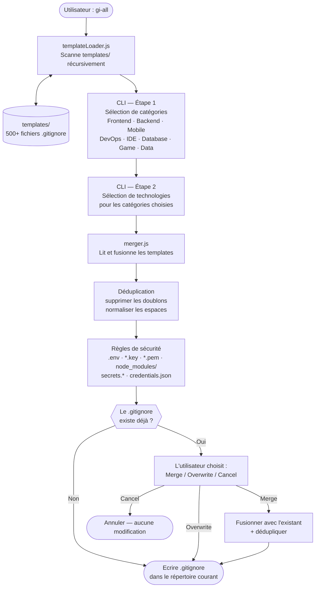

# gi-all

> **Lisez ce README dans votre langue :**  
> [English](../README.md) · [Türkçe](README.tr.md) · [Azərbaycan](README.az.md) · [Deutsch](README.de.md) · **Français** · [Español](README.es.md) · [Português](README.pt.md) · [Italiano](README.it.md) · [Nederlands](README.nl.md) · [Polski](README.pl.md) · [Русский](README.ru.md) · [Українська](README.uk.md) · [العربية](README.ar.md) · [日本語](README.ja.md) · [한국어](README.ko.md) · [简体中文](README.zh.md) · [Svenska](README.sv.md) · [हिन्दी](README.hi.md) · [Bahasa Indonesia](README.id.md)

## 🌟 Le seul générateur `.gitignore` dont vous aurez jamais besoin

`gi-all` est un **générateur de `.gitignore` modulaire et basé sur des catégories** pour les équipes modernes et les développeurs solo ambitieux.

Au lieu d'un unique fichier « kitchen sink » gonflé, `gi-all` vous offre une **bibliothèque de centaines de templates ciblés** (Angular, Unity, Android, Flutter, Node.js, Laravel, Docker et bien d'autres) pour composer le `.gitignore` parfait en quelques secondes.

[](https://www.npmjs.com/package/gi-all)
[](https://www.npmjs.com/package/gi-all)
[](https://github.com/qafaraz/gi-all/stargazers)
[](https://github.com/qafaraz/gi-all/commits)
[](https://github.com/qafaraz/gi-all/commits)
[](https://github.com/qafaraz/gi-all/blob/main/LICENSE)
[](https://badge.socket.dev/npm/package/gi-all/2.1.0)

---

## 💡 Pourquoi gi-all ?

La plupart des générateurs `.gitignore` tombent dans l'un de ces deux pièges :

- **Trop petit** : vous choisissez un seul langage et vous finissez quand même par committer des configs IDE, des artefacts de build ou du bruit de plateforme.
- **Trop grand** : vous copiez un « mega.gitignore » aléatoire sur internet et héritez de **milliers de règles inutiles** que vous ne comprenez pas.

`gi-all` adopte une approche différente :

- **Modulaire par conception** – Chaque technologie vit dans son propre template dédié dans `templates/`.
- **Indexation dynamique** – Le CLI scanne le dossier `templates/` à l'exécution, donc **chaque fichier template est automatiquement supporté**.
- **UX basée sur les catégories** – Choisissez d'abord les domaines de haut niveau (Frontend, Backend, Mobile, DevOps & Cloud, IDE & Editor, Database, Game & 3D, Data & Science, Other), puis les technologies exactes.
- **Zéro fusion manuelle** – Choisissez votre stack et `gi-all` :
  - Lit tous les templates `.gitignore` sélectionnés
  - Les fusionne en un seul `.gitignore` intelligent
  - Supprime les doublons et les espaces inutiles
  - Ajoute des règles de sécurité obligatoires pour les fichiers secrets courants

Vous obtenez un `.gitignore` **propre, minimal et précis** adapté à votre stack.

---

## 🛠️ Immense bibliothèque de templates (500+)

`gi-all` est livré avec **des centaines de templates dédiés** sous `templates/`, incluant :

- **Frontend & Web** : React, Next.js, Angular, Vue, Svelte, Astro, Remix, Gatsby, Webpack, Vite, Tailwind CSS, Storybook…
- **Mobile & Cross‑platform** : Android, iOS, React Native, Flutter, Ionic, Capacitor, NativeScript…
- **Backend & APIs** : Node.js, Express, NestJS, Django, Flask, Laravel, Symfony, Spring, Rails, FastAPI…
- **Game & 3D** : Unity, Unreal Engine, Godot, libGDX, FlaxEngine, MonoGame, PICO‑8…
- **Cloud & DevOps** : Docker, Kubernetes, Terraform, Ansible, Vagrant, Cloudflare, Snap/Snapcraft…
- **Éditeurs & IDEs** : VS Code, JetBrains IDEs (WebStorm, Rider, etc.), Vim, Emacs, Sublime, Xcode, Android Studio, NetBeans…
- **Bases de données** : Redis, PostgreSQL, MySQL, MongoDB, MSSQL…
- **Outils & Connaissances** : Exports Obsidian/Notion, systèmes ERP, langages exotiques…

---

## 🛡️ La sécurité d'abord

Fuiter des fichiers `.env` ou des clés privées dans Git est une erreur coûteuse.

`gi-all` intègre la sécurité par défaut :

- `.env`, `.env.*`, `*.env` et variantes d'environnement courantes
- Clés privées & certificats : `*.key`, `*.pem`, `*.p12`, `*.cert`, `*.crt`, `*.pfx`, `id_rsa*`, `id_ed25519`, etc.
- Identifiants développeur et cloud : `.envrc`, `.npmrc`, `.netrc`, `.aws/`, `credentials.json`
- Secrets infrastructure et mobile : `*.tfstate`, `*.tfvars`, `*.tfplan`, `*.mobileprovision`, `GoogleService-Info.plist`
- Stockages de secrets : `secrets.*`, `*.kdbx`, `serviceAccountKey.json`, `firebase-adminsdk*.json`
- `node_modules/` et logs de débogage courants
- Bruit OS/éditeur comme `.DS_Store`

Ces règles sont **codées en dur et automatiquement ajoutées** en plus des templates sélectionnés.

---

## ⚙️ Comment ça fonctionne

- **Scan** : au démarrage, `gi-all` scanne dynamiquement le dossier `templates/` et construit un catalogue.
- **Étape 1 – Catégories** : le CLI demande quels domaines votre projet utilise.
- **Étape 2 – Technologies** : pour les catégories choisies, vous sélectionnez les technologies exactes.
- **Traitement** : lecture, fusion, déduplication, ajout des règles de sécurité.
- **Sortie** : le résultat est écrit dans un seul fichier `.gitignore` dans votre **répertoire de travail courant**.
- **Conflits** : si un `.gitignore` existe déjà, `gi-all` propose : **Merge**, **Overwrite** ou **Cancel**.

---

## 📦 Installation

Nécessite Node.js `>=22.0.0` (Node 22 ou 24 LTS recommandé).

### Utilisation unique (recommandé)

```bash
npx gi-all
```

### Installation globale

```bash
npm install -g gi-all
```

Puis lancez simplement :

```bash
gi-all
```

---

## 🧪 Utilisation

Depuis la racine de votre projet :

```bash
gi-all
```

Vous serez guidé pour choisir vos catégories et technologies. `gi-all` lira les templates correspondants, les fusionnera, ajoutera les règles de sécurité et écrira le fichier `.gitignore`.

---

## Architecture



### Responsabilités des modules

| Module | Responsabilité |
|---|---|
| `src/cli.js` | Point d'entrée utilisateur. Interface interactive en deux étapes (catégories → technologies). Résolution des conflits. |
| `src/core/templateLoader.js` | Scanne `templates/` récursivement. Indexe chaque `.gitignore`. Détermine la catégorie par le nom de fichier. |
| `src/core/merger.js` | Fusionne les templates. Supprime les doublons. Ajoute les règles de sécurité. |

---

## Contribuer

`gi-all` est conçu pour être un **catalogue communautaire** des meilleures pratiques `.gitignore`.

📚 Wiki : https://github.com/qafaraz/gi-all/wiki  
💬 Discussions : https://github.com/qafaraz/gi-all/discussions

### Ajouter un nouveau template

1. **Forkez** le dépôt
2. Créez un nouveau fichier `.gitignore` sous `templates/`
3. Ajoutez des règles ciblées et de haute qualité pour cette technologie
4. Ouvrez une pull request avec une courte description

---

## 📜 Licence

[MIT](../LICENSE) — créé pour la communauté open source par **[Qafar](https://github.com/qafaraz)**.
