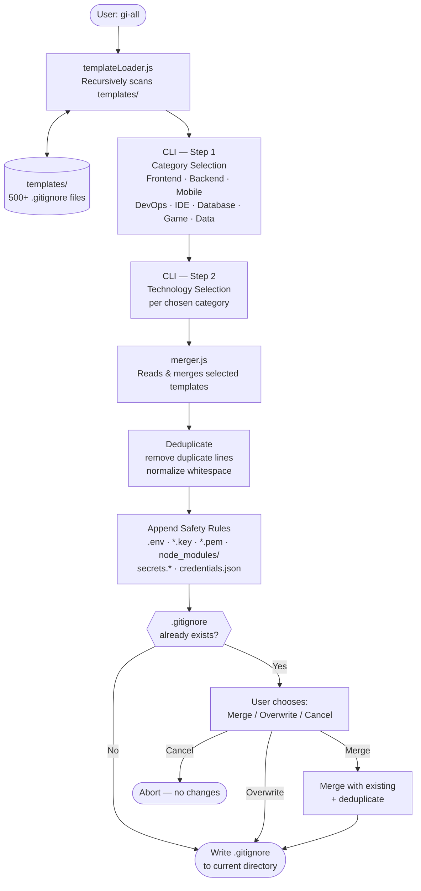

# gi-all

> **इस README को अपनी भाषा में पढ़ें:**  
> [English](../README.md) · [Türkçe](README.tr.md) · [Azərbaycan](README.az.md) · [O'zbekcha](README.uz.md) · [Қазақша](README.kk.md) · [Кыргызча](README.ky.md) · [Türkmençe](README.tk.md) · [Deutsch](README.de.md) · [Français](README.fr.md) · [Español](README.es.md) · [Português](README.pt.md) · [Italiano](README.it.md) · [Română](README.ro.md) · [Nederlands](README.nl.md) · [Polski](README.pl.md) · [Русский](README.ru.md) · [Українська](README.uk.md) · [Svenska](README.sv.md) · [Tiếng Việt](README.vi.md) · [Bahasa Indonesia](README.id.md) · [ภาษาไทย](README.th.md) · [فارسی](README.fa.md) · [العربية](README.ar.md) · **हिन्दी** · [বাংলা](README.bn.md) · [日本語](README.ja.md) · [한국어](README.ko.md) · [简体中文](README.zh.md)

## 🌟 एकमात्र `.gitignore` जनरेटर जिसकी आपको कभी जरूरत होगी

`gi-all` एक **मॉड्यूलर, श्रेणी-आधारित `.gitignore` जनरेटर** है जो आधुनिक टीमों और महत्वाकांक्षी सोलो डेवलपर्स के लिए बनाया गया है।

एक बड़े "kitchen sink" फ़ाइल की जगह, `gi-all` आपको **सैकड़ों केंद्रित टेम्प्लेट की एक क्यूरेटेड लाइब्रेरी** (Angular, Unity, Android, Flutter, Node.js, Laravel, Docker और बहुत कुछ) प्रदान करता है — ताकि आप कुछ सेकंड में परफेक्ट `.gitignore` बना सकें।

[](https://www.npmjs.com/package/gi-all)
[](https://www.npmjs.com/package/gi-all)
[](https://github.com/qafaraz/gi-all/stargazers)
[](https://github.com/qafaraz/gi-all/commits)
[](https://github.com/qafaraz/gi-all/commits)
[](https://github.com/qafaraz/gi-all/blob/main/LICENSE)
[](https://badge.socket.dev/npm/package/gi-all/2.1.0)

---

## 💡 gi-all क्यों?

अधिकांश `.gitignore` जनरेटर इन दो जालों में से एक में फंस जाते हैं:

- **बहुत छोटा**: आप एक भाषा चुनते हैं और फिर भी IDE कॉन्फिग, बिल्ड आर्टिफैक्ट, या प्लेटफॉर्म जंक कमिट हो जाता है।
- **बहुत बड़ा**: आप इंटरनेट से कोई "mega.gitignore" कॉपी करते हैं और **हजारों अप्रासंगिक नियम** विरासत में पाते हैं जो आप समझते भी नहीं।

`gi-all` एक अलग तरीका अपनाता है:

- **मॉड्यूलर डिज़ाइन** – हर तकनीक `templates/` में अपनी खुद की डेडिकेटेड टेम्प्लेट फ़ाइल में रहती है।
- **डायनामिक इंडेक्सिंग** – CLI रनटाइम पर `templates/` फोल्डर को स्कैन करता है, इसलिए **हर टेम्प्लेट फ़ाइल स्वचालित रूप से समर्थित है**।
- **श्रेणी-आधारित UX** – पहले उच्च-स्तरीय क्षेत्र चुनें (Frontend, Backend, Mobile, DevOps & Cloud, IDE & Editor, Database, Game & 3D, Data & Science, Other), फिर सटीक तकनीकें।
- **शून्य मैनुअल मर्जिंग** – अपना स्टैक चुनें और `gi-all`:
  - सभी चुने गए `.gitignore` टेम्प्लेट पढ़ता है
  - उन्हें एक स्मार्ट `.gitignore` में मर्ज करता है
  - डुप्लिकेट लाइनें और अनावश्यक व्हाइटस्पेस हटाता है
  - सामान्य सीक्रेट और क्रेडेंशियल फ़ाइलों के लिए अनिवार्य सुरक्षा नियम जोड़ता है

आपको एक **साफ, न्यूनतम और सटीक** `.gitignore` मिलता है जो आपके स्टैक के अनुसार बना हो।

---

## 🛠️ विशाल टेम्प्लेट लाइब्रेरी (500+ टेम्प्लेट)

`gi-all` `templates/` में **सैकड़ों डेडिकेटेड टेम्प्लेट** के साथ आता है, जिनमें शामिल हैं:

- **Frontend & Web**: React, Next.js, Angular, Vue, Svelte, Astro, Remix, Gatsby, Webpack, Vite, Tailwind CSS, Storybook…
- **Mobile & Cross‑platform**: Android, iOS, React Native, Flutter, Ionic, Capacitor, NativeScript…
- **Backend & APIs**: Node.js, Express, NestJS, Django, Flask, Laravel, Symfony, Spring, Rails, FastAPI…
- **Game & 3D**: Unity, Unreal Engine, Godot, libGDX, FlaxEngine, MonoGame, PICO‑8…
- **Cloud & DevOps**: Docker, Kubernetes, Terraform, Ansible, Vagrant, Cloudflare, Snap/Snapcraft…
- **Editors & IDEs**: VS Code, JetBrains IDEs (WebStorm, Rider आदि), Vim, Emacs, Sublime, Xcode, Android Studio, NetBeans…
- **Databases**: Redis, PostgreSQL, MySQL, MongoDB, MSSQL…
- **टूल्स & ज्ञान**: Obsidian/Notion एक्सपोर्ट, ERP सिस्टम, एक्सोटिक लैंग्वेज…

---

## 🛡️ सुरक्षा पहले

`.env` फ़ाइलों या प्राइवेट कीज़ को गलती से Git में कमिट करना एक महंगी गलती है।

`gi-all` डिफ़ॉल्ट रूप से सुरक्षा बनाता है:

- `.env`, `.env.*`, `*.env` और सामान्य एनवायरनमेंट वेरिएंट
- प्राइवेट कीज़ और सर्टिफिकेट: `*.key`, `*.pem`, `*.p12`, `*.cert`, `*.crt`, `*.pfx`, `id_rsa*`, `id_ed25519` आदि
- डेवलपर और क्लाउड क्रेडेंशियल: `.envrc`, `.npmrc`, `.netrc`, `.aws/`, `credentials.json`
- इन्फ्रास्ट्रक्चर और मोबाइल सीक्रेट: `*.tfstate`, `*.tfvars`, `*.tfplan`, `*.mobileprovision`, `GoogleService-Info.plist`
- जेनेरिक सीक्रेट स्टोर: `secrets.*`, `*.kdbx`, `serviceAccountKey.json`, `firebase-adminsdk*.json`
- `node_modules/` और सामान्य डिबग लॉग
- OS/एडिटर शोर जैसे `.DS_Store`

---

## ⚙️ यह कैसे काम करता है

- **स्कैनिंग**: शुरू होने पर, `gi-all` `templates/` फोल्डर को डायनामिक रूप से स्कैन करता है और एक कैटलॉग बनाता है।
- **चरण 1 – श्रेणियां**: CLI पूछता है कि आपका प्रोजेक्ट किन क्षेत्रों का उपयोग करता है।
- **चरण 2 – तकनीकें**: चुनी गई श्रेणियों के लिए, आप सटीक तकनीकें चुनते हैं।
- **प्रोसेसिंग**: पढ़ता है, मर्ज करता है, डुप्लिकेट हटाता है, सुरक्षा नियम जोड़ता है।
- **आउटपुट**: परिणाम को आपकी **वर्तमान कार्यशील डायरेक्टरी** में एकल `.gitignore` फ़ाइल में लिखता है।
- **संघर्ष**: यदि `.gitignore` पहले से मौजूद है, `gi-all` पूछता है: **Merge**, **Overwrite**, या **Cancel**।

---

## 📦 इंस्टॉलेशन

Node.js `>=22.0.0` आवश्यक है (Node 22 या 24 LTS की सिफारिश)।

### एक बार उपयोग (सिफारिश)

```bash
npx gi-all
```

### ग्लोबल इंस्टॉलेशन

```bash
npm install -g gi-all
```

फिर बस चलाएं:

```bash
gi-all
```

---

## 🧪 उपयोग

अपने प्रोजेक्ट की रूट से:

```bash
gi-all
```

आपको श्रेणियां और तकनीकें चुनने में मार्गदर्शन किया जाएगा। `gi-all` संबंधित टेम्प्लेट पढ़ेगा, मर्ज करेगा, सुरक्षा नियम जोड़ेगा और `.gitignore` फ़ाइल लिखेगा।

---

## Architecture



### Module Responsibilities

| Module | Responsibility |
|---|---|
| `src/cli.js` | User-facing entry point. Two-step interactive UI (categories → technologies). Conflict resolution. |
| `src/core/templateLoader.js` | Scans `templates/` recursively. Indexes every `.gitignore` file. Assigns category by filename. |
| `src/core/merger.js` | Merges multiple templates. Deduplicates lines. Appends mandatory safety rules. |

---

## 🤝 योगदान

`gi-all` को `.gitignore` सर्वोत्तम प्रथाओं के **समुदाय-संचालित कैटलॉग** के रूप में डिज़ाइन किया गया है।

📚 Wiki: 
https://github.com/qafaraz/gi-all/discussions
### नया टेम्प्लेट जोड़ना

1. रिपो को **Fork** करें
2. `templates/` के अंतर्गत एक नई `.gitignore` फ़ाइल बनाएं
3. उस तकनीक के लिए केंद्रित, उच्च-गुणवत्ता वाले नियम जोड़ें
4. एक संक्षिप्त विवरण के साथ pull request खोलें

---

## 📜 लाइसेंस

[MIT](../LICENSE) — ओपन-सोर्स समुदाय के लिए **[Qafar](https://github.com/qafaraz)** द्वारा तैयार किया गया।
