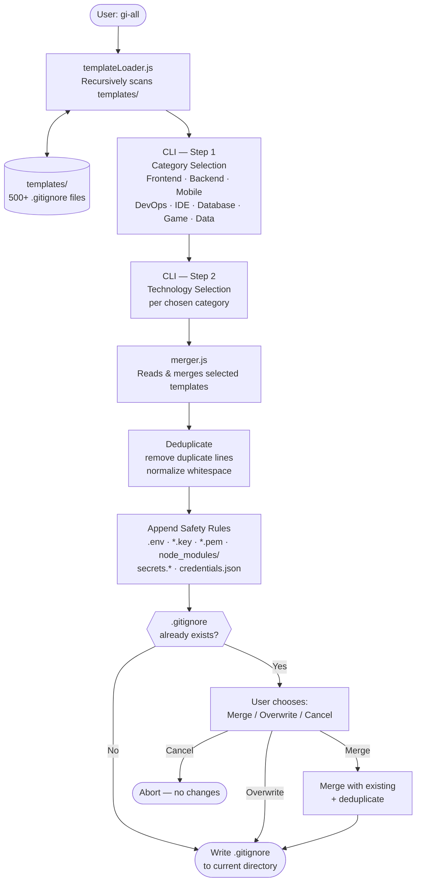

# gi-all

> **Baca README ini dalam bahasa Anda:**  
> [English](../README.md) · [Türkçe](README.tr.md) · [Azərbaycan](README.az.md) · [O'zbekcha](README.uz.md) · [Қазақша](README.kk.md) · [Кыргызча](README.ky.md) · [Türkmençe](README.tk.md) · [Deutsch](README.de.md) · [Français](README.fr.md) · [Español](README.es.md) · [Português](README.pt.md) · [Italiano](README.it.md) · [Română](README.ro.md) · [Nederlands](README.nl.md) · [Polski](README.pl.md) · [Русский](README.ru.md) · [Українська](README.uk.md) · [Svenska](README.sv.md) · [Tiếng Việt](README.vi.md) · **Bahasa Indonesia** · [ภาษาไทย](README.th.md) · [فارسی](README.fa.md) · [العربية](README.ar.md) · [हिन्दी](README.hi.md) · [বাংলা](README.bn.md) · [日本語](README.ja.md) · [한국어](README.ko.md) · [简体中文](README.zh.md)

## 🌟 Satu-satunya Generator `.gitignore` yang Akan Anda Butuhkan

`gi-all` adalah **generator `.gitignore` yang modular dan berbasis kategori** untuk tim modern dan pengembang solo yang ambisius.

Alih-alih satu file "kitchen sink" yang besar, `gi-all` memberikan Anda **pustaka kuratasi dari ratusan template yang terfokus** (Angular, Unity, Android, Flutter, Node.js, Laravel, Docker dan banyak lagi) untuk menyusun `.gitignore` yang sempurna dalam hitungan detik.

[](https://www.npmjs.com/package/gi-all)
[](https://www.npmjs.com/package/gi-all)
[](https://github.com/qafaraz/gi-all/stargazers)
[](https://github.com/qafaraz/gi-all/commits)
[](https://github.com/qafaraz/gi-all/commits)
[](https://github.com/qafaraz/gi-all/blob/main/LICENSE)
[](https://badge.socket.dev/npm/package/gi-all/2.1.0)

---

## 💡 Mengapa gi-all?

Sebagian besar generator `.gitignore` jatuh ke salah satu dari dua perangkap ini:

- **Terlalu kecil**: Anda memilih satu bahasa dan masih saja men-commit konfigurasi IDE, artefak build, atau sampah platform.
- **Terlalu besar**: Anda menyalin "mega.gitignore" acak dari internet dan mewarisi **ribuan aturan yang tidak relevan** yang tidak Anda pahami.

`gi-all` mengambil pendekatan yang berbeda:

- **Modular secara desain** – Setiap teknologi hidup di file template khusus di `templates/`.
- **Pengindeksan dinamis** – CLI memindai folder `templates/` saat runtime, sehingga **setiap file template didukung secara otomatis**.
- **UX berbasis kategori** – Pertama pilih area tingkat tinggi (Frontend, Backend, Mobile, DevOps & Cloud, IDE & Editor, Database, Game & 3D, Data & Science, Other), lalu teknologi yang tepat.
- **Nol penggabungan manual** – Pilih stack Anda dan `gi-all` akan:
  - Membaca semua template `.gitignore` yang dipilih
  - Menggabungkannya menjadi satu `.gitignore` yang cerdas
  - Menghapus baris duplikat dan spasi yang tidak perlu
  - Menambahkan aturan keamanan wajib untuk file rahasia dan kredensial yang umum

Anda mendapatkan `.gitignore` yang **bersih, minimal, dan akurat** yang disesuaikan dengan stack Anda.

---

## 🛠️ Pustaka Template yang Besar (500+ Template)

`gi-all` hadir dengan **ratusan template khusus** di bawah `templates/`, termasuk:

- **Frontend & Web**: React, Next.js, Angular, Vue, Svelte, Astro, Remix, Gatsby, Webpack, Vite, Tailwind CSS, Storybook…
- **Mobile & Cross‑platform**: Android, iOS, React Native, Flutter, Ionic, Capacitor, NativeScript…
- **Backend & API**: Node.js, Express, NestJS, Django, Flask, Laravel, Symfony, Spring, Rails, FastAPI…
- **Game & 3D**: Unity, Unreal Engine, Godot, libGDX, FlaxEngine, MonoGame, PICO‑8…
- **Cloud & DevOps**: Docker, Kubernetes, Terraform, Ansible, Vagrant, Cloudflare, Snap/Snapcraft…
- **Editor & IDE**: VS Code, JetBrains IDEs (WebStorm, Rider, dll.), Vim, Emacs, Sublime, Xcode, Android Studio, NetBeans…
- **Basis Data**: Redis, PostgreSQL, MySQL, MongoDB, MSSQL…
- **Alat & Pengetahuan**: Ekspor Obsidian/Notion, sistem ERP, bahasa eksotis…

---

## 🛡️ Keamanan Lebih Dulu

Secara tidak sengaja meng-commit file `.env` atau kunci privat ke Git adalah kesalahan yang mahal.

`gi-all` membangun keamanan secara default:

- `.env`, `.env.*`, `*.env` dan varian lingkungan yang umum
- Kunci privat dan sertifikat: `*.key`, `*.pem`, `*.p12`, `*.cert`, `*.crt`, `*.pfx`, `id_rsa*`, `id_ed25519`, dll.
- Kredensial pengembang dan cloud: `.envrc`, `.npmrc`, `.netrc`, `.aws/`, `credentials.json`
- Rahasia infrastruktur dan mobile: `*.tfstate`, `*.tfvars`, `*.tfplan`, `*.mobileprovision`, `GoogleService-Info.plist`
- Penyimpanan rahasia umum: `secrets.*`, `*.kdbx`, `serviceAccountKey.json`, `firebase-adminsdk*.json`
- `node_modules/` dan log debug yang umum
- Kebisingan OS/editor seperti `.DS_Store`

---

## ⚙️ Cara Kerjanya

- **Pemindaian**: saat mulai, `gi-all` memindai folder `templates/` secara dinamis dan membangun katalog.
- **Langkah 1 – Kategori**: CLI menanyakan area yang digunakan proyek Anda.
- **Langkah 2 – Teknologi**: untuk kategori yang dipilih, Anda memilih teknologi yang tepat.
- **Pemrosesan**: membaca, menggabungkan, mendeduplikasi, menambahkan aturan keamanan.
- **Output**: menulis hasilnya ke satu file `.gitignore` di **direktori kerja Anda saat ini**.
- **Konflik**: jika `.gitignore` sudah ada, `gi-all` menanyakan: **Merge**, **Overwrite**, atau **Cancel**.

---

## 📦 Instalasi

Membutuhkan Node.js `>=22.0.0` (Node 22 atau 24 LTS disarankan).

### Penggunaan sekali pakai (disarankan)

```bash
npx gi-all
```

### Instalasi global

```bash
npm install -g gi-all
```

Kemudian cukup jalankan:

```bash
gi-all
```

---

## 🧪 Penggunaan

Dari root proyek Anda:

```bash
gi-all
```

Anda akan dipandu untuk memilih kategori dan teknologi. `gi-all` akan membaca template yang sesuai, menggabungkannya, menambahkan aturan keamanan, dan menulis file `.gitignore`.

---

## Architecture



### Module Responsibilities

| Module | Responsibility |
|---|---|
| `src/cli.js` | User-facing entry point. Two-step interactive UI (categories → technologies). Conflict resolution. |
| `src/core/templateLoader.js` | Scans `templates/` recursively. Indexes every `.gitignore` file. Assigns category by filename. |
| `src/core/merger.js` | Merges multiple templates. Deduplicates lines. Appends mandatory safety rules. |

---

## 🤝 Berkontribusi

`gi-all` dirancang sebagai **katalog yang digerakkan oleh komunitas** dari praktik terbaik `.gitignore`.

📚 Wiki: 
https://github.com/qafaraz/gi-all/discussions
### Menambahkan template baru

1. **Fork** repositorinya
2. Buat file `.gitignore` baru di bawah `templates/`
3. Tambahkan aturan yang terfokus dan berkualitas tinggi untuk teknologi tersebut
4. Buka pull request dengan deskripsi singkat

---

## 📜 Lisensi

[MIT](../LICENSE) — dibuat untuk komunitas open source oleh **[Qafar](https://github.com/qafaraz)**.
