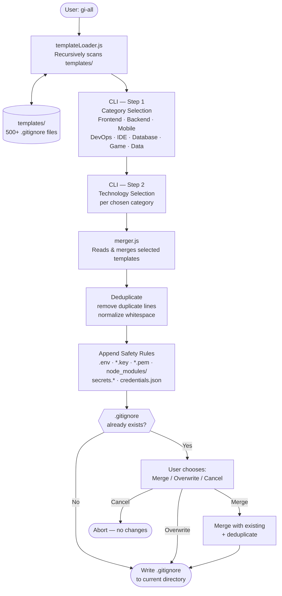

# gi-all

> **Leggi questo README nella tua lingua:**  
> [English](../README.md) · [Türkçe](README.tr.md) · [Azərbaycan](README.az.md) · [Deutsch](README.de.md) · [Français](README.fr.md) · [Español](README.es.md) · [Português](README.pt.md) · **Italiano** · [Nederlands](README.nl.md) · [Polski](README.pl.md) · [Русский](README.ru.md) · [Українська](README.uk.md) · [العربية](README.ar.md) · [日本語](README.ja.md) · [한국어](README.ko.md) · [简体中文](README.zh.md) · [Svenska](README.sv.md) · [हिन्दी](README.hi.md) · [Bahasa Indonesia](README.id.md)

## 🌟 L'unico generatore di `.gitignore` di cui avrai mai bisogno

`gi-all` è un **generatore di `.gitignore` modulare e basato su categorie** per team moderni e sviluppatori solo ambiziosi.

Invece di un unico file "kitchen sink" gonfiato, `gi-all` offre una **libreria curata di centinaia di template mirati** (Angular, Unity, Android, Flutter, Node.js, Laravel, Docker e molti altri) per comporre il `.gitignore` perfetto in pochi secondi.

[](https://www.npmjs.com/package/gi-all)
[](https://www.npmjs.com/package/gi-all)
[](https://github.com/qafaraz/gi-all/stargazers)
[](https://github.com/qafaraz/gi-all/commits)
[](https://github.com/qafaraz/gi-all/commits)
[](https://github.com/qafaraz/gi-all/blob/main/LICENSE)
[](https://badge.socket.dev/npm/package/gi-all/2.1.0)

---

## 💡 Perché gi-all?

La maggior parte dei generatori di `.gitignore` cade in una di queste due trappole:

- **Troppo piccolo**: scegli un singolo linguaggio e finisci comunque per committare config IDE, artefatti di build o spazzatura di piattaforma.
- **Troppo grande**: copi un "mega.gitignore" casuale da internet ed erediti **migliaia di regole irrilevanti** che non capisci.

`gi-all` adotta un approccio diverso:

- **Modulare per design** – Ogni tecnologia vive nel proprio template dedicato in `templates/`.
- **Indicizzazione dinamica** – Il CLI scansiona la cartella `templates/` a runtime, quindi **ogni file di template è automaticamente supportato**.
- **UX basata su categorie** – Prima seleziona aree di alto livello (Frontend, Backend, Mobile, DevOps & Cloud, IDE & Editor, Database, Game & 3D, Data & Science, Other), poi le tecnologie esatte.
- **Zero unione manuale** – Scegli il tuo stack e `gi-all`:
  - Legge tutti i template `.gitignore` selezionati
  - Li unisce in un unico `.gitignore` intelligente
  - Rimuove righe duplicate e spazi inutili
  - Aggiunge regole di sicurezza obbligatorie per i file segreti comuni

Ottieni un `.gitignore` **pulito, minimale e preciso** adattato al tuo stack.

---

## 🛠️ Enorme libreria di template (500+)

`gi-all` viene fornito con **centinaia di template dedicati** in `templates/`, tra cui:

- **Frontend & Web**: React, Next.js, Angular, Vue, Svelte, Astro, Remix, Gatsby, Webpack, Vite, Tailwind CSS, Storybook…
- **Mobile & Cross‑platform**: Android, iOS, React Native, Flutter, Ionic, Capacitor, NativeScript…
- **Backend & API**: Node.js, Express, NestJS, Django, Flask, Laravel, Symfony, Spring, Rails, FastAPI…
- **Game & 3D**: Unity, Unreal Engine, Godot, libGDX, FlaxEngine, MonoGame, PICO‑8…
- **Cloud & DevOps**: Docker, Kubernetes, Terraform, Ansible, Vagrant, Cloudflare, Snap/Snapcraft…
- **Editor & IDE**: VS Code, JetBrains IDEs (WebStorm, Rider, ecc.), Vim, Emacs, Sublime, Xcode, Android Studio, NetBeans…
- **Database**: Redis, PostgreSQL, MySQL, MongoDB, MSSQL…
- **Strumenti & Conoscenza**: Esportazioni di Obsidian/Notion, sistemi ERP, linguaggi esotici…

---

## 🛡️ La sicurezza prima di tutto

Fare trapelare file `.env` o chiavi private in Git è un errore costoso.

`gi-all` integra la sicurezza di default:

- `.env`, `.env.*`, `*.env` e varianti di ambiente comuni
- Chiavi private e certificati: `*.key`, `*.pem`, `*.p12`, `*.cert`, `*.crt`, `*.pfx`, `id_rsa*`, `id_ed25519`, ecc.
- Credenziali sviluppatore e cloud: `.envrc`, `.npmrc`, `.netrc`, `.aws/`, `credentials.json`
- Segreti infrastruttura e mobile: `*.tfstate`, `*.tfvars`, `*.tfplan`, `*.mobileprovision`, `GoogleService-Info.plist`
- Archivi di segreti: `secrets.*`, `*.kdbx`, `serviceAccountKey.json`, `firebase-adminsdk*.json`
- `node_modules/` e log di debug comuni
- Rumore OS/editor come `.DS_Store`

---

## ⚙️ Come funziona

- **Scansione**: all'avvio, `gi-all` scansiona dinamicamente la cartella `templates/` e costruisce un catalogo.
- **Passo 1 – Categorie**: il CLI chiede quali aree usa il tuo progetto.
- **Passo 2 – Tecnologie**: per le categorie scelte, selezioni le tecnologie esatte.
- **Elaborazione**: legge, unisce, deduplica e aggiunge regole di sicurezza.
- **Output**: scrive il risultato in un unico file `.gitignore` nella tua **directory di lavoro corrente**.
- **Conflitti**: se esiste già un `.gitignore`, `gi-all` chiede: **Merge**, **Overwrite** o **Cancel**.

---

## 📦 Installazione

Richiede Node.js `>=22.0.0` (Node 22 o 24 LTS consigliato).

### Uso singolo (consigliato)

```bash
npx gi-all
```

### Installazione globale

```bash
npm install -g gi-all
```

Poi esegui semplicemente:

```bash
gi-all
```

---

## 🧪 Utilizzo

Dalla radice del tuo progetto:

```bash
gi-all
```

Sarai guidato nella scelta di categorie e tecnologie. `gi-all` leggerà i template corrispondenti, li unirà, aggiungerà le regole di sicurezza e scriverà il file `.gitignore`.

---

## Architecture



### Module Responsibilities

| Module | Responsibility |
|---|---|
| `src/cli.js` | User-facing entry point. Two-step interactive UI (categories → technologies). Conflict resolution. |
| `src/core/templateLoader.js` | Scans `templates/` recursively. Indexes every `.gitignore` file. Assigns category by filename. |
| `src/core/merger.js` | Merges multiple templates. Deduplicates lines. Appends mandatory safety rules. |

---

## 🤝 Contribuire

`gi-all` è progettato per essere un **catalogo guidato dalla comunità** delle migliori pratiche di `.gitignore`.

📚 Wiki: 
https://github.com/qafaraz/gi-all/discussions
### Aggiungere un nuovo template

1. **Fai il fork** del repository
2. Crea un nuovo file `.gitignore` in `templates/`
3. Aggiungi regole mirate e di alta qualità per quella tecnologia
4. Apri una pull request con una breve descrizione

---

## 📜 Licenza

[MIT](../LICENSE) — creato per la comunità open source da **[Qafar](https://github.com/qafaraz)**.
