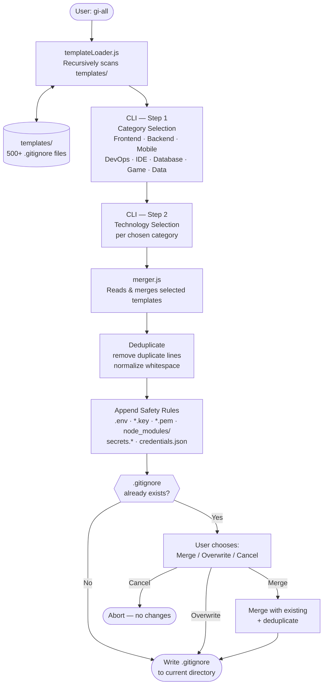

# gi-all

> **このREADMEをあなたの言語で読む：**  
> [English](../README.md) · [Türkçe](README.tr.md) · [Azərbaycan](README.az.md) · [Deutsch](README.de.md) · [Français](README.fr.md) · [Español](README.es.md) · [Português](README.pt.md) · [Italiano](README.it.md) · [Nederlands](README.nl.md) · [Polski](README.pl.md) · [Русский](README.ru.md) · [Українська](README.uk.md) · [العربية](README.ar.md) · **日本語** · [한국어](README.ko.md) · [简体中文](README.zh.md) · [Svenska](README.sv.md) · [हिन्दी](README.hi.md) · [Bahasa Indonesia](README.id.md)

## 🌟 あなたが今後必要とする唯一の `.gitignore` ジェネレーター

`gi-all` は、モダンなチームと野心的なソロ開発者のための **モジュラーでカテゴリベースの `.gitignore` ジェネレーター** です。

一つの肥大化した「kitchen sink」ファイルの代わりに、`gi-all` は **何百もの焦点を絞ったテンプレートのキュレーションされたライブラリ**（Angular、Unity、Android、Flutter、Node.js、Laravel、Dockerなど多数）を提供し、数秒で完璧な `.gitignore` を作成できます。

[](https://www.npmjs.com/package/gi-all)
[](https://www.npmjs.com/package/gi-all)
[](https://github.com/qafaraz/gi-all/stargazers)
[](https://github.com/qafaraz/gi-all/commits)
[](https://github.com/qafaraz/gi-all/commits)
[](https://github.com/qafaraz/gi-all/blob/main/LICENSE)
[](https://badge.socket.dev/npm/package/gi-all/2.1.0)

---

## 💡 なぜ gi-all なのか？

ほとんどの `.gitignore` ジェネレーターは、次の2つの罠のどちらかに陥ります：

- **小さすぎる**: 一つの言語を選んでも、IDEの設定、ビルドアーティファクト、またはプラットフォームのゴミをコミットしてしまう。
- **大きすぎる**: インターネットからランダムな「mega.gitignore」をコピーして、理解できない **何千もの無関係なルール** を継承してしまう。

`gi-all` は異なるアプローチを取ります：

- **モジュラー設計** – すべてのテクノロジーが `templates/` の専用テンプレートファイルに存在します。
- **動的インデックス** – CLIは実行時に `templates/` フォルダをスキャンするため、**すべてのテンプレートファイルが自動的にサポート**されます。
- **カテゴリベースのUX** – まず高レベルのエリア（Frontend、Backend、Mobile、DevOps & Cloud、IDE & Editor、Database、Game & 3D、Data & Science、Other）を選択し、次に正確なテクノロジーを選びます。
- **手動マージ不要** – スタックを選択すると、`gi-all` が：
  - 選択されたすべての `.gitignore` テンプレートを読み込む
  - 一つのスマートな `.gitignore` にマージする
  - 重複行と余分な空白を除去する
  - 一般的なシークレットと認証情報ファイルの必須セキュリティルールを追加する

あなたのスタックに合わせた **クリーンで最小限かつ正確な** `.gitignore` が得られます。

---

## 🛠️ 巨大なテンプレートライブラリ（500以上）

`gi-all` は `templates/` に **何百もの専用テンプレート** を備えています。主なものは：

- **フロントエンド & Web**: React、Next.js、Angular、Vue、Svelte、Astro、Remix、Gatsby、Webpack、Vite、Tailwind CSS、Storybook…
- **モバイル & クロスプラットフォーム**: Android、iOS、React Native、Flutter、Ionic、Capacitor、NativeScript…
- **バックエンド & API**: Node.js、Express、NestJS、Django、Flask、Laravel、Symfony、Spring、Rails、FastAPI…
- **ゲーム & 3D**: Unity、Unreal Engine、Godot、libGDX、FlaxEngine、MonoGame、PICO‑8…
- **クラウド & DevOps**: Docker、Kubernetes、Terraform、Ansible、Vagrant、Cloudflare、Snap/Snapcraft…
- **エディタ & IDE**: VS Code、JetBrains IDEs（WebStorm、Riderなど）、Vim、Emacs、Sublime、Xcode、Android Studio、NetBeans…
- **データベース**: Redis、PostgreSQL、MySQL、MongoDB、MSSQL…
- **ツール & ナレッジ**: Obsidian/Notionエクスポート、ERPシステム、エキゾチックな言語…

---

## 🛡️ セキュリティファースト

`.env` ファイルや秘密鍵を誤ってGitにコミットすることは、代償の大きいミスです。

`gi-all` はデフォルトでセキュリティを組み込んでいます：

- `.env`、`.env.*`、`*.env` および一般的な環境変数のバリアント
- 秘密鍵と証明書: `*.key`、`*.pem`、`*.p12`、`*.cert`、`*.crt`、`*.pfx`、`id_rsa*`、`id_ed25519` など
- 開発者とクラウドの認証情報: `.envrc`、`.npmrc`、`.netrc`、`.aws/`、`credentials.json`
- インフラとモバイルのシークレット: `*.tfstate`、`*.tfvars`、`*.tfplan`、`*.mobileprovision`、`GoogleService-Info.plist`
- 汎用シークレットストア: `secrets.*`、`*.kdbx`、`serviceAccountKey.json`、`firebase-adminsdk*.json`
- `node_modules/` と一般的なデバッグログ
- `.DS_Store` などのOS/エディタのノイズ

---

## ⚙️ 動作の仕組み

- **スキャン**: 起動時に `gi-all` は `templates/` フォルダを動的にスキャンしてカタログを構築します。
- **ステップ1 – カテゴリ**: CLIがプロジェクトで使用するエリアを尋ねます。
- **ステップ2 – テクノロジー**: 選択したカテゴリに対して正確なテクノロジーを選びます。
- **処理**: 読み込み、マージ、重複除去、セキュリティルールの追加。
- **出力**: **現在の作業ディレクトリ** に単一の `.gitignore` ファイルとして書き出されます。
- **競合**: `.gitignore` が既に存在する場合、`gi-all` は尋ねます：**Merge**、**Overwrite**、または **Cancel**。

---

## 📦 インストール

Node.js `>=22.0.0` が必要です（Node 22 または 24 LTS を推奨）。

### 単発使用（推奨）

```bash
npx gi-all
```

### グローバルインストール

```bash
npm install -g gi-all
```

その後、単純に実行：

```bash
gi-all
```

---

## 🧪 使い方

プロジェクトのルートから：

```bash
gi-all
```

カテゴリとテクノロジーの選択がガイドされます。`gi-all` は対応するテンプレートを読み込み、マージし、セキュリティルールを追加して `.gitignore` ファイルを書き出します。

---

## Architecture



### Module Responsibilities

| Module | Responsibility |
|---|---|
| `src/cli.js` | User-facing entry point. Two-step interactive UI (categories → technologies). Conflict resolution. |
| `src/core/templateLoader.js` | Scans `templates/` recursively. Indexes every `.gitignore` file. Assigns category by filename. |
| `src/core/merger.js` | Merges multiple templates. Deduplicates lines. Appends mandatory safety rules. |

---

## 🤝 コントリビューション

`gi-all` は `.gitignore` のベストプラクティスの **コミュニティ駆動カタログ** として設計されています。

📚 Wiki: 
https://github.com/qafaraz/gi-all/discussions
### 新しいテンプレートの追加

1. リポジトリを **フォーク** する
2. `templates/` に新しい `.gitignore` ファイルを作成する
3. そのテクノロジーに焦点を当てた高品質なルールを追加する
4. 簡単な説明とともにプルリクエストを開く

---

## 📜 ライセンス

[MIT](../LICENSE) — **[Qafar](https://github.com/qafaraz)** によってオープンソースコミュニティのために作成されました。
