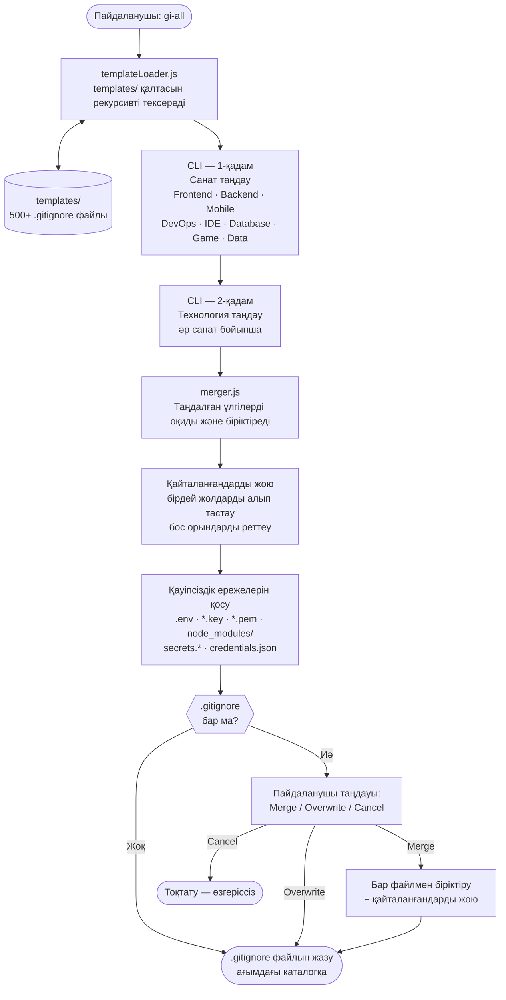

# gi-all

> **Бұл README-ні өз тіліңізде оқыңыз:**  
> [English](../README.md) · [Türkçe](README.tr.md) · [Azərbaycan](README.az.md) · [O'zbekcha](README.uz.md) · **Қазақша** · [Кыргызча](README.ky.md) · [Türkmençe](README.tk.md) · [Deutsch](README.de.md) · [Français](README.fr.md) · [Español](README.es.md) · [Português](README.pt.md) · [Italiano](README.it.md) · [Română](README.ro.md) · [Nederlands](README.nl.md) · [Polski](README.pl.md) · [Русский](README.ru.md) · [Українська](README.uk.md) · [Svenska](README.sv.md) · [Tiếng Việt](README.vi.md) · [Bahasa Indonesia](README.id.md) · [ภาษาไทย](README.th.md) · [فارسی](README.fa.md) · [العربية](README.ar.md) · [हिन्दी](README.hi.md) · [বাংলা](README.bn.md) · [日本語](README.ja.md) · [한국어](README.ko.md) · [简体中文](README.zh.md)

## 🌟 Сізге қажет болатын жалғыз `.gitignore` генераторы

`gi-all` — заманауи командалар мен жеке әзірлеушілерге арналған **модульді, санатқа негізделген `.gitignore` генераторы**.

Барлығы бір жерге жиналған, ретсіз "mega.gitignore" файлының орнына, `gi-all` сізге **жүздеген арнайы үлгілерден тұратын таңдаулы кітапхананы** (Angular, Unity, Android, Flutter, Node.js, Laravel, Docker және т.б.) ұсынады және оларды бірнеше секунд ішінде өзіңіздің стекке сәйкес біріктіруге мүмкіндік береді.

[](https://www.npmjs.com/package/gi-all)
[](https://www.npmjs.com/package/gi-all)
[](https://github.com/qafaraz/gi-all/stargazers)
[](https://github.com/qafaraz/gi-all/commits)
[](https://github.com/qafaraz/gi-all/commits)
[](https://github.com/qafaraz/gi-all/blob/main/LICENSE)
[](https://badge.socket.dev/npm/package/gi-all/2.1.0)

---

## 💡 Неге gi-all?

Көптеген `.gitignore` шешімдері екі қатенің біріне ұрынады:

- **Тым кіші**: Тек бір тілді таңдайсыз, бірақ IDE параметрлері, құрастыру (build) файлдары немесе жүйелік қоқыс бәрібір репозиторийге кіріп кетеді.
- **Тым үлкен**: Интернеттен кездейсоқ "mega.gitignore" көшіріп аласыз және мағынасын білмейтін **мыңдаған қажетсіз ережелерді** жобаңызға қосып аласыз.

`gi-all` мүлдем басқа тәсілді ұсынады:

- **Модульді дизайн** – Әрбір технология `templates/` қалтасындағы өзінің арнайы `.gitignore` үлгісінде сақталады.
- **Динамикалық индекстеу** – CLI іске қосылған кезде `templates/` қалтасын тексереді; **әрбір үлгі файлы автоматты түрде қолдау табады**. Жаңа файл қосқан кезде, код өзгертусіз ол бірден пайдаланушыларға қолжетімді болады.
- **Санатқа негізделген UX** – Алдымен жалпы бағыттарды таңдайсыз (Frontend, Backend, Mobile, DevOps & Cloud, IDE & Editor, Database, Game & 3D, Data & Science, Other), содан кейін сол санаттардың ішінен қолданатын нақты технологияларды белгілейсіз.
- **Қолмен біріктірудің қажеті жоқ** – Өз стегіңізді таңдаңыз (Angular + Node + Android + Unity + Docker + VS Code…), ал `gi-all`:
  - Таңдалған барлық `.gitignore` үлгілерін оқиды
  - Оларды бір ақылды `.gitignore` файлына біріктіреді
  - Қайталанатын жолдар мен артық бос орындарды тазартады
  - Құпия және сенімді деректер (credentials) файлдары үшін міндетті қауіпсіздік ережелерін қосады

Нәтиже: Өз стегіңізге **арнайы бейімделген, таза, ықшам және нақты** `.gitignore`.

---

## 🛠️ Үлкен үлгілер кітапханасы (500+ үлгі)

Бастапқы күйінде `gi-all` `templates/` ішінде **жүздеген арнайы үлгілермен** жеткізіледі, соның ішінде (бірақ мұнымен шектелмейді):

- **Frontend & Web**: React, Next.js, Angular, Vue, Svelte, Astro, Remix, Gatsby, Webpack, Vite, Tailwind CSS, Storybook…
- **Mobile & Cross‑platform**: Android, iOS, React Native, Flutter, Ionic, Capacitor, NativeScript…
- **Backend & API**: Node.js, Express, NestJS, Django, Flask, Laravel, Symfony, Spring, Rails, FastAPI…
- **Game & 3D**: Unity, Unreal Engine, Godot, libGDX, FlaxEngine, MonoGame, PICO‑8…
- **Cloud & DevOps**: Docker, Kubernetes, Terraform, Ansible, Vagrant, Cloudflare, Snap/Snapcraft…
- **Редакторлар мен IDE-лер**: VS Code, JetBrains IDE-лері (WebStorm, Rider және т.б.), Vim, Emacs, Sublime, Xcode, Android Studio, NetBeans…
- **Дерекқорлар**: Redis, PostgreSQL, MySQL, MongoDB, MSSQL…
- **Құралдар мен білім қоры**: Obsidian/Notion экспорттары, ERP жүйелері, арнайы бағдарламалау тілдері мен құралдар…

Әрбір технологияның **жеке `.gitignore` файлы** бар. CLI `templates/` ішіндегі **әрбір файлды** рекурсивті түрде индекстейді, нәтижесінде:

- Ешбір үлгі "ұмытылмайды" немесе кодта қатып қалмайды (hardcoded).
- Жаңа үлгі қосқан кезде, CLI оны автоматты түрде таниды.

Егер ол `templates/` ішінде болса, `gi-all` ол үшін `.gitignore` жасай алады.

---

## 🛡️ Әдепкі қауіпсіздік деңгейі

`.env` файлдарын немесе жеке құпия кілттерді байқаусызда Git-ке жүктеу – үлкен қателік. Әдетте бұл жай ғана ұмытылған ереженің салдарынан болады.

`gi-all` қауіпсіздікті әуел бастан ескереді:

- `.env`, `.env.*`, `*.env` және ортаның басқа нұсқалары
- Жеке құпия кілттер мен сертификаттар: `*.key`, `*.pem`, `*.p12`, `*.cert`, `*.crt`, `*.pfx`, `id_rsa*`, `id_ed25519` және т.б.
- Әзірлеуші және бұлттық сенімді деректері: `.envrc`, `.npmrc`, `.netrc`, `.aws/`, `credentials.json`
- Инфрақұрылым және мобильді құпиялар: `*.tfstate`, `*.tfvars`, `*.tfplan`, `*.mobileprovision`, `GoogleService-Info.plist`
- Ортақ құпия қоймалары: `secrets.*`, `*.kdbx`, `serviceAccountKey.json`, `firebase-adminsdk*.json`
- `node_modules/` және жалпы жөндеу (debug) журналдары
- Жүйелік және редакторлық файлдар: `.DS_Store` және т.б.

Бұл ережелер таңдалған кез келген үлгілердің соңына **автоматты түрде және міндетті түрде** қосылады.  
Үлгі толық болмаса немесе ескірсе де, `gi-all` базалық қорғаныс деңгейін қамтамасыз етеді.

> `gi-all` құпия файлдарды байқаусызда сақтау қаупін айтарлықтай төмендетеді, дегенмен жобаңызға тән арнайы деректерді өзіңіз тексеріп шығуды ұсынамыз.

---

## ⚙️ Қалай жұмыс істейді?

- **Тексеру (сканерлеу)**: Іске қосылғанда `gi-all` `templates/` қалтасын рекурсивті түрде тексеріп, барлық `.gitignore` файлдарын анықтайды.
- **1-қадам – Санаттарды таңдау**: `inquirer` негізіндегі интерактивті интерфейс жобаңызда қандай бағыттар қолданылатынын сұрайды:
  - Frontend, Backend, Mobile, DevOps & Cloud, IDE & Editor, Database, Game & 3D, Data & Science, Other.
- **2-қадам – Технологияларды таңдау**: Таңдалған санаттар бойынша нақты құралдар мен кітапханаларды белгілейсіз.
- **Өңдеу**:
  - Барлық таңдалған үлгілерді оқиды
  - Оларды бір мәтінге біріктіреді
  - Бірдей жолдарды жояды және бос орындарды реттейді
  - Міндетті қауіпсіздік ережелерін қосады
- **Нәтиже**: Дайын файлды **ағымдағы жұмыс каталогындағы** бір `.gitignore` файлына жазады.
- **Қайшылықтарды шешу**:
  - Егер каталогта `.gitignore` бұрыннан бар болса, `gi-all` мыналарды ұсынады:
    - **Merge**: Бұрынғы ережелерді сақтап, жаңа ережелерді қосу (қайталанбайды).
    - **Overwrite**: Бұрынғы `.gitignore` файлын толығымен жаңасымен ауыстыру.
    - **Cancel**: Ешқандай өзгеріс енгізбей тоқтату.
  - Қауіпсіздік мақсатында `gi-all` символдық сілтемелерге немесе бірнеше қатты сілтемесі (hardlink) бар файлдарға жазудан бас тартады.

---

## 📦 Орнату

Node.js `>=22.0.0` нұсқасын қажет етеді (Node 22 немесе 24 LTS ұсынылады).

`gi-all` құралын `npx` арқылы бірден іске қоса аласыз немесе тұрақты CLI ретінде жаһандық (global) орната аласыз:

### Бір реттік іске қосу (ұсынылады)

```bash
# npm
npx gi-all

# yarn
yarn dlx gi-all

# pnpm
pnpm dlx gi-all

# bun
bunx gi-all
```

### Жаһандық (global) орнату

```bash
# npm
npm install -g gi-all

# yarn
yarn global add gi-all

# pnpm
pnpm install -g gi-all

# bun
bun add -g gi-all
```

Содан кейін жай ғана іске қосыңыз:

```bash
gi-all
```

---

## 🧪 Пайдалану: Санаулы секундтарда `.gitignore` дайындау

Жобаңыздың түпкі каталогында мына пәрменді орындаңыз:

```bash
gi-all
```

Интерактивті қадамдар:

1. **Санаттарды таңдау** (Frontend, Backend, Mobile, DevOps & Cloud, IDE & Editor, Database, Game & 3D, Data & Science, Other)
2. Сол санаттар ішіндегі **технологияларды таңдау**

`gi-all` келесі әрекеттерді орындайды:

1. `templates/` ішінен тиісті үлгілерді оқиды
2. Барлық ережелерді біріктіреді және қайталануларды жояды
3. Міндетті қауіпсіздік ережелерін қосады
4. Нәтижені ағымдағы каталогтағы **`.gitignore`** файлына жазады

Егер `.gitignore` бар болса, таңдау ұсынылады:

- **Merge** – бұрынғы ережелерді сақтап, жаңаларымен толықтыру  
- **Overwrite** – `.gitignore` файлын толығымен қайта жазу  
- **Cancel** – өзгеріссіз шығу  

---

## Архитектура



### Модульдердің міндеттері

| Модуль | Міндеті |
|---|---|
| `src/cli.js` | Пайдаланушы интерфейсі. Екі қадамды интерактивті UI (санаттар → технологиялар). Қайшылықтарды басқару. |
| `src/core/templateLoader.js` | `templates/` қалтасын рекурсивті тексереді. Әрбір `.gitignore` файлын индекстейді. Файл атауына қарап санатты анықтайды. |
| `src/core/merger.js` | Бірнеше үлгіні біріктіреді. Қайталанатын жолдарды жояды. Міндетті қауіпсіздік ережелерін қосады. |

---

## 🤝 Жобаға үлес қосу

`gi-all` қауымдастықпен бірге дамитын **`.gitignore` үздік тәжірибелерінің каталогы** ретінде жасалған.

📚 Wiki: https://github.com/qafaraz/gi-all/wiki  
💬 Талқылаулар: https://github.com/qafaraz/gi-all/discussions

- Жаңа фреймворк, IDE немесе құралға қолдау қосқыңыз келе ме?
- Танымал стек үшін жақсырақ ережелерді білесіз бе?

Сіздің үлесіңіз әрқашан қуантады!

### Жаңа үлгі қосу

1. Репозиторийді **Fork** жасаңыз
2. `templates/` қалтасында жаңа `.gitignore` файлын жасаңыз  
   - Мысалы: `templates/flutter.gitignore`, `templates/unity.gitignore`, `templates/devops/docker.gitignore` және т.б.
3. Сол технологияға арналған сапалы ережелерді жазыңыз
4. Қысқаша сипаттамасы бар Pull Request ашыңыз

CLI `templates/` қалтасын динамикалық түрде тексеретіндіктен, **жаңа файлыңыз автоматты түрде анықталады** — `src/` ішіне өзгеріс енгізудің қажеті жоқ.

---

## 📜 Лицензия

[MIT](../LICENSE) — **[Qafar](https://github.com/qafaraz)** тарапынан ашық бастапқы код қауымдастығы үшін жасалған.
