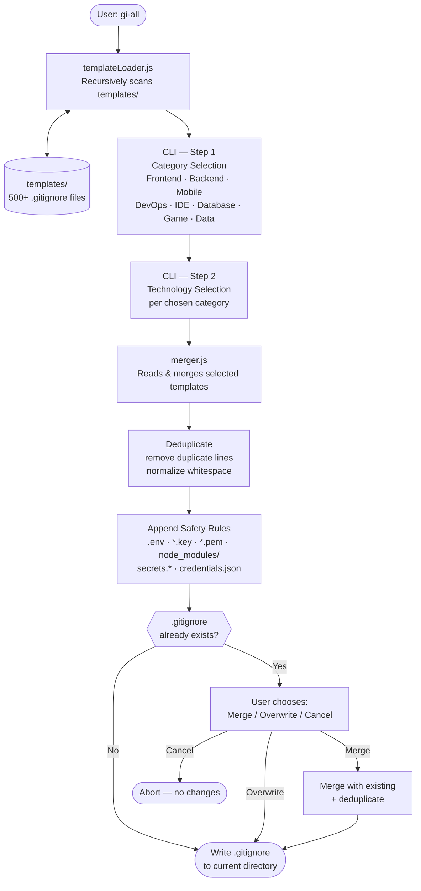

# gi-all

> **이 README를 당신의 언어로 읽으세요:**  
> [English](../README.md) · [Türkçe](README.tr.md) · [Azərbaycan](README.az.md) · [Deutsch](README.de.md) · [Français](README.fr.md) · [Español](README.es.md) · [Português](README.pt.md) · [Italiano](README.it.md) · [Nederlands](README.nl.md) · [Polski](README.pl.md) · [Русский](README.ru.md) · [Українська](README.uk.md) · [العربية](README.ar.md) · [日本語](README.ja.md) · **한국어** · [简体中文](README.zh.md) · [Svenska](README.sv.md) · [हिन्दी](README.hi.md) · [Bahasa Indonesia](README.id.md)

## 🌟 당신이 앞으로 필요한 유일한 `.gitignore` 생성기

`gi-all`은 현대적인 팀과 야심찬 개인 개발자를 위한 **모듈형, 카테고리 기반의 `.gitignore` 생성기**입니다.

하나의 방대한 "kitchen sink" 파일 대신, `gi-all`은 **수백 개의 집중된 템플릿으로 구성된 큐레이션된 라이브러리**（Angular, Unity, Android, Flutter, Node.js, Laravel, Docker 등 다수）를 제공하여 몇 초 만에 완벽한 `.gitignore`를 구성할 수 있습니다.

[](https://www.npmjs.com/package/gi-all)
[](https://www.npmjs.com/package/gi-all)
[](https://github.com/qafaraz/gi-all/stargazers)
[](https://github.com/qafaraz/gi-all/commits)
[](https://github.com/qafaraz/gi-all/commits)
[](https://github.com/qafaraz/gi-all/blob/main/LICENSE)
[](https://badge.socket.dev/npm/package/gi-all/2.1.0)

---

## 💡 왜 gi-all인가?

대부분의 `.gitignore` 생성기는 다음 두 가지 함정 중 하나에 빠집니다:

- **너무 작음**: 단일 언어를 선택해도 IDE 설정, 빌드 아티팩트, 또는 플랫폼 쓰레기를 커밋하게 됩니다.
- **너무 큼**: 인터넷에서 임의의 "mega.gitignore"를 복사하여 이해하지 못하는 **수천 개의 무관한 규칙**을 상속합니다.

`gi-all`은 다른 접근 방식을 취합니다:

- **모듈형 설계** – 모든 기술이 `templates/`의 전용 템플릿 파일에 존재합니다.
- **동적 인덱싱** – CLI가 런타임에 `templates/` 폴더를 스캔하므로 **모든 템플릿 파일이 자동으로 지원**됩니다.
- **카테고리 기반 UX** – 먼저 상위 레벨 영역（Frontend, Backend, Mobile, DevOps & Cloud, IDE & Editor, Database, Game & 3D, Data & Science, Other）을 선택한 다음 정확한 기술을 선택합니다.
- **수동 병합 없음** – 스택을 선택하면 `gi-all`이:
  - 선택된 모든 `.gitignore` 템플릿을 읽음
  - 하나의 스마트한 `.gitignore`로 병합
  - 중복 줄 및 불필요한 공백 제거
  - 일반적인 비밀 및 자격 증명 파일에 대한 필수 보안 규칙 추가

당신의 스택에 맞게 조정된 **깔끔하고 최소한이며 정확한** `.gitignore`를 얻습니다.

---

## 🛠️ 방대한 템플릿 라이브러리（500+ 템플릿）

`gi-all`은 `templates/` 아래에 **수백 개의 전용 템플릿**을 포함하여 제공됩니다:

- **프론트엔드 & Web**: React, Next.js, Angular, Vue, Svelte, Astro, Remix, Gatsby, Webpack, Vite, Tailwind CSS, Storybook…
- **모바일 & 크로스플랫폼**: Android, iOS, React Native, Flutter, Ionic, Capacitor, NativeScript…
- **백엔드 & API**: Node.js, Express, NestJS, Django, Flask, Laravel, Symfony, Spring, Rails, FastAPI…
- **게임 & 3D**: Unity, Unreal Engine, Godot, libGDX, FlaxEngine, MonoGame, PICO‑8…
- **클라우드 & DevOps**: Docker, Kubernetes, Terraform, Ansible, Vagrant, Cloudflare, Snap/Snapcraft…
- **에디터 & IDE**: VS Code, JetBrains IDEs（WebStorm, Rider 등）, Vim, Emacs, Sublime, Xcode, Android Studio, NetBeans…
- **데이터베이스**: Redis, PostgreSQL, MySQL, MongoDB, MSSQL…
- **도구 & 지식**: Obsidian/Notion 내보내기, ERP 시스템, 희귀 언어…

---

## 🛡️ 보안 우선

`.env` 파일이나 개인 키를 Git에 실수로 커밋하는 것은 비용이 많이 드는 실수입니다.

`gi-all`은 기본적으로 보안을 내장합니다:

- `.env`, `.env.*`, `*.env` 및 일반적인 환경 변수
- 개인 키 & 인증서: `*.key`, `*.pem`, `*.p12`, `*.cert`, `*.crt`, `*.pfx`, `id_rsa*`, `id_ed25519` 등
- 개발자 및 클라우드 자격 증명: `.envrc`, `.npmrc`, `.netrc`, `.aws/`, `credentials.json`
- 인프라 및 모바일 비밀: `*.tfstate`, `*.tfvars`, `*.tfplan`, `*.mobileprovision`, `GoogleService-Info.plist`
- 일반 비밀 저장소: `secrets.*`, `*.kdbx`, `serviceAccountKey.json`, `firebase-adminsdk*.json`
- `node_modules/` 및 일반 디버그 로그
- `.DS_Store` 같은 OS/에디터 노이즈

---

## ⚙️ 작동 방식

- **스캔**: 시작 시 `gi-all`은 `templates/` 폴더를 동적으로 스캔하고 카탈로그를 구축합니다.
- **1단계 – 카테고리**: CLI가 프로젝트에서 사용하는 영역을 묻습니다.
- **2단계 – 기술**: 선택한 카테고리에 대해 정확한 기술을 선택합니다.
- **처리**: 읽기, 병합, 중복 제거, 보안 규칙 추가.
- **출력**: **현재 작업 디렉토리**에 단일 `.gitignore` 파일로 씁니다.
- **충돌**: `.gitignore`가 이미 존재하는 경우, `gi-all`은 묻습니다: **Merge**, **Overwrite**, 또는 **Cancel**.

---

## 📦 설치

Node.js `>=22.0.0`이 필요합니다（Node 22 또는 24 LTS 권장）.

### 1회 사용（권장）

```bash
npx gi-all
```

### 전역 설치

```bash
npm install -g gi-all
```

그런 다음 간단히 실행:

```bash
gi-all
```

---

## 🧪 사용법

프로젝트 루트에서:

```bash
gi-all
```

카테고리와 기술 선택이 안내됩니다. `gi-all`은 해당 템플릿을 읽고, 병합하고, 보안 규칙을 추가하고 `.gitignore` 파일을 씁니다.

---

## Architecture



### Module Responsibilities

| Module | Responsibility |
|---|---|
| `src/cli.js` | User-facing entry point. Two-step interactive UI (categories → technologies). Conflict resolution. |
| `src/core/templateLoader.js` | Scans `templates/` recursively. Indexes every `.gitignore` file. Assigns category by filename. |
| `src/core/merger.js` | Merges multiple templates. Deduplicates lines. Appends mandatory safety rules. |

---

## 🤝 기여

`gi-all`은 `.gitignore` 모범 사례의 **커뮤니티 주도 카탈로그**로 설계되었습니다.

📚 Wiki: 
https://github.com/qafaraz/gi-all/discussions
### 새 템플릿 추가

1. 저장소를 **Fork** 합니다
2. `templates/` 아래에 새 `.gitignore` 파일을 생성합니다
3. 해당 기술에 대한 집중적이고 고품질의 규칙을 추가합니다
4. 간단한 설명과 함께 pull request를 엽니다

---

## 📜 라이선스

[MIT](../LICENSE) — 오픈소스 커뮤니티를 위해 **[Qafar](https://github.com/qafaraz)**가 만들었습니다.
