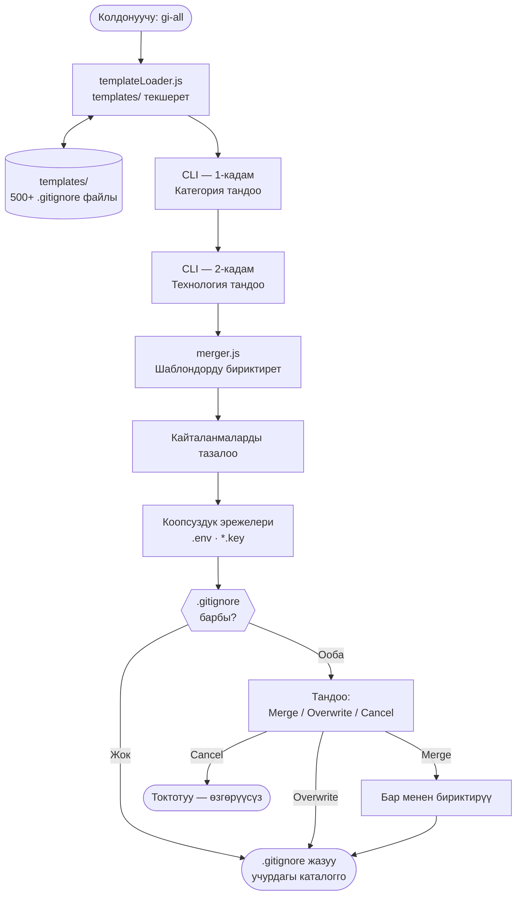

# gi-all

> **Бул README'ни өз тилиңизде окуңуз:**  
> [English](../README.md) · [Türkçe](README.tr.md) · [Azərbaycan](README.az.md) · [O'zbekcha](README.uz.md) · [Қазақша](README.kk.md) · **Кыргызча** · [Türkmençe](README.tk.md) · [Deutsch](README.de.md) · [Français](README.fr.md) · [Español](README.es.md) · [Português](README.pt.md) · [Italiano](README.it.md) · [Română](README.ro.md) · [Nederlands](README.nl.md) · [Polski](README.pl.md) · [Русский](README.ru.md) · [Українська](README.uk.md) · [Svenska](README.sv.md) · [Tiếng Việt](README.vi.md) · [Bahasa Indonesia](README.id.md) · [ภาษาไทย](README.th.md) · [فارسی](README.fa.md) · [العربية](README.ar.md) · [हिन्दी](README.hi.md) · [বাংলা](README.bn.md) · [日本語](README.ja.md) · [한국어](README.ko.md) · [简体中文](README.zh.md)

## 🌟 Сизге керек боло турган жалгыз `.gitignore` генератору

`gi-all` — заманбап командалар жана жеке иштеп чыгуучулар үчүн иштелип чыккан **модулдук, категорияларга негизделген `.gitignore` генератору**.

Бир чоң, башаламан "mega.gitignore" файлынын ордуна, `gi-all` сизге **жүздөгөн атайын шаблондордон турган китепкананы** (Angular, Unity, Android, Flutter, Node.js, Laravel, Docker жана башкалар) сунуштайт жана аларды бир нече секундда өзүңүздүн стекке шайкеш бириктирүүгө мүмкүндүк берет.

[](https://www.npmjs.com/package/gi-all)
[](https://www.npmjs.com/package/gi-all)
[](https://github.com/qafaraz/gi-all/stargazers)
[](https://github.com/qafaraz/gi-all/commits)
[](https://github.com/qafaraz/gi-all/commits)
[](https://github.com/qafaraz/gi-all/blob/main/LICENSE)
[](https://badge.socket.dev/npm/package/gi-all/2.1.0)

---

## 💡 Эмне үчүн gi-all?

- **Өтө кичине**: Бир гана тилди тандайсыз, бирок IDE жөндөөлөрү же куруу файлдары репозиторийге кирип кетет.
- **Өтө чоң**: Интернеттен кокус "mega.gitignore" көчүрүп алып, маанисин билбеген **миңдеген керексиз эрежелерди** долбоорго кошуп аласыз.

`gi-all` таптакыр башкача ыкманы сунуштайт:

- **Модулдук дизайн** – Ар бир технология `templates/` папкасындагы өзүнүн атайын `.gitignore` шаблонунда сакталат.
- **Динамикалык индекстөө** – CLI ишке киргенде `templates/` папкасын текшерет; **ар бир шаблон файлы автоматтык түрдө колдоого алынат**.
- **Категорияларга негизделген UX** – Алгач жалпы багыттарды тандайсыз (Frontend, Backend, Mobile, DevOps & Cloud, IDE & Editor, Database, Game & 3D, Data & Science, Other), андан соң накта технологияларды белгилейсиз.
- **Кол менен бириктирүүнүн кажети жок** – Өз стегиңизди тандаңыз, `gi-all` баарын өзү бириктирип, кайталанмаларды жок кылат.
  - Тандалган бардык `.gitignore` шаблондорун окуйт
  - Аларды бир акылдуу `.gitignore` файлына бириктирет
  - Кайталанган саптарды жана ашыкча боштуктарды тазалайт
  - Жашыруун жана коопсуздук маалыматтары үчүн милдеттүү эрежелерди кошот

Жыйынтык: Сиздин стегиңизге **ылайыкташтырылган, таза жана так** `.gitignore`.

---

## 🛠️ Чоң шаблондор китепканасы (500+ шаблон)

`gi-all` `templates/` ичинде **жүздөгөн атайын шаблондор** менен келет:

- **Frontend & Web**: React, Next.js, Angular, Vue, Svelte, Astro, Remix, Gatsby, Webpack, Vite, Tailwind CSS, Storybook…
- **Mobile & Cross‑platform**: Android, iOS, React Native, Flutter, Ionic, Capacitor, NativeScript…
- **Backend & API**: Node.js, Express, NestJS, Django, Flask, Laravel, Symfony, Spring, Rails, FastAPI…
- **Game & 3D**: Unity, Unreal Engine, Godot, libGDX, FlaxEngine, MonoGame, PICO‑8…
- **Cloud & DevOps**: Docker, Kubernetes, Terraform, Ansible, Vagrant, Cloudflare, Snap/Snapcraft…
- **Редакторлор жана IDE**: VS Code, JetBrains IDE'лери, Vim, Emacs, Sublime, Xcode, Android Studio, NetBeans…
- **Маалымат базалары**: Redis, PostgreSQL, MySQL, MongoDB, MSSQL…
- **Куралдар жана билимдер базасы**: Obsidian/Notion экспорттору, ERP системалары, өзгөчө программалоо тилдери…

Ар бир технологиянын **өзүнүн `.gitignore` файлы** бар. CLI ар бир файлды рекурсивдүү түрдө индекстейт.

---

## 🛡️ Демейки коопсуздук катмары

`.env` файлдарын же жеке ачкычтарды байкабай Git'ке жүктөө – чоң ката. `gi-all` коопсуздукту автоматтык түрдө камсыз кылат:

- `.env`, `.env.*`, `*.env` жана чөйрөнүн башка варианттары
- Жеке жашыруун ачкычтар: `*.key`, `*.pem`, `*.p12`, `*.cert`, `*.crt`, `*.pfx`, `id_rsa*`, `id_ed25519` ж.б.
- Иштеп чыгуучунун маалыматтары: `.envrc`, `.npmrc`, `.netrc`, `.aws/`, `credentials.json`
- Инфраструктуралык сырлар: `*.tfstate`, `*.tfvars`, `*.tfplan`, `*.mobileprovision`, `GoogleService-Info.plist`
- Сырлардын жалпы сактагычтары: `secrets.*`, `*.kdbx`, `serviceAccountKey.json`, `firebase-adminsdk*.json`
- `node_modules/` жана жөндөө журналдары
- Системалык файлдар: `.DS_Store` ж.б.

> `gi-all` купуя файлдарды кокустан жүктөө коркунучун кыйла азайтат, бирок долбооруңузга мүнөздүү файлдарды өзүңүз да текшерип турууну сунуштайбыз.

---

## ⚙️ Кантип иштейт?

- **Скандоо**: CLI `templates/` папкасын текшерип, бардык `.gitignore` файлдарын табат.
- **1-кадам – Категорияларды тандоо**: Долбооруңузда колдонулган багыттарды белгилейсиз.
- **2-кадам – Технологияларды тандоо**: Тандалган багыттар боюнча керектүү куралдарды тандайсыз.
- **Иштетүү**: Бардык шаблондорду бириктирет, тазалайт жана коопсуздук эрежелерин кошот.
- **Чыгаруу**: Учурдагы каталогдо бир `.gitignore` файлы түзүлөт.
- **Карама-каршылыктарды чечүү:**
    - **Merge**: Мурдагы эрежелерди сактап, жаңыларды кошуу.
    - **Overwrite**: `.gitignore` файлын толугу менен алмаштыруу.
    - **Cancel**: Өзгөртүүсүз чыгуу.
  - Коопсуздук үчүн `gi-all` символикалык шилтемелерге жазуудан баш тартат.

---

## 📦 Орнотуу

Node.js `>=22.0.0` талап кылынат (Node 22 же 24 LTS сунушталат).

### One‑shot

```bash
# npm
npx gi-all

# yarn
yarn dlx gi-all

# pnpm
pnpm dlx gi-all

# bun
bunx gi-all
```

### Global install

```bash
# npm
npm install -g gi-all

# yarn
yarn global add gi-all

# pnpm
pnpm install -g gi-all

# bun
bun add -g gi-all
```

```bash
gi-all
```

---

## 🧪 Колдонуу: Саналуу секунддарда `.gitignore` даярдоо

Долбоордун түпкү каталогунда төмөнкү буйрукту аткарыңыз:

```bash
gi-all
```

1. **Категорияларды тандоо** (Frontend, Backend, Mobile, DevOps, IDE, Database, Game, Data, Other)
2. Ошол категориялар ичинен **технологияларды тандоо**

`gi-all` төмөнкүлөрдү аткарат:

1. `templates/` папкасынан шаблондорду окуйт
2. Эрежелерди бириктирет жана тазалайт
3. Коопсуздук эрежелерин кошот
4. Жыйынтыкты **`.gitignore`** файлына жазат

---

## Архитектура



### Модулдардын милдеттери

| Модуль | Милдети |
|---|---|
| `src/cli.js` | Колдонуучу интерфейси. Интерактивдүү меню. |
| `src/core/templateLoader.js` | `templates/` папкасын индекстейт. |
| `src/core/merger.js` | Шаблондорду бириктирет жана коопсуздук эрежелерин кошот. |

---

## 🤝 Салым кошуу

`gi-all` ачык коомчулук менен биргеликте өнүгөт.

📚 Wiki: https://github.com/qafaraz/gi-all/wiki  
💬 Талкуулар: https://github.com/qafaraz/gi-all/discussions

### Жаңы шаблон кошуу

1. Репозиторийди **Fork** кылыңыз
2. `templates/` папкасында жаңы `.gitignore` файлын түзүңүз
3. Ошол технологияга тиешелүү эрежелерди жазыңыз
4. Pull Request жөнөтүңүз

CLI файлдарды автоматтык түрдө табат; `src/` кодуна өзгөртүү киргизүү талап кылынбайт.

---

## 📜 Лицензия

[MIT](../LICENSE) — **[Qafar](https://github.com/qafaraz)** тарабынан түзүлгөн.
