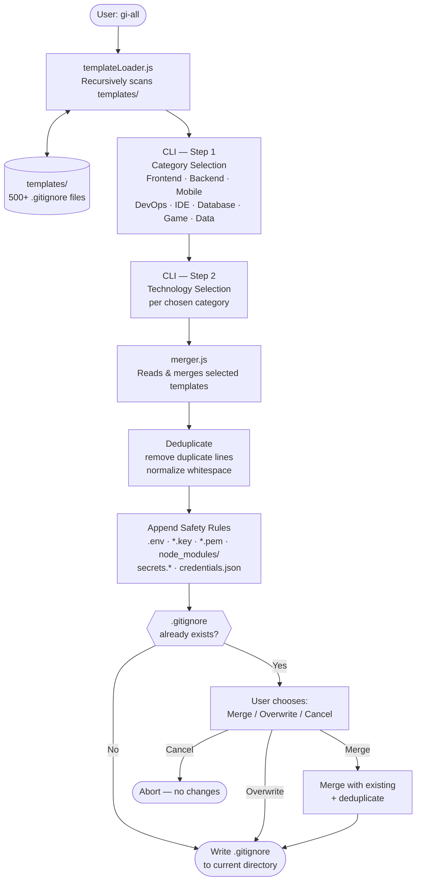

# gi-all

> **Lees deze README in jouw taal:**  
> [English](../README.md) · [Türkçe](README.tr.md) · [Azərbaycan](README.az.md) · [O'zbekcha](README.uz.md) · [Қазақша](README.kk.md) · [Кыргызча](README.ky.md) · [Türkmençe](README.tk.md) · [Deutsch](README.de.md) · [Français](README.fr.md) · [Español](README.es.md) · [Português](README.pt.md) · [Italiano](README.it.md) · [Română](README.ro.md) · **Nederlands** · [Polski](README.pl.md) · [Русский](README.ru.md) · [Українська](README.uk.md) · [Svenska](README.sv.md) · [Tiếng Việt](README.vi.md) · [Bahasa Indonesia](README.id.md) · [ภาษาไทย](README.th.md) · [فارسی](README.fa.md) · [العربية](README.ar.md) · [हिन्दी](README.hi.md) · [বাংলা](README.bn.md) · [日本語](README.ja.md) · [한국어](README.ko.md) · [简体中文](README.zh.md)

## 🌟 De enige `.gitignore`-generator die je ooit nodig zult hebben

`gi-all` is een **modulaire, categoriegebaseerde `.gitignore`-generator** voor moderne teams en ambitieuze soloontwikkelaars.

In plaats van één opgeblazen "kitchen sink"-bestand biedt `gi-all` een **samengestelde bibliotheek van honderden gerichte templates** (Angular, Unity, Android, Flutter, Node.js, Laravel, Docker en veel meer) om in seconden het perfecte `.gitignore` samen te stellen.

[](https://www.npmjs.com/package/gi-all)
[](https://www.npmjs.com/package/gi-all)
[](https://github.com/qafaraz/gi-all/stargazers)
[](https://github.com/qafaraz/gi-all/commits)
[](https://github.com/qafaraz/gi-all/commits)
[](https://github.com/qafaraz/gi-all/blob/main/LICENSE)
[](https://badge.socket.dev/npm/package/gi-all/2.1.0)

---

## 💡 Waarom gi-all?

De meeste `.gitignore`-generators vallen in een van deze twee valkuilen:

- **Te klein**: je kiest een enkele taal en commit toch nog IDE-configs, buildartefacten of platformrommel.
- **Te groot**: je kopieert een willekeurig "mega.gitignore" van internet en erft **duizenden irrelevante regels** die je niet begrijpt.

`gi-all` kiest een andere aanpak:

- **Modulair by design** – Elke technologie leeft in zijn eigen toegewijde template in `templates/`.
- **Dynamische indexering** – De CLI scant de map `templates/` tijdens runtime, zodat **elk templatebestand automatisch wordt ondersteund**.
- **Categoriegebaseerde UX** – Kies eerst hoofd-niveaugebieden (Frontend, Backend, Mobile, DevOps & Cloud, IDE & Editor, Database, Game & 3D, Data & Science, Other), dan de exacte technologieën.
- **Nul handmatig samenvoegen** – Kies je stack en `gi-all`:
  - Leest alle geselecteerde `.gitignore`-templates
  - Voegt ze samen tot één slim `.gitignore`
  - Verwijdert dubbele regels en overbodige witruimte
  - Voegt verplichte beveiligingsregels toe voor veelvoorkomende geheime bestanden

Je krijgt een **schone, minimale en nauwkeurige** `.gitignore` op maat van je stack.

---

## 🛠️ Enorme templatebibliotheek (500+)

`gi-all` wordt geleverd met **honderden toegewijde templates** onder `templates/`, waaronder:

- **Frontend & Web**: React, Next.js, Angular, Vue, Svelte, Astro, Remix, Gatsby, Webpack, Vite, Tailwind CSS, Storybook…
- **Mobile & Cross‑platform**: Android, iOS, React Native, Flutter, Ionic, Capacitor, NativeScript…
- **Backend & API's**: Node.js, Express, NestJS, Django, Flask, Laravel, Symfony, Spring, Rails, FastAPI…
- **Game & 3D**: Unity, Unreal Engine, Godot, libGDX, FlaxEngine, MonoGame, PICO‑8…
- **Cloud & DevOps**: Docker, Kubernetes, Terraform, Ansible, Vagrant, Cloudflare, Snap/Snapcraft…
- **Editors & IDE's**: VS Code, JetBrains IDEs (WebStorm, Rider, enz.), Vim, Emacs, Sublime, Xcode, Android Studio, NetBeans…
- **Databases**: Redis, PostgreSQL, MySQL, MongoDB, MSSQL…
- **Kennis & Tools**: Obsidian/Notion-exports, ERP-systemen, exotische talen…

---

## 🛡️ Veiligheid eerst

Het per ongeluk committen van `.env`-bestanden of privésleutels in Git is een kostbare fout.

`gi-all` bouwt standaard beveiliging in:

- `.env`, `.env.*`, `*.env` en veelvoorkomende omgevingsvarianten
- Privésleutels & certificaten: `*.key`, `*.pem`, `*.p12`, `*.cert`, `*.crt`, `*.pfx`, `id_rsa*`, `id_ed25519`, enz.
- Ontwikkelaars- en cloudgegevens: `.envrc`, `.npmrc`, `.netrc`, `.aws/`, `credentials.json`
- Infrastructuur- en mobielegeheimen: `*.tfstate`, `*.tfvars`, `*.tfplan`, `*.mobileprovision`, `GoogleService-Info.plist`
- Generieke geheimopslagplaatsen: `secrets.*`, `*.kdbx`, `serviceAccountKey.json`, `firebase-adminsdk*.json`
- `node_modules/` en veelvoorkomende debuglogs
- OS/editor-ruis zoals `.DS_Store`

---

## ⚙️ Hoe het werkt

- **Scannen**: bij het starten scant `gi-all` dynamisch de map `templates/` en bouwt een catalogus.
- **Stap 1 – Categorieën**: de CLI vraagt welke gebieden je project gebruikt.
- **Stap 2 – Technologieën**: voor de gekozen categorieën selecteer je de exacte technologieën.
- **Verwerking**: leest, voegt samen, dedupliceert en voegt beveiligingsregels toe.
- **Uitvoer**: schrijft het resultaat naar één `.gitignore`-bestand in je **huidige werkmap**.
- **Conflicten**: als er al een `.gitignore` bestaat, vraagt `gi-all`: **Merge**, **Overwrite** of **Cancel**.

---

## 📦 Installatie

Vereist Node.js `>=22.0.0` (Node 22 of 24 LTS aanbevolen).

### Eenmalig gebruik (aanbevolen)

```bash
npx gi-all
```

### Globale installatie

```bash
npm install -g gi-all
```

Dan gewoon uitvoeren:

```bash
gi-all
```

---

## 🧪 Gebruik

Vanuit de root van je project:

```bash
gi-all
```

Je wordt begeleid bij het kiezen van categorieën en technologieën. `gi-all` leest de bijbehorende templates, voegt ze samen, voegt beveiligingsregels toe en schrijft het `.gitignore`-bestand.

---

## Architecture



### Module Responsibilities

| Module | Responsibility |
|---|---|
| `src/cli.js` | User-facing entry point. Two-step interactive UI (categories → technologies). Conflict resolution. |
| `src/core/templateLoader.js` | Scans `templates/` recursively. Indexes every `.gitignore` file. Assigns category by filename. |
| `src/core/merger.js` | Merges multiple templates. Deduplicates lines. Appends mandatory safety rules. |

---

## 🤝 Bijdragen

`gi-all` is ontworpen als een **community-gedreven catalogus** van `.gitignore`-best practices.

📚 Wiki: 
https://github.com/qafaraz/gi-all/discussions
### Een nieuw template toevoegen

1. **Fork** de repository
2. Maak een nieuw `.gitignore`-bestand aan onder `templates/`
3. Voeg gerichte, hoogwaardige regels toe voor die technologie
4. Open een pull request met een korte beschrijving

---

## 📜 Licentie

[MIT](../LICENSE) — gemaakt voor de open source-gemeenschap door **[Qafar](https://github.com/qafaraz)**.
