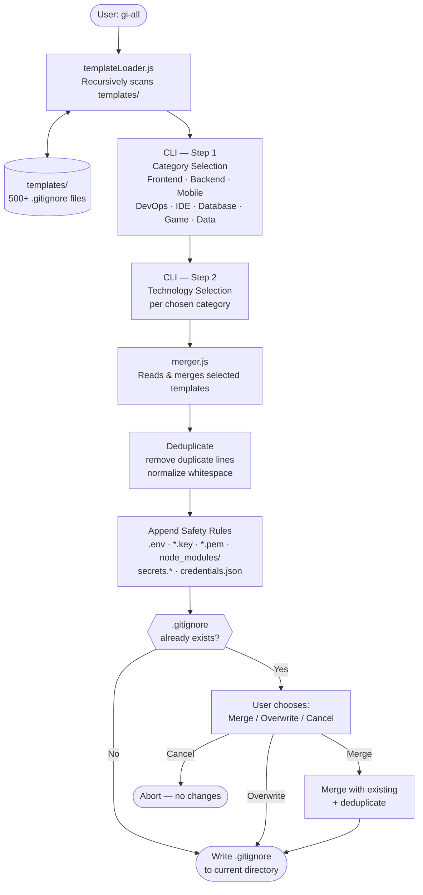

# gi-all

> **Przeczytaj ten README w swoim języku:**  
> [English](../README.md) · [Türkçe](README.tr.md) · [Azərbaycan](README.az.md) · [O'zbekcha](README.uz.md) · [Қазақша](README.kk.md) · [Кыргызча](README.ky.md) · [Türkmençe](README.tk.md) · [Deutsch](README.de.md) · [Français](README.fr.md) · [Español](README.es.md) · [Português](README.pt.md) · [Italiano](README.it.md) · [Română](README.ro.md) · [Nederlands](README.nl.md) · **Polski** · [Русский](README.ru.md) · [Українська](README.uk.md) · [Svenska](README.sv.md) · [Tiếng Việt](README.vi.md) · [Bahasa Indonesia](README.id.md) · [ภาษาไทย](README.th.md) · [فارسی](README.fa.md) · [العربية](README.ar.md) · [हिन्दी](README.hi.md) · [বাংলা](README.bn.md) · [日本語](README.ja.md) · [한국어](README.ko.md) · [简体中文](README.zh.md)

## 🌟 Jedyny generator `.gitignore`, którego kiedykolwiek będziesz potrzebować

`gi-all` to **modularny, oparty na kategoriach generator `.gitignore`** dla nowoczesnych zespołów i ambitnych solowych deweloperów.

Zamiast jednego, rozdętego pliku „kitchen sink", `gi-all` oferuje **wyselekcjonowaną bibliotekę setek ukierunkowanych szablonów** (Angular, Unity, Android, Flutter, Node.js, Laravel, Docker i wiele więcej) — pozwalając złożyć idealne `.gitignore` w kilka sekund.

[](https://www.npmjs.com/package/gi-all)
[](https://www.npmjs.com/package/gi-all)
[](https://github.com/qafaraz/gi-all/stargazers)
[](https://github.com/qafaraz/gi-all/commits)
[](https://github.com/qafaraz/gi-all/commits)
[](https://github.com/qafaraz/gi-all/blob/main/LICENSE)
[](https://badge.socket.dev/npm/package/gi-all/2.1.0)

---

## 💡 Dlaczego gi-all?

Większość generatorów `.gitignore` wpada w jedną z dwóch pułapek:

- **Za mały**: wybierasz jeden język i i tak kończysz z commitowaniem konfiguracji IDE, artefaktów buildu lub śmieci platformowych.
- **Za duży**: kopiujesz losowy „mega.gitignore" z internetu i dziedziczysz **tysiące nieistotnych reguł**, których nie rozumiesz.

`gi-all` stosuje inne podejście:

- **Modularny z założenia** – Każda technologia żyje we własnym dedykowanym szablonie w `templates/`.
- **Dynamiczne indeksowanie** – CLI skanuje folder `templates/` w czasie wykonania, więc **każdy plik szablonu jest automatycznie obsługiwany**.
- **UX oparta na kategoriach** – Najpierw wybierz obszary wysokiego poziomu (Frontend, Backend, Mobile, DevOps & Cloud, IDE & Editor, Database, Game & 3D, Data & Science, Other), a następnie dokładne technologie.
- **Zero ręcznego scalania** – Wybierz swój stack i `gi-all`:
  - Odczytuje wszystkie wybrane szablony `.gitignore`
  - Scala je w jedno sprytne `.gitignore`
  - Usuwa zduplikowane linie i zbędne białe znaki
  - Dodaje obowiązkowe reguły bezpieczeństwa dla typowych plików tajnych

Otrzymujesz **czyste, minimalne i precyzyjne** `.gitignore` dopasowane do twojego stacku.

---

## 🛠️ Ogromna biblioteka szablonów (500+)

`gi-all` jest dostarczany z **setkami dedykowanych szablonów** w `templates/`, w tym:

- **Frontend & Web**: React, Next.js, Angular, Vue, Svelte, Astro, Remix, Gatsby, Webpack, Vite, Tailwind CSS, Storybook…
- **Mobile & Cross‑platform**: Android, iOS, React Native, Flutter, Ionic, Capacitor, NativeScript…
- **Backend & API**: Node.js, Express, NestJS, Django, Flask, Laravel, Symfony, Spring, Rails, FastAPI…
- **Game & 3D**: Unity, Unreal Engine, Godot, libGDX, FlaxEngine, MonoGame, PICO‑8…
- **Cloud & DevOps**: Docker, Kubernetes, Terraform, Ansible, Vagrant, Cloudflare, Snap/Snapcraft…
- **Edytory & IDE**: VS Code, JetBrains IDEs (WebStorm, Rider itp.), Vim, Emacs, Sublime, Xcode, Android Studio, NetBeans…
- **Bazy danych**: Redis, PostgreSQL, MySQL, MongoDB, MSSQL…
- **Narzędzia & Wiedza**: Eksporty Obsidian/Notion, systemy ERP, egzotyczne języki…

---

## 🛡️ Bezpieczeństwo przede wszystkim

Przypadkowe wypchnięcie plików `.env` lub kluczy prywatnych do Gita to kosztowny błąd.

`gi-all` wbudowuje bezpieczeństwo domyślnie:

- `.env`, `.env.*`, `*.env` i typowe warianty środowiskowe
- Klucze prywatne i certyfikaty: `*.key`, `*.pem`, `*.p12`, `*.cert`, `*.crt`, `*.pfx`, `id_rsa*`, `id_ed25519` itp.
- Poświadczenia deweloperskie i chmurowe: `.envrc`, `.npmrc`, `.netrc`, `.aws/`, `credentials.json`
- Sekrety infrastruktury i mobilne: `*.tfstate`, `*.tfvars`, `*.tfplan`, `*.mobileprovision`, `GoogleService-Info.plist`
- Ogólne magazyny sekretów: `secrets.*`, `*.kdbx`, `serviceAccountKey.json`, `firebase-adminsdk*.json`
- `node_modules/` i typowe logi debugowania
- Hałas OS/edytora jak `.DS_Store`

---

## ⚙️ Jak to działa

- **Skanowanie**: przy uruchomieniu `gi-all` dynamicznie skanuje folder `templates/` i buduje katalog.
- **Krok 1 – Kategorie**: CLI pyta, jakich obszarów używa twój projekt.
- **Krok 2 – Technologie**: dla wybranych kategorii zaznaczasz dokładne technologie.
- **Przetwarzanie**: odczytuje, scala, deduplikuje i dodaje reguły bezpieczeństwa.
- **Wyjście**: zapisuje wynik do jednego pliku `.gitignore` w twoim **bieżącym katalogu roboczym**.
- **Konflikty**: jeśli `.gitignore` już istnieje, `gi-all` pyta: **Merge**, **Overwrite** lub **Cancel**.

---

## 📦 Instalacja

Wymaga Node.js `>=22.0.0` (zalecany Node 22 lub 24 LTS).

### Jednorazowe użycie (zalecane)

```bash
npx gi-all
```

### Instalacja globalna

```bash
npm install -g gi-all
```

Następnie po prostu uruchom:

```bash
gi-all
```

---

## 🧪 Użycie

Z katalogu głównego projektu:

```bash
gi-all
```

Zostaniesz przeprowadzony przez wybór kategorii i technologii. `gi-all` odczyta odpowiednie szablony, scali je, doda reguły bezpieczeństwa i zapisze plik `.gitignore`.

---

## Architecture



### Module Responsibilities

| Module | Responsibility |
|---|---|
| `src/cli.js` | User-facing entry point. Two-step interactive UI (categories → technologies). Conflict resolution. |
| `src/core/templateLoader.js` | Scans `templates/` recursively. Indexes every `.gitignore` file. Assigns category by filename. |
| `src/core/merger.js` | Merges multiple templates. Deduplicates lines. Appends mandatory safety rules. |

---

## 🤝 Współtworzenie

`gi-all` jest zaprojektowany jako **społecznościowy katalog** najlepszych praktyk `.gitignore`.

📚 Wiki: 
https://github.com/qafaraz/gi-all/discussions
### Dodawanie nowego szablonu

1. **Forkuj** repozytorium
2. Utwórz nowy plik `.gitignore` w `templates/`
3. Dodaj skupione, wysokiej jakości reguły dla tej technologii
4. Otwórz pull request z krótkim opisem

---

## 📜 Licencja

[MIT](../LICENSE) — stworzone dla społeczności open source przez **[Qafar](https://github.com/qafaraz)**.
