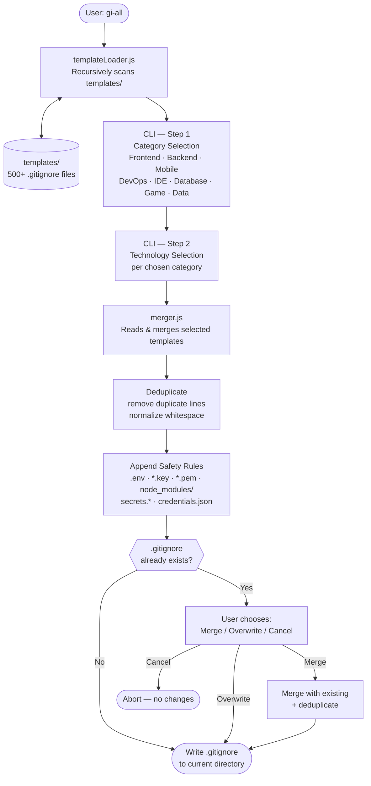

# gi-all

> **Leia este README no seu idioma:**  
> [English](../README.md) · [Türkçe](README.tr.md) · [Azərbaycan](README.az.md) · [O'zbekcha](README.uz.md) · [Қазақша](README.kk.md) · [Кыргызча](README.ky.md) · [Türkmençe](README.tk.md) · [Deutsch](README.de.md) · [Français](README.fr.md) · [Español](README.es.md) · **Português** · [Italiano](README.it.md) · [Română](README.ro.md) · [Nederlands](README.nl.md) · [Polski](README.pl.md) · [Русский](README.ru.md) · [Українська](README.uk.md) · [Svenska](README.sv.md) · [Tiếng Việt](README.vi.md) · [Bahasa Indonesia](README.id.md) · [ภาษาไทย](README.th.md) · [فارسی](README.fa.md) · [العربية](README.ar.md) · [हिन्दी](README.hi.md) · [বাংলা](README.bn.md) · [日本語](README.ja.md) · [한국어](README.ko.md) · [简体中文](README.zh.md)

## 🌟 O único gerador de `.gitignore` que você jamais precisará

`gi-all` é um **gerador de `.gitignore` modular e baseado em categorias** para equipes modernas e desenvolvedores solo ambiciosos.

Em vez de um único arquivo "kitchen sink" inflado, `gi-all` oferece uma **biblioteca curada de centenas de templates focados** (Angular, Unity, Android, Flutter, Node.js, Laravel, Docker e muito mais) para compor o `.gitignore` perfeito em segundos.

[](https://www.npmjs.com/package/gi-all)
[](https://www.npmjs.com/package/gi-all)
[](https://github.com/qafaraz/gi-all/stargazers)
[](https://github.com/qafaraz/gi-all/commits)
[](https://github.com/qafaraz/gi-all/commits)
[](https://github.com/qafaraz/gi-all/blob/main/LICENSE)
[](https://badge.socket.dev/npm/package/gi-all/2.1.0)

---

## 💡 Por que gi-all?

A maioria dos geradores de `.gitignore` cai em uma dessas duas armadilhas:

- **Muito pequeno**: você escolhe uma única linguagem e ainda acaba commitando configs de IDE, artefatos de build ou lixo de plataforma.
- **Muito grande**: você copia um "mega.gitignore" aleatório da internet e herda **milhares de regras irrelevantes** que não entende.

`gi-all` adota uma abordagem diferente:

- **Modular por design** – Cada tecnologia vive em seu próprio template dedicado em `templates/`.
- **Indexação dinâmica** – O CLI escaneia a pasta `templates/` em tempo de execução, então **cada arquivo de template é automaticamente suportado**.
- **UX baseada em categorias** – Primeiro selecione áreas de alto nível (Frontend, Backend, Mobile, DevOps & Cloud, IDE & Editor, Database, Game & 3D, Data & Science, Other), depois as tecnologias exatas.
- **Zero fusão manual** – Escolha seu stack e `gi-all`:
  - Lê todos os templates `.gitignore` selecionados
  - Mescla-os em um único `.gitignore` inteligente
  - Remove linhas duplicadas e espaços desnecessários
  - Adiciona regras de segurança obrigatórias para arquivos secretos comuns

Você obtém um `.gitignore` **limpo, mínimo e preciso** adaptado ao seu stack.

---

## 🛠️ Enorme biblioteca de templates (500+)

`gi-all` vem com **centenas de templates dedicados** sob `templates/`, incluindo:

- **Frontend & Web**: React, Next.js, Angular, Vue, Svelte, Astro, Remix, Gatsby, Webpack, Vite, Tailwind CSS, Storybook…
- **Mobile & Cross‑platform**: Android, iOS, React Native, Flutter, Ionic, Capacitor, NativeScript…
- **Backend & APIs**: Node.js, Express, NestJS, Django, Flask, Laravel, Symfony, Spring, Rails, FastAPI…
- **Game & 3D**: Unity, Unreal Engine, Godot, libGDX, FlaxEngine, MonoGame, PICO‑8…
- **Cloud & DevOps**: Docker, Kubernetes, Terraform, Ansible, Vagrant, Cloudflare, Snap/Snapcraft…
- **Editores & IDEs**: VS Code, JetBrains IDEs (WebStorm, Rider, etc.), Vim, Emacs, Sublime, Xcode, Android Studio, NetBeans…
- **Bancos de dados**: Redis, PostgreSQL, MySQL, MongoDB, MSSQL…
- **Ferramentas & Conhecimento**: Exportações do Obsidian/Notion, sistemas ERP, linguagens exóticas…

---

## 🛡️ Segurança em primeiro lugar

Vazar arquivos `.env` ou chaves privadas no Git é um erro custoso.

`gi-all` integra segurança por padrão:

- `.env`, `.env.*`, `*.env` e variantes de ambiente comuns
- Chaves privadas e certificados: `*.key`, `*.pem`, `*.p12`, `*.cert`, `*.crt`, `*.pfx`, `id_rsa*`, `id_ed25519`, etc.
- Credenciais de desenvolvedor e cloud: `.envrc`, `.npmrc`, `.netrc`, `.aws/`, `credentials.json`
- Secrets de infraestrutura e mobile: `*.tfstate`, `*.tfvars`, `*.tfplan`, `*.mobileprovision`, `GoogleService-Info.plist`
- Armazenamentos de secrets: `secrets.*`, `*.kdbx`, `serviceAccountKey.json`, `firebase-adminsdk*.json`
- `node_modules/` e logs de debug comuns
- Ruído de OS/editor como `.DS_Store`

---

## ⚙️ Como funciona

- **Varredura**: ao iniciar, `gi-all` escaneia dinamicamente a pasta `templates/` e constrói um catálogo.
- **Passo 1 – Categorias**: o CLI pergunta quais áreas seu projeto usa.
- **Passo 2 – Tecnologias**: para as categorias escolhidas, você seleciona as tecnologias exatas.
- **Processamento**: lê, mescla, deduplica e adiciona regras de segurança.
- **Saída**: escreve o resultado em um único arquivo `.gitignore` no seu **diretório de trabalho atual**.
- **Conflitos**: se um `.gitignore` já existe, `gi-all` pergunta: **Merge**, **Overwrite** ou **Cancel**.

---

## 📦 Instalação

Requer Node.js `>=22.0.0` (Node 22 ou 24 LTS recomendado).

### Uso único (recomendado)

```bash
npx gi-all
```

### Instalação global

```bash
npm install -g gi-all
```

Depois simplesmente execute:

```bash
gi-all
```

---

## 🧪 Uso

Da raiz do seu projeto:

```bash
gi-all
```

Você será guiado para escolher categorias e tecnologias. `gi-all` lerá os templates correspondentes, mesclará, adicionará regras de segurança e escreverá o arquivo `.gitignore`.

---

## Architecture



### Module Responsibilities

| Module | Responsibility |
|---|---|
| `src/cli.js` | User-facing entry point. Two-step interactive UI (categories → technologies). Conflict resolution. |
| `src/core/templateLoader.js` | Scans `templates/` recursively. Indexes every `.gitignore` file. Assigns category by filename. |
| `src/core/merger.js` | Merges multiple templates. Deduplicates lines. Appends mandatory safety rules. |

---

## 🤝 Contribuir

`gi-all` foi projetado para ser um **catálogo impulsionado pela comunidade** das melhores práticas de `.gitignore`.

📚 Wiki: 
https://github.com/qafaraz/gi-all/discussions
### Adicionar um novo template

1. **Faça um fork** do repositório
2. Crie um novo arquivo `.gitignore` sob `templates/`
3. Adicione regras focadas e de alta qualidade para essa tecnologia
4. Abra um pull request com uma breve descrição

---

## 📜 Licença

[MIT](../LICENSE) — criado para a comunidade open source por **[Qafar](https://github.com/qafaraz)**.
