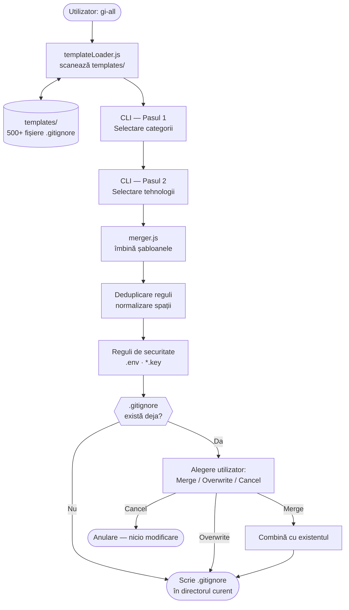

# gi-all

> **Citiți acest README în limba dumneavoastră:**  
> [English](../README.md) · [Türkçe](README.tr.md) · [Azərbaycan](README.az.md) · [O'zbekcha](README.uz.md) · [Қазақша](README.kk.md) · [Кыргызча](README.ky.md) · [Türkmençe](README.tk.md) · [Deutsch](README.de.md) · [Français](README.fr.md) · [Español](README.es.md) · [Português](README.pt.md) · [Italiano](README.it.md) · **Română** · [Nederlands](README.nl.md) · [Polski](README.pl.md) · [Русский](README.ru.md) · [Українська](README.uk.md) · [Svenska](README.sv.md) · [Tiếng Việt](README.vi.md) · [Bahasa Indonesia](README.id.md) · [ภาษาไทย](README.th.md) · [فارسی](README.fa.md) · [العربية](README.ar.md) · [हिन्दी](README.hi.md) · [বাংলা](README.bn.md) · [日本語](README.ja.md) · [한국어](README.ko.md) · [简体中文](README.zh.md)

## 🌟 Singurul generator de `.gitignore` de care vei avea vreodată nevoie

`gi-all` este un **generator modular de .gitignore bazat pe categorii** pentru echipe moderne și dezvoltatori ambițioși.

În loc de un fișier uriaș și dezordonat, `gi-all` îți oferă o **bibliotecă organizată cu sute de șabloane dedicate** (Angular, Unity, Android, Flutter, Node.js, Laravel, Docker și multe altele) și îți permite să compui fișierul `.gitignore` perfect în câteva secunde.

[](https://www.npmjs.com/package/gi-all)
[](https://www.npmjs.com/package/gi-all)
[](https://github.com/qafaraz/gi-all/stargazers)
[](https://github.com/qafaraz/gi-all/commits)
[](https://github.com/qafaraz/gi-all/commits)
[](https://github.com/qafaraz/gi-all/blob/main/LICENSE)
[](https://badge.socket.dev/npm/package/gi-all/2.1.0)

---

## 💡 De ce gi-all?

- **Prea mic**: Alegi un singur limbaj și sfârșești prin a include configurații IDE sau fișiere temporare în repo.
- **Prea mare**: Copiezi un fișier "mega.gitignore" aleatoriu de pe internet și moștenești **mii de reguli irelevante**.

`gi-all` adoptă o abordare complet diferită:

- **Modular prin design** – Fiecare tehnologie are propriul fișier șablon dedicat în `templates/`.
- **Indexare dinamică** – CLI-ul scanează directorul `templates/` la rulare; fiecare fișier șablon este recunoscut automat.
- **UX bazat pe categorii** – Începi prin selectarea domeniilor principale, apoi alegi tehnologiile specifice.
- **Fără îmbinare manuală** – Selectezi stack-ul tău, iar `gi-all` unește șabloanele, elimină duplicatele și adaugă reguli de securitate.
  - Citește toate șabloanele `.gitignore` selectate
  - Le îmbină într-un singur fișier inteligent `.gitignore`
  - Elimină liniile duplicate și normalizează spațiile
  - Adaugă reguli obligatorii de securitate pentru fișiere secrete și credențiale

Rezultat: Un fișier `.gitignore` **curat, minimal și precis** adaptat exact la tehnologiile tale.

---

## 🛠️ Bibliotecă uriașă de șabloane (500+ șabloane)

`gi-all` vine gata de utilizare cu **sute de șabloane dedicate** în `templates/`:

- **Frontend & Web**: React, Next.js, Angular, Vue, Svelte, Astro, Remix, Gatsby, Webpack, Vite, Tailwind CSS, Storybook…
- **Mobile & Cross‑platform**: Android, iOS, React Native, Flutter, Ionic, Capacitor, NativeScript…
- **Backend & API**: Node.js, Express, NestJS, Django, Flask, Laravel, Symfony, Spring, Rails, FastAPI…
- **Game & 3D**: Unity, Unreal Engine, Godot, libGDX, FlaxEngine, MonoGame, PICO‑8…
- **Cloud & DevOps**: Docker, Kubernetes, Terraform, Ansible, Vagrant, Cloudflare, Snap/Snapcraft…
- **Editoare & IDE-uri**: VS Code, JetBrains IDEs, Vim, Emacs, Sublime, Xcode, Android Studio, NetBeans…
- **Baze de date**: Redis, PostgreSQL, MySQL, MongoDB, MSSQL…
- **Instrumente & Bază de cunoștințe**: Exporturi Obsidian/Notion, sisteme ERP, limbaje specializate…

Fiecare tehnologie are **propriul său fișier `.gitignore`**. CLI-ul indexează recursiv fiecare fișier.

---

## 🛡️ Securitate implicită

Comiterea accidentală a fișierelor `.env` sau a cheilor private în Git este o greșeală costisitoare. `gi-all` include securitatea în mod implicit:

- `.env`, `.env.*`, `*.env` și variante de mediu
- Chei private și certificate: `*.key`, `*.pem`, `*.p12`, `*.cert`, `*.crt`, `*.pfx`, `id_rsa*`, `id_ed25519` etc.
- Credențiale dezvoltator și cloud: `.envrc`, `.npmrc`, `.netrc`, `.aws/`, `credentials.json`
- Secrete de infrastructură și mobile: `*.tfstate`, `*.tfvars`, `*.tfplan`, `*.mobileprovision`, `GoogleService-Info.plist`
- Depozite generice de secrete: `secrets.*`, `*.kdbx`, `serviceAccountKey.json`, `firebase-adminsdk*.json`
- `node_modules/` și jurnale de depanare
- Fișiere de sistem: `.DS_Store` etc.

> `gi-all` reduce semnificativ riscul de a comite fișiere secrete, dar vă recomandăm să revizuiți întotdeauna credențialele specifice proiectului.

---

## ⚙️ Cum funcționează

- **Scanare**: La pornire, `gi-all` scanează directorul `templates/` pentru a descoperi toate fișierele `.gitignore`.
- **Pasul 1 – Categorii**: Selectezi domeniile de interes pentru proiectul tău.
- **Pasul 2 – Tehnologii**: Alegi instrumentele și tehnologiile exacte din acele categorii.
- **Procesare**: Citește șabloanele, elimină duplicatele și adaugă regulile de securitate.
- **Ieșire**: Scrie rezultatul final într-un fișier `.gitignore` în directorul curent.
- **Gestionarea conflictelor:**
    - **Merge**: Păstrează regulile existente și adaugă șabloanele `gi-all`.
    - **Overwrite**: Înlocuiește complet `.gitignore` existent.
    - **Cancel**: Renunță fără nicio modificare.
  - Pentru siguranță, `gi-all` refuză să suprascrie link-uri simbolice sau fișiere hardlink multiple.

---

## 📦 Instalare

Necesită Node.js `>=22.0.0` (Node 22 sau 24 LTS recomandat).

### One‑shot

```bash
# npm
npx gi-all

# yarn
yarn dlx gi-all

# pnpm
pnpm dlx gi-all

# bun
bunx gi-all
```

### Global install

```bash
# npm
npm install -g gi-all

# yarn
yarn global add gi-all

# pnpm
pnpm install -g gi-all

# bun
bun add -g gi-all
```

```bash
gi-all
```

---

## 🧪 Utilizare: De la zero la `.gitignore` în câteva secunde

Rulați următoarea comandă în directorul rădăcină al proiectului:

```bash
gi-all
```

1. **Selectarea categoriilor** (Frontend, Backend, Mobile, DevOps, IDE, Database, Game, Data, Other)
2. **Selectarea tehnologiilor** din categoriile alese

`gi-all` va realiza următorii pași:

1. Va citi șabloanele corespunzătoare din `templates/`
2. Va îmbina și va deduplica toate regulile
3. Va adăuga regulile obligatorii de securitate
4. Va scrie rezultatul în **`.gitignore`** în directorul curent

---

## Arhitectură



### Responsabilități module

| Modul | Responsabilitate |
|---|---|
| `src/cli.js` | Interfața cu utilizatorul. Meniu interactiv în doi pași. Rezolvare conflicte. |
| `src/core/templateLoader.js` | Scanează recursiv `templates/`. Indexează fiecare fișier `.gitignore`. |
| `src/core/merger.js` | Îmbină șabloanele, elimină duplicatele și adaugă regulile de siguranță. |

---

## 🤝 Contribuții

`gi-all` este conceput ca un **catalog comunitar** de bune practici `.gitignore`.

📚 Wiki: https://github.com/qafaraz/gi-all/wiki  
💬 Discuții: https://github.com/qafaraz/gi-all/discussions

### Adăugarea unui nou șablon

1. Fă un **Fork** al depozitului
2. Creează un fișier `.gitignore` nou în directorul `templates/`
3. Adaugă reguli de calitate pentru acea tehnologie
4. Deschide un Pull Request cu o scurtă descriere

CLI-ul descoperă automat fișierele noi din `templates/`; nu sunt necesare modificări în `src/`.

---

## 📜 Licență

[MIT](../LICENSE) — creat pentru comunitatea open-source de către **[Qafar](https://github.com/qafaraz)**.
