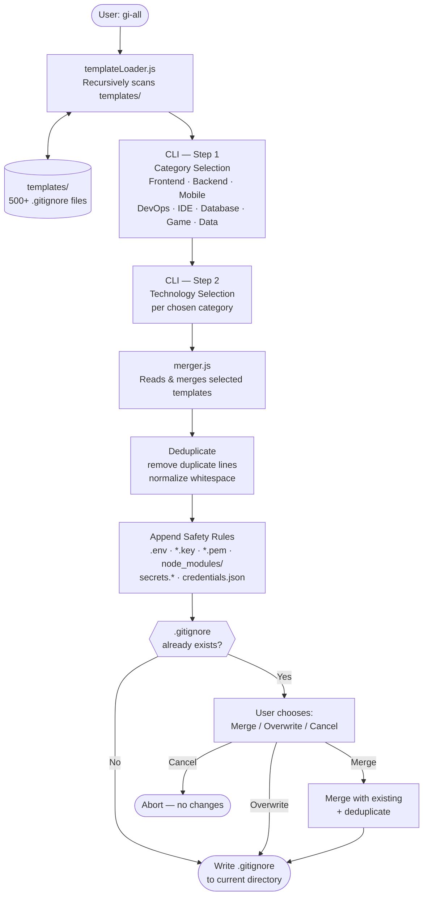

# gi-all

> **Läs denna README på ditt språk:**  
> [English](../README.md) · [Türkçe](README.tr.md) · [Azərbaycan](README.az.md) · [Deutsch](README.de.md) · [Français](README.fr.md) · [Español](README.es.md) · [Português](README.pt.md) · [Italiano](README.it.md) · [Nederlands](README.nl.md) · [Polski](README.pl.md) · [Русский](README.ru.md) · [Українська](README.uk.md) · [العربية](README.ar.md) · [日本語](README.ja.md) · [한국어](README.ko.md) · [简体中文](README.zh.md) · **Svenska** · [हिन्दी](README.hi.md) · [Bahasa Indonesia](README.id.md)

## 🌟 Den enda `.gitignore`-generatorn du någonsin behöver

`gi-all` är en **modulär, kategoribaserad `.gitignore`-generator** för moderna team och ambitiösa soloutvecklare.

Istället för en enda uppsvälld "kitchen sink"-fil erbjuder `gi-all` ett **kurerat bibliotek med hundratals fokuserade mallar** (Angular, Unity, Android, Flutter, Node.js, Laravel, Docker och mycket mer) för att komponera den perfekta `.gitignore` på sekunder.

[](https://www.npmjs.com/package/gi-all)
[](https://www.npmjs.com/package/gi-all)
[](https://github.com/qafaraz/gi-all/stargazers)
[](https://github.com/qafaraz/gi-all/commits)
[](https://github.com/qafaraz/gi-all/commits)
[](https://github.com/qafaraz/gi-all/blob/main/LICENSE)
[](https://badge.socket.dev/npm/package/gi-all/2.1.0)

---

## 💡 Varför gi-all?

De flesta `.gitignore`-generatorer faller i en av dessa två fällor:

- **För liten**: du väljer ett enda språk och committar ändå IDE-konfigurationer, byggartefakter eller plattformsskräp.
- **För stor**: du kopierar en slumpmässig "mega.gitignore" från internet och ärver **tusentals irrelevanta regler** som du inte förstår.

`gi-all` tar ett annat grepp:

- **Modulärt av design** – Varje teknik lever i sin egen dedikerade mall i `templates/`.
- **Dynamisk indexering** – CLI skannar mappen `templates/` vid körning, så **varje mallfil stöds automatiskt**.
- **Kategoribaserad UX** – Välj först högnivåområden (Frontend, Backend, Mobile, DevOps & Cloud, IDE & Editor, Database, Game & 3D, Data & Science, Other), sedan de exakta teknikerna.
- **Noll manuell sammanslagning** – Välj din stack och `gi-all`:
  - Läser alla valda `.gitignore`-mallar
  - Slår samman dem till en smart `.gitignore`
  - Tar bort dubbletter och onödiga blanksteg
  - Lägger till obligatoriska säkerhetsregler för vanliga hemlighets- och inloggningsfiler

Du får en **ren, minimal och noggrann** `.gitignore` anpassad efter din stack.

---

## 🛠️ Enormt mallbibliotek (500+ mallar)

`gi-all` levereras med **hundratals dedikerade mallar** under `templates/`, inklusive:

- **Frontend & Webb**: React, Next.js, Angular, Vue, Svelte, Astro, Remix, Gatsby, Webpack, Vite, Tailwind CSS, Storybook…
- **Mobil & Korsplattform**: Android, iOS, React Native, Flutter, Ionic, Capacitor, NativeScript…
- **Backend & API**: Node.js, Express, NestJS, Django, Flask, Laravel, Symfony, Spring, Rails, FastAPI…
- **Spel & 3D**: Unity, Unreal Engine, Godot, libGDX, FlaxEngine, MonoGame, PICO‑8…
- **Moln & DevOps**: Docker, Kubernetes, Terraform, Ansible, Vagrant, Cloudflare, Snap/Snapcraft…
- **Editorer & IDE**: VS Code, JetBrains IDEs (WebStorm, Rider m.fl.), Vim, Emacs, Sublime, Xcode, Android Studio, NetBeans…
- **Databaser**: Redis, PostgreSQL, MySQL, MongoDB, MSSQL…
- **Verktyg & Kunskap**: Obsidian/Notion-exporter, ERP-system, exotiska språk…

---

## 🛡️ Säkerhet först

Att av misstag commita `.env`-filer eller privata nycklar till Git är ett kostsamt misstag.

`gi-all` bygger in säkerhet som standard:

- `.env`, `.env.*`, `*.env` och vanliga miljövarianter
- Privata nycklar och certifikat: `*.key`, `*.pem`, `*.p12`, `*.cert`, `*.crt`, `*.pfx`, `id_rsa*`, `id_ed25519` osv.
- Utvecklar- och molnuppgifter: `.envrc`, `.npmrc`, `.netrc`, `.aws/`, `credentials.json`
- Infrastruktur- och mobilhemligheter: `*.tfstate`, `*.tfvars`, `*.tfplan`, `*.mobileprovision`, `GoogleService-Info.plist`
- Generiska hemlighetsarkiv: `secrets.*`, `*.kdbx`, `serviceAccountKey.json`, `firebase-adminsdk*.json`
- `node_modules/` och vanliga felsökningsloggar
- OS/redigeringsbrus som `.DS_Store`

---

## ⚙️ Hur det fungerar

- **Skanning**: vid start skannar `gi-all` dynamiskt mappen `templates/` och bygger en katalog.
- **Steg 1 – Kategorier**: CLI frågar vilka områden ditt projekt använder.
- **Steg 2 – Tekniker**: för de valda kategorierna väljer du de exakta teknikerna.
- **Bearbetning**: läser, slår samman, avduplicerar och lägger till säkerhetsregler.
- **Utdata**: skriver resultatet till en enda `.gitignore`-fil i din **nuvarande arbetsmapp**.
- **Konflikter**: om `.gitignore` redan finns frågar `gi-all`: **Merge**, **Overwrite** eller **Cancel**.

---

## 📦 Installation

Kräver Node.js `>=22.0.0` (Node 22 eller 24 LTS rekommenderas).

### Engångsanvändning (rekommenderas)

```bash
npx gi-all
```

### Global installation

```bash
npm install -g gi-all
```

Kör sedan enkelt:

```bash
gi-all
```

---

## 🧪 Användning

Från roten av ditt projekt:

```bash
gi-all
```

Du vägleds att välja kategorier och tekniker. `gi-all` läser motsvarande mallar, slår samman dem, lägger till säkerhetsregler och skriver `.gitignore`-filen.

---

## Architecture



### Module Responsibilities

| Module | Responsibility |
|---|---|
| `src/cli.js` | User-facing entry point. Two-step interactive UI (categories → technologies). Conflict resolution. |
| `src/core/templateLoader.js` | Scans `templates/` recursively. Indexes every `.gitignore` file. Assigns category by filename. |
| `src/core/merger.js` | Merges multiple templates. Deduplicates lines. Appends mandatory safety rules. |

---

## 🤝 Bidra

`gi-all` är utformat som en **gemenskapsstyrd katalog** av `.gitignore`-bästa praxis.

📚 Wiki: 
https://github.com/qafaraz/gi-all/discussions
### Lägga till en ny mall

1. **Forka** repositoryt
2. Skapa en ny `.gitignore`-fil under `templates/`
3. Lägg till fokuserade, högkvalitativa regler för den tekniken
4. Öppna en pull request med en kort beskrivning

---

## 📜 Licens

[MIT](../LICENSE) — skapad för open source-gemenskapen av **[Qafar](https://github.com/qafaraz)**.
