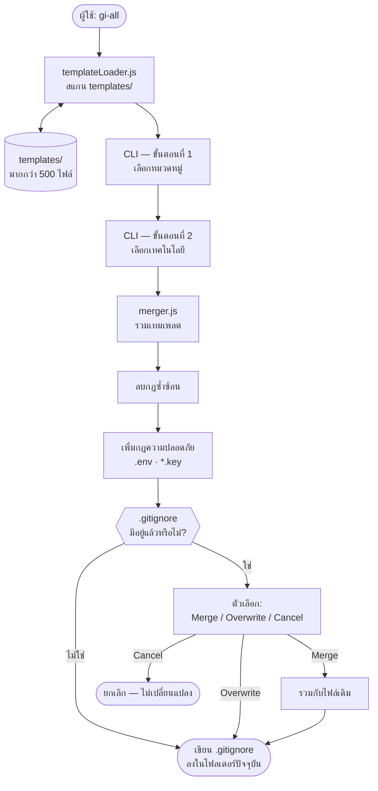

# gi-all

> **อ่าน README นี้ในภาษาของคุณ:**  
> [English](../README.md) · [Türkçe](README.tr.md) · [Azərbaycan](README.az.md) · [O'zbekcha](README.uz.md) · [Қазақша](README.kk.md) · [Кыргызча](README.ky.md) · [Türkmençe](README.tk.md) · [Deutsch](README.de.md) · [Français](README.fr.md) · [Español](README.es.md) · [Português](README.pt.md) · [Italiano](README.it.md) · [Română](README.ro.md) · [Nederlands](README.nl.md) · [Polski](README.pl.md) · [Русский](README.ru.md) · [Українська](README.uk.md) · [Svenska](README.sv.md) · [Tiếng Việt](README.vi.md) · [Bahasa Indonesia](README.id.md) · **ภาษาไทย** · [فارسی](README.fa.md) · [العربية](README.ar.md) · [हिन्दी](README.hi.md) · [বাংলা](README.bn.md) · [日本語](README.ja.md) · [한국어](README.ko.md) · [简体中文](README.zh.md)

## 🌟 เครื่องมือสร้าง `.gitignore` เดียวที่คุณต้องการ

`gi-all` เป็น **เครื่องมือสร้าง .gitignore แบบแยกโมดูลและจัดหมวดหมู่** สำหรับทีมสมัยใหม่และนักพัฒนาอิสระ

แทนที่จะใช้ไฟล์ "mega.gitignore" ขนาดใหญ่และรก `gi-all` มอบ **คลังเทมเพลตเฉพาะทางหลายร้อยรายการ** (Angular, Unity, Android, Flutter, Node.js, Laravel, Docker และอื่นๆ อีกมากมาย) ให้คุณสร้าง `.gitignore` ที่สมบูรณ์แบบได้ในไม่กี่วินาที

[](https://www.npmjs.com/package/gi-all)
[](https://www.npmjs.com/package/gi-all)
[](https://github.com/qafaraz/gi-all/stargazers)
[](https://github.com/qafaraz/gi-all/commits)
[](https://github.com/qafaraz/gi-all/commits)
[](https://github.com/qafaraz/gi-all/blob/main/LICENSE)
[](https://badge.socket.dev/npm/package/gi-all/2.1.0)

---

## 💡 ทำไมต้อง gi-all?

- **เล็กเกินไป**: คุณเลือกภาษาเดียว แต่การตั้งค่า IDE หรือไฟล์บิลด์ยังคงหลุดเข้าไปในที่เก็บโค้ด
- **ใหญ่เกินไป**: คุณคัดลอกไฟล์สุ่มจากอินเทอร์เน็ตและได้ **กฎที่ไม่เกี่ยวข้องหลายพันข้อ** เข้ามาในโปรเจกต์

`gi-all` ใช้วิธีการที่แตกต่างอย่างสิ้นเชิง:

- **การออกแบบแยกโมดูล** – แต่ละเทคโนโลยีมีไฟล์เทมเพลต `.gitignore` เฉพาะของตัวเองใน `templates/`
- **การสร้างดัชนีแบบไดนามิก** – CLI จะสแกนโฟลเดอร์ `templates/` อัตโนมัติเมื่อเริ่มทำงาน ทุกไฟล์ใหม่พร้อมใช้งานทันที
- **ประสบการณ์ตามหมวดหมู่** – เลือกหมวดหมู่หลักก่อน จากนั้นจึงเลือกเทคโนโลยีที่ใช้จริง
- **ไม่ต้องรวมไฟล์เอง** – เลือกเทคโนโลยีที่คุณใช้ `gi-all` จะรวมเทมเพลต ลบกฎซ้ำซ้อน และเพิ่มกฎความปลอดภัยให้ทันที
  - อ่านเทมเพลต `.gitignore` ที่เลือกทั้งหมด
  - รวมเป็นไฟล์ `.gitignore` อัจฉริยะเพียงไฟล์เดียว
  - ลบบรรทัดที่ซ้ำกันและจัดการช่องว่างให้เรียบร้อย
  - เพิ่มกฎความปลอดภัยบังคับสำหรับไฟล์ข้อมูลลับและข้อมูลรับรอง

ผลลัพธ์: ไฟล์ `.gitignore` ที่ **สะอาด กะทัดรัด และแม่นยำ** ตรงตามความต้องการของคุณ

---

## 🛠️ คลังเทมเพลตขนาดใหญ่ (มากกว่า 500 เทมเพลต)

`gi-all` มาพร้อมกับ **เทมเพลตเฉพาะทางหลายร้อยรายการ** ใน `templates/`:

- **Frontend & Web**: React, Next.js, Angular, Vue, Svelte, Astro, Remix, Gatsby, Webpack, Vite, Tailwind CSS, Storybook…
- **Mobile & Cross‑platform**: Android, iOS, React Native, Flutter, Ionic, Capacitor, NativeScript…
- **Backend & API**: Node.js, Express, NestJS, Django, Flask, Laravel, Symfony, Spring, Rails, FastAPI…
- **Game & 3D**: Unity, Unreal Engine, Godot, libGDX, FlaxEngine, MonoGame, PICO‑8…
- **Cloud & DevOps**: Docker, Kubernetes, Terraform, Ansible, Vagrant, Cloudflare, Snap/Snapcraft…
- **เครื่องมือแก้ไข & IDE**: VS Code, JetBrains IDEs, Vim, Emacs, Sublime, Xcode, Android Studio, NetBeans…
- **ฐานข้อมูล**: Redis, PostgreSQL, MySQL, MongoDB, MSSQL…
- **เครื่องมือ & คลังความรู้**: การส่งออก Obsidian/Notion, ระบบ ERP, ภาษาเฉพาะทาง…

ทุกเทคโนโลยีมี **ไฟล์ `.gitignore` ของตัวเอง** CLI จะสแกนทุกไฟล์แบบวนซ้ำ

---

## 🛡️ ปลอดภัยไว้ก่อน

การเผลอคอมมิตไฟล์ `.env` หรือคีย์ส่วนตัวลง Git เป็นความผิดพลาดร้ายแรง `gi-all` มีระบบความปลอดภัยติดตั้งมาตั้งแต่ต้น:

- `.env`, `.env.*`, `*.env` และตัวแปรสภาพแวดล้อมต่างๆ
- คีย์ส่วนตัวและใบรับรอง: `*.key`, `*.pem`, `*.p12`, `*.cert`, `*.crt`, `*.pfx`, `id_rsa*`, `id_ed25519` เป็นต้น
- ข้อมูลรับรองนักพัฒนาและคลาวด์: `.envrc`, `.npmrc`, `.netrc`, `.aws/`, `credentials.json`
- ข้อมูลลับของโครงสร้างพื้นฐานและโมบายล์: `*.tfstate`, `*.tfvars`, `*.tfplan`, `*.mobileprovision`, `GoogleService-Info.plist`
- ที่เก็บข้อมูลลับ: `secrets.*`, `*.kdbx`, `serviceAccountKey.json`, `firebase-adminsdk*.json`
- `node_modules/` และบันทึกการแก้ไขข้อบกพร่อง (debug logs)
- ไฟล์ขยะระบบ: `.DS_Store` เป็นต้น

> `gi-all` ช่วยลดความเสี่ยงในการคอมมิตไฟล์ลับได้อย่างมาก แต่คุณยังควรตรวจสอบไฟล์เฉพาะของโปรเจกต์ด้วยตนเอง

---

## ⚙️ การทำงาน

- **สแกน**: เมื่อเริ่มทำงาน `gi-all` จะค้นหาไฟล์ `.gitignore` ทั้งหมดใน `templates/`
- **ขั้นตอนที่ 1 – เลือกหมวดหมู่**: เลือกสาขาที่ใช้ในโปรเจกต์ของคุณ
- **ขั้นตอนที่ 2 – เลือกเทคโนโลยี**: ทำเครื่องหมายเครื่องมือและไลบรารีที่คุณใช้
- **ประมวลผล**: รวมเทมเพลต ลบบรรทัดซ้ำ และเพิ่มกฎความปลอดภัย
- **ส่งออก**: บันทึกผลลัพธ์ลงในไฟล์ `.gitignore` ในโฟลเดอร์ปัจจุบัน
- **การจัดการข้อขัดแย้ง:**
    - **Merge**: รวมกับกฎเดิมที่มีอยู่
    - **Overwrite**: เขียนทับไฟล์เดิมทั้งหมด
    - **Cancel**: ยกเลิกโดยไม่เปลี่ยนแปลง
  - เพื่อความปลอดภัย `gi-all` จะปฏิเสธการเขียนทับซิมลิงก์ (symlinks) หรือฮาร์ดลิงก์หลายตัว

---

## 📦 การติดตั้ง

ต้องการ Node.js `>=22.0.0` (แนะนำ Node 22 หรือ 24 LTS)

### One‑shot

```bash
# npm
npx gi-all

# yarn
yarn dlx gi-all

# pnpm
pnpm dlx gi-all

# bun
bunx gi-all
```

### Global install

```bash
# npm
npm install -g gi-all

# yarn
yarn global add gi-all

# pnpm
pnpm install -g gi-all

# bun
bun add -g gi-all
```

```bash
gi-all
```

---

## 🧪 วิธีใช้งาน: สร้าง `.gitignore` ในไม่กี่วินาที

ที่โฟลเดอร์รากของโปรเจกต์ ให้รันคำสั่งต่อไปนี้:

```bash
gi-all
```

1. **เลือกหมวดหมู่** (Frontend, Backend, Mobile, DevOps, IDE, Database, Game, Data, Other)
2. **เลือกเทคโนโลยี** จากหมวดหมู่เหล่านั้น

`gi-all` จะดำเนินการดังนี้:

1. อ่านเทมเพลตที่เกี่ยวข้องจาก `templates/`
2. รวมและลบกฎที่ซ้ำกัน
3. เพิ่มกฎความปลอดภัยที่จำเป็น
4. บันทึกลงใน **`.gitignore`** ในโฟลเดอร์ปัจจุบัน

---

## สถาปัตยกรรม



### หน้าที่ของโมดูล

| โมดูล | หน้าที่ |
|---|---|
| `src/cli.js` | อินเทอร์เฟซผู้ใช้แบบโต้ตอบและการจัดการข้อขัดแย้ง |
| `src/core/templateLoader.js` | สแกนโฟลเดอร์ `templates/` และทำดัชนี |
| `src/core/merger.js` | รวมเทมเพลตและเพิ่มกฎความปลอดภัย |

---

## 🤝 การมีส่วนร่วม

`gi-all` ได้รับการออกแบบให้เป็น **คลังความรู้สำหรับชุมชน** เกี่ยวกับแนวทางปฏิบัติที่ดีที่สุดสำหรับ `.gitignore`

📚 Wiki: https://github.com/qafaraz/gi-all/wiki  
💬 การพูดคุย: https://github.com/qafaraz/gi-all/discussions

### การเพิ่มเทมเพลตใหม่

1. **Fork** คลังเก็บโค้ด
2. สร้างไฟล์ `.gitignore` ใหม่ในโฟลเดอร์ `templates/`
3. เพิ่มกฎที่มีคุณภาพสำหรับเทคโนโลยีนั้น
4. เปิด Pull Request พร้อมคำอธิบายสั้นๆ

CLI จะตรวจพบไฟล์ใหม่โดยอัตโนมัติ ไม่จำเป็นต้องแก้ไขโค้ดใน `src/`

---

## 📜 ใบอนุญาต

[MIT](../LICENSE) — พัฒนาขึ้นเพื่อชุมชนโอเพนซอร์สโดย **[Qafar](https://github.com/qafaraz)**
