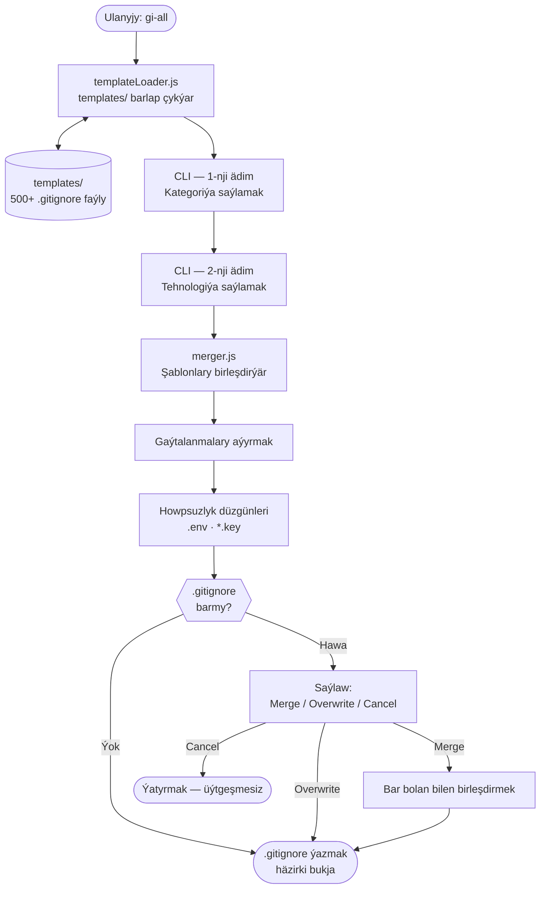

# gi-all

> **Bu README-ni öz diliňizde okaň:**  
> [English](../README.md) · [Türkçe](README.tr.md) · [Azərbaycan](README.az.md) · [O'zbekcha](README.uz.md) · [Қазақша](README.kk.md) · [Кыргызча](README.ky.md) · **Türkmençe** · [Deutsch](README.de.md) · [Français](README.fr.md) · [Español](README.es.md) · [Português](README.pt.md) · [Italiano](README.it.md) · [Română](README.ro.md) · [Nederlands](README.nl.md) · [Polski](README.pl.md) · [Русский](README.ru.md) · [Українська](README.uk.md) · [Svenska](README.sv.md) · [Tiếng Việt](README.vi.md) · [Bahasa Indonesia](README.id.md) · [ภาษาไทย](README.th.md) · [فارسی](README.fa.md) · [العربية](README.ar.md) · [हिन्दी](README.hi.md) · [বাংলা](README.bn.md) · [日本語](README.ja.md) · [한국어](README.ko.md) · [简体中文](README.zh.md)

## 🌟 Size gerek boljak ýeke-täk `.gitignore` generatory

`gi-all` — häzirki zaman toparlary we şahsy döredijiler üçin niýetlenen **modully, kategoriýa esaslanýan `.gitignore` generatorydyr**.

Uly, tertipsiz "mega.gitignore" faýlynyň ýerine, `gi-all` size **ýüzlerçe ýöriteleşdirilen şablondan ybarat baý kitaphanany** (Angular, Unity, Android, Flutter, Node.js, Laravel, Docker we başgalar) hödürleýär we olary birnäçe sekuntda öz stekiňize laýyklykda birleşdirmäge mümkinçilik berýär.

[](https://www.npmjs.com/package/gi-all)
[](https://www.npmjs.com/package/gi-all)
[](https://github.com/qafaraz/gi-all/stargazers)
[](https://github.com/qafaraz/gi-all/commits)
[](https://github.com/qafaraz/gi-all/commits)
[](https://github.com/qafaraz/gi-all/blob/main/LICENSE)
[](https://badge.socket.dev/npm/package/gi-all/2.1.0)

---

## 💡 Näme üçin gi-all?

- **Gaty kiçi**: Diňe bir dili saýlaýarsyňyz, ýöne IDE sazlamalary ýa-da gurluş faýllary repozitoriýa girip galýar.
- **Gaty uly**: Internetden tötänleýin "mega.gitignore" göçürip alýarsyňyz we manysyna düşünmeýän **müňlerçe gereksiz düzgüni** taslamaňyza goşýarsyňyz.

`gi-all` düýbünden başgaça çemeleşmäni hödürleýär:

- **Modully dizaýn** – Her tehnologiýa `templates/` bukjasynda özüne degişli `.gitignore` şablonynda saklanýar.
- **Dinamiki indeksirleme** – CLI işläp başlanda `templates/` bukjasyny barlap çykýar; **her bir şablon faýly awtomatiki goldanýar**.
- **Kategoriýa esaslanýan UX** – Ilki bilen umumy ugurlary saýlaýarsyňyz (Frontend, Backend, Mobile, DevOps & Cloud, IDE & Editor, Database, Game & 3D, Data & Science, Other), soňra bolsa ulanýan tehnologiýalaryňyzy belleýärsiňiz.
- **Elde birleşdirmek gerek däl** – Öz stekiňizi saýlaň, `gi-all` ählisini birleşdirip, gaýtalanýan setirleri arassalar.
  - Saýlanan ähli `.gitignore` şablonlaryny okaýar
  - Olary ýeke-täk akylly `.gitignore` faýlynda birleşdirýär
  - Gaýtalanýan setirleri we artykmaç boşluklary aýyrýar
  - Gizlin we howpsuzlyk maglumatlary üçin hökmany düzgünleri goşýar

Netije: Stekiňize **laýyklaşdyrylan, arassa we takyk** `.gitignore`.

---

## 🛠️ Giň şablonlar kitaphanasy (500+ şablon)

`gi-all` `templates/` bukjasynda **ýüzlerçe ýöriteleşdirilen şablon** bilen gelýär:

- **Frontend & Web**: React, Next.js, Angular, Vue, Svelte, Astro, Remix, Gatsby, Webpack, Vite, Tailwind CSS, Storybook…
- **Mobile & Cross‑platform**: Android, iOS, React Native, Flutter, Ionic, Capacitor, NativeScript…
- **Backend & API**: Node.js, Express, NestJS, Django, Flask, Laravel, Symfony, Spring, Rails, FastAPI…
- **Game & 3D**: Unity, Unreal Engine, Godot, libGDX, FlaxEngine, MonoGame, PICO‑8…
- **Cloud & DevOps**: Docker, Kubernetes, Terraform, Ansible, Vagrant, Cloudflare, Snap/Snapcraft…
- **Redaktorlar we IDE**: VS Code, JetBrains IDE-leri, Vim, Emacs, Sublime, Xcode, Android Studio, NetBeans…
- **Maglumatlar bazasy**: Redis, PostgreSQL, MySQL, MongoDB, MSSQL…
- **Gurallar we bilim binýady**: Obsidian/Notion eksportlary, ERP ulgamlary, aýratyn programma dilleri…

Her tehnologiýanyň **öz `.gitignore` faýly** bardyr. CLI `templates/` bukjasyndaky her bir faýly indeksleýär.

---

## 🛡️ Gaýybana howpsuzlyk gatlagy

`.env` faýllaryny ýa-da şahsy gizlin açarlary Git-e goýbermek uly ýalňyşlykdyr. `gi-all` howpsuzlygy awtomatiki kepillendirýär:

- `.env`, `.env.*`, `*.env` we beýleki gurşaw görnüşleri
- Şahsy gizlin açarlar: `*.key`, `*.pem`, `*.p12`, `*.cert`, `*.crt`, `*.pfx`, `id_rsa*`, `id_ed25519` we ş.m.
- Döredijiniň ygtyýarnamalary: `.envrc`, `.npmrc`, `.netrc`, `.aws/`, `credentials.json`
- Infrastruktura gizlinlikleri: `*.tfstate`, `*.tfvars`, `*.tfplan`, `*.mobileprovision`, `GoogleService-Info.plist`
- Gizlin ammar faýllary: `secrets.*`, `*.kdbx`, `serviceAccountKey.json`, `firebase-adminsdk*.json`
- `node_modules/` we düzediş ýazgylary
- Ulgam we redaktor faýllary: `.DS_Store` we ş.m.

> `gi-all` gizlin faýllary tötänleýin goşmak töwekgelçiligini ep-esli azaldýar, ýöne taslamaňyza degişli şahsy faýllary elmydama gözden geçirmegiňizi maslahat berýäris.

---

## ⚙️ Nähili işleýär?

- **Barlamak (skanirlemek)**: `gi-all` `templates/` bukjasyndaky ähli `.gitignore` faýllaryny tapýar.
- **1-nji ädim – Kategoriýalary saýlamak**: Taslamaňyzda ulanylýan ugurlary belleýärsiňiz.
- **2-nji ädim – Tehnologiýalary saýlamak**: Saýlanan ugurlar boýunça tehnologiýalary görkezýärsiňiz.
- **Gaýtadan işlemek**: Ähli şablonlary birleşdirýär, arassalaýar we howpsuzlyk düzgünlerini goşýar.
- **Netije**: Häzirki iş bukjasynda taýyn `.gitignore` faýly döredilýär.
- **Gapma-garşylyklary çözmek:**
    - **Merge**: Öňki düzgünleri saklap, täzeleri goşmak.
    - **Overwrite**: `.gitignore` faýlyny doly täzelemek.
    - **Cancel**: Üýtgeşmesiz çykmak.
  - Howpsuzlyk üçin `gi-all` simwoliki baglanyşyklara ýazmakdan ýüz öwürýär.

---

## 📦 Gurnamak

Node.js `>=22.0.0` talap edilýär (Node 22 ýa-da 24 LTS maslahat berilýär).

### One‑shot

```bash
# npm
npx gi-all

# yarn
yarn dlx gi-all

# pnpm
pnpm dlx gi-all

# bun
bunx gi-all
```

### Global install

```bash
# npm
npm install -g gi-all

# yarn
yarn global add gi-all

# pnpm
pnpm install -g gi-all

# bun
bun add -g gi-all
```

```bash
gi-all
```

---

## 🧪 Ulanylyşy: Birnäçe sekuntda `.gitignore` taýýarlamak

Taslamaňyzyň esasy bukjasynda şu buýrugy ýerine ýetiriň:

```bash
gi-all
```

1. **Kategoriýalary saýlamak** (Frontend, Backend, Mobile, DevOps, IDE, Database, Game, Data, Other)
2. Şol kategoriýalar boýunça **tehnologiýalary saýlamak**

`gi-all` şulary ýerine ýetirýär:

1. `templates/` bukjasyndan degişli şablonlary okaýar
2. Düzgünleri birleşdirýär we arassalaýar
3. Howpsuzlyk düzgünlerini goşýar
4. Netijäni **`.gitignore`** faýlyna ýazýar

---

## Binagärlik



### Modullaryň borçlary

| Modul | Borjy |
|---|---|
| `src/cli.js` | Ulanyjy interfeýsi. Interaktiw saýlaw menýusy. |
| `src/core/templateLoader.js` | `templates/` bukjasyndaky faýllary indeksleýär. |
| `src/core/merger.js` | Şablonlary birleşdirýär we howpsuzlyk düzgünlerini goşýar. |

---

## 🤝 Goşant goşmak

`gi-all` jemgyýet bilen bilelikde ösdürilýän katalogdyr.

📚 Wiki: https://github.com/qafaraz/gi-all/wiki  
💬 Çekişmeler: https://github.com/qafaraz/gi-all/discussions

### Täze şablon goşmak

1. Repozitoriýany **Fork** ediň
2. `templates/` bukjasynda täze `.gitignore` faýlyny dörediň
3. Şol tehnologiýa degişli düzgünleri ýazyň
4. Pull Request iberiň

CLI faýllary awtomatiki tapýar; `src/` kodunda üýtgeşme girizmek gerek däl.

---

## 📜 Ygtyýarnama

[MIT](../LICENSE) — **[Qafar](https://github.com/qafaraz)** tarapyndan döredildi.
