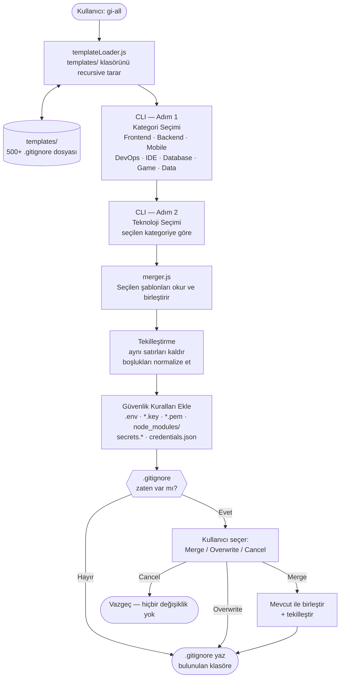

# gi-all

> **Bu README'yi dilinizde okuyun:**  
> [English](../README.md) · **Türkçe** · [Azərbaycan](README.az.md) · [O'zbekcha](README.uz.md) · [Қазақша](README.kk.md) · [Кыргызча](README.ky.md) · [Türkmençe](README.tk.md) · [Deutsch](README.de.md) · [Français](README.fr.md) · [Español](README.es.md) · [Português](README.pt.md) · [Italiano](README.it.md) · [Română](README.ro.md) · [Nederlands](README.nl.md) · [Polski](README.pl.md) · [Русский](README.ru.md) · [Українська](README.uk.md) · [Svenska](README.sv.md) · [Tiếng Việt](README.vi.md) · [Bahasa Indonesia](README.id.md) · [ภาษาไทย](README.th.md) · [فارسی](README.fa.md) · [العربية](README.ar.md) · [हिन्दी](README.hi.md) · [বাংলা](README.bn.md) · [日本語](README.ja.md) · [한국어](README.ko.md) · [简体中文](README.zh.md)

## 🌟 İhtiyacın Olan Son `.gitignore` Üreticisi

`gi-all`, modern ekipler ve iddialı solo geliştiriciler için tasarlanmış **modüler, kategori bazlı bir `.gitignore` üreticisidir**.

Tek bir şişmiş "mega.gitignore" yerine, `gi-all` sana **yüzlerce odaklı şablondan oluşan bir kütüphane** sunar (Angular, Unity, Android, Flutter, Node.js, Laravel, Docker ve çok daha fazlası) ve bunları birkaç tıklamayla kendi stack'ine göre birleştirir.

[](https://www.npmjs.com/package/gi-all)
[](https://www.npmjs.com/package/gi-all)
[](https://github.com/qafaraz/gi-all/stargazers)
[](https://github.com/qafaraz/gi-all/commits)
[](https://github.com/qafaraz/gi-all/commits)
[](https://github.com/qafaraz/gi-all/blob/main/LICENSE)
[](https://badge.socket.dev/npm/package/gi-all/2.1.0)

---

## 💡 Neden gi-all?

Çoğu `.gitignore` çözümü iki hatadan birine düşer:

- **Çok küçük**: Sadece bir dil seçersin, ama IDE ayarları, build çıktıları veya platform çöpü yine de repoya girer.
- **Çok büyük**: İnternetten rastgele bir "mega.gitignore" kopyalarsın ve **binlerce alakasız kuralı** anlamadan projene gömersin.

`gi-all` bambaşka bir yaklaşım sunar:

- **Modüler tasarım** – Her teknoloji, `templates/` klasöründe kendi özel `.gitignore` dosyasında yaşar.
- **Dinamik tarama** – CLI, çalıştığı anda `templates/` klasörünü tarar; **her bir `.gitignore` otomatik olarak desteklenir**. Yeni bir dosya eklediğinde, kod yazmana gerek kalmadan menüye eklenir.
- **Kategori bazlı UX** – Önce yüksek seviye alanları seçersin (Frontend, Backend, Mobile, DevOps & Cloud, IDE & Editor, Database, Game & 3D, Data & Science, Other), sonra bu kategorilerin içinden kullandığın teknolojileri işaretlersin.
- **Elle merge yok** – Stack'ini seç (Angular + Node + Android + Unity + Docker + VS Code…) ve `gi-all`:
  - Tüm ilgili `.gitignore` şablonlarını okur
  - Tek bir akıllı `.gitignore` içinde birleştirir
  - Aynı satırları tekilleştirir, gereksiz boşlukları temizler
  - Yaygın secret ve credential dosyaları için zorunlu güvenlik kuralları ekler

Sonuç: Stack'ine **özel**, sade ama **eksiksiz** bir `.gitignore`.

---

## 🛠️ Dev Şablon Kütüphanesi (500+ Şablon)

Kutudan çıktığı haliyle `gi-all`, `templates/` altında **yüzlerce odaklı `.gitignore` şablonu** ile gelir. Örnekler:

- **Frontend & Web**: React, Next.js, Angular, Vue, Svelte, Astro, Remix, Gatsby, Webpack, Vite, Tailwind CSS, Storybook…
- **Mobile & Cross‑platform**: Android, iOS, React Native, Flutter, Ionic, Capacitor, NativeScript…
- **Backend & API**: Node.js, Express, NestJS, Django, Flask, Laravel, Symfony, Spring, Rails, FastAPI…
- **Game & 3D**: Unity, Unreal Engine, Godot, libGDX, FlaxEngine, MonoGame, PICO‑8…
- **Cloud & DevOps**: Docker, Kubernetes, Terraform, Ansible, Vagrant, Cloudflare, Snap/Snapcraft…
- **Editör & IDE**: VS Code, JetBrains IDE'leri (WebStorm, Rider, vb.), Vim, Emacs, Sublime, Xcode, Android Studio, NetBeans…
- **Veritabanları**: Redis, PostgreSQL, MySQL, MongoDB, MSSQL…
- **Bilgi & Araçlar**: Obsidian/Notion export'ları, ERP sistemleri, farklı diller ve özel tool'lar…

Her teknoloji **kendi `.gitignore` dosyasına** sahiptir. CLI, `templates/` altındaki **her dosyayı** indeksler, böylece:

- Hiçbir şablon "unutulmaz" veya hard-code edilmez.
- Yeni bir şablon eklediğinde, CLI otomatik olarak onu da kullanır.

`templates/` içinde yaşıyorsa, `gi-all` onun için `.gitignore` üretebilir.

---

## 🛡️ Varsayılan Güvenlik Katmanı

`.env` dosyalarını veya private key'leri yanlışlıkla Git'e itmek pahalı bir hatadır — genelde de sadece "unutulmuş" bir ignore kuralından kaynaklanır.

`gi-all` güvenliği en baştan tasarıma dahil eder:

- `.env`, `.env.*`, `*.env` ve yaygın environment varyantları
- Özel anahtar ve sertifikalar: `*.key`, `*.pem`, `*.p12`, `*.cert`, `*.crt`, `*.pfx`, `id_rsa*`, `id_ed25519`, vb.
- Geliştirici ve bulut credential'ları: `.envrc`, `.npmrc`, `.netrc`, `.aws/`, `credentials.json`
- Altyapı ve mobil secret'ları: `*.tfstate`, `*.tfvars`, `*.tfplan`, `*.mobileprovision`, `GoogleService-Info.plist`
- Ortak secret store'lar: `secrets.*`, `*.kdbx`, `serviceAccountKey.json`, `firebase-adminsdk*.json`
- `node_modules/` ve yaygın debug log dosyaları
- OS / editör gürültüsü: `.DS_Store` vb.

Bu kurallar **her durumda, otomatik olarak** seçtiğin şablonların sonuna eklenir.  
Bir şablon eksik veya hatalı olsa bile, `gi-all` yine de temel bir koruma katmanı ekler.

> `gi-all`, yaygın secret dosyalarını yanlışlıkla commit etme riskini ciddi biçimde azaltır; yine de projeye özel credential dosyalarını elle gözden geçirmelisin.

---

## ⚙️ Nasıl Çalışır?

- **Tarama**: CLI çalıştığında `templates/` klasörünü recursive olarak tarar ve tüm `.gitignore` dosyalarını bulur.
- **Adım 1 – Kategori seçimi**: `inquirer` tabanlı interaktif arayüz, projende hangi alanların kullanıldığını sorar:
  - Frontend, Backend, Mobile, DevOps & Cloud, IDE & Editor, Database, Game & 3D, Data & Science, Other.
- **Adım 2 – Teknoloji seçimi**: Seçtiğin kategoriler altında, kullandığın spesifik teknoloji ve araçları işaretlersin.
- **İşleme**:
  - İlgili tüm şablonlar okunur
  - Tek bir string halinde birleştirilir
  - Aynı satırlar tekilleştirilir, boşluklar normalize edilir
  - Zorunlu güvenlik kuralları eklenir
- **Çıktı**: Sonuç, çalıştığın klasörde **tek bir `.gitignore` dosyasına** yazılır.
- **Çakışma yönetimi**:
  - Klasörde zaten `.gitignore` varsa, `gi-all` sorar:
    - **Merge**: Mevcut kuralları koru, `gi-all` kurallarını üstüne ekle ve tekilleştir.
    - **Overwrite**: Var olan `.gitignore`'u tamamen `gi-all` çıktısı ile değiştir.
    - **Cancel**: Hiçbir değişiklik yapma.
  - Güvenlik için, symbolic link veya çoklu hardlink olan `.gitignore` hedeflerine yazmayı reddeder.

---

## 📦 Kurulum

Node.js `>=22.0.0` gerektirir (Node 22 veya 24 LTS önerilir).

Hiç kurulum yapmadan, tek komutla kullanabilirsin:

```bash
# npm
npx gi-all

# yarn
yarn dlx gi-all

# pnpm
pnpm dlx gi-all

# bun
bunx gi-all
```

Global kurmak istersen:

```bash
# npm
npm install -g gi-all

# yarn
yarn global add gi-all

# pnpm
pnpm install -g gi-all

# bun
bun add -g gi-all
```

Sonra sadece:

```bash
gi-all
```

---

## 🧪 Kullanım: Saniyeler İçinde Mükemmel `.gitignore`

Projeni aç:

```bash
gi-all
```

Sonrasında:

1. **Kategori seç** (Frontend, Backend, Mobile, DevOps & Cloud, IDE & Editor, Database, Game & 3D, Data & Science, Other)
2. **Teknoloji seç** (React, Next.js, NestJS, Docker, VS Code, vb.)

`gi-all`:

1. İlgili `templates/` dosyalarını okur
2. Kuralları merge eder ve tekilleştirir
3. Zorunlu güvenlik kurallarını ekler
4. Çıktıyı bulunduğun klasördeki **`.gitignore`** dosyasına yazar

`.gitignore` zaten varsa:

- **Merge** – mevcut kuralları korur, `gi-all` kurallarıyla zenginleştirir  
- **Overwrite** – `.gitignore`'u tamamen `gi-all` çıktısı ile değiştirir  
- **Cancel** – hiçbir şey yapmaz  

---

## Mimari



### Modül Sorumlulukları

| Modül | Sorumluluk |
|---|---|
| `src/cli.js` | Kullanıcı arayüzyü. İki adımlı interaktif arayüz (kategori → teknoloji). Çaktışma yönetimi. |
| `src/core/templateLoader.js` | `templates/` klasörünü recursive tarar. Her `.gitignore` dosyasını indeksler. Dosya adına göre kategori atar. |
| `src/core/merger.js` | Birden fazla şablonu birleştirir. Duplicate satırları siler. Zorunlu güvenlik kurallarını ekler. |

---

## Katkı

`gi-all`, **topluluk tarafından beslenen bir `.gitignore` bilgi bankası** olarak tasarlandı.

📚 Wiki: https://github.com/qafaraz/gi-all/wiki  
💬 Tartışmalar: https://github.com/qafaraz/gi-all/discussions

- Yeni bir framework, IDE veya araç için destek eklemek mi istiyorsun?
- Popüler bir stack için daha iyi ignore kuralları mı biliyorsun?

PR açmak için harika bir zaman.

### Yeni şablon eklemek

1. Reponun bir fork'unu al
2. `templates/` altında yeni bir `.gitignore` dosyası oluştur  
   - Örnek: `templates/flutter.gitignore`, `templates/unity.gitignore`, `templates/devops/docker.gitignore`, vb.
3. O teknoloji için odaklı, kaliteli kurallar yaz
4. Kısa açıklamalı bir pull request aç

CLI, `templates/` klasörünü otomatik taradığı için **yeni dosyan anında keşfedilir**; `src/` tarafında değişiklik yapmana gerek kalmaz.

---

## 📜 Lisans

[MIT](../LICENSE) — açık kaynak topluluğu için **[Qafar](https://github.com/qafaraz)** tarafından geliştirildi.
