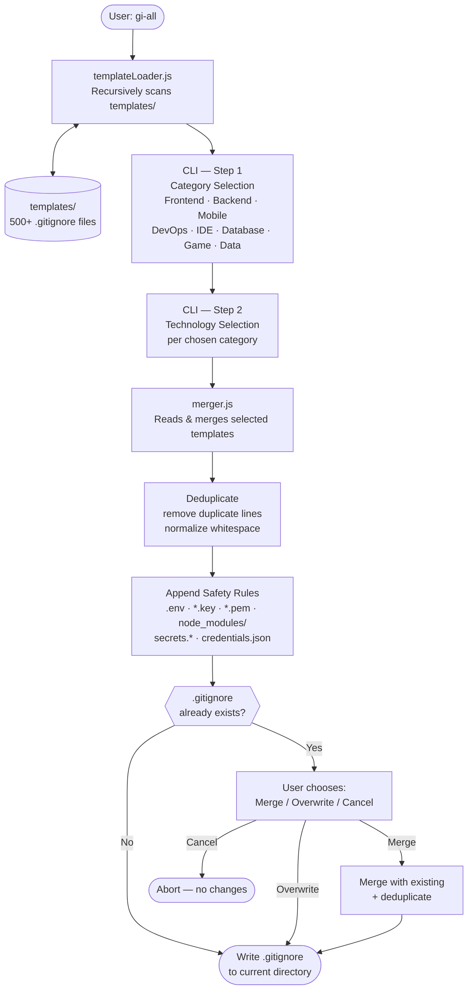

# gi-all

> **Читайте цей README своєю мовою:**  
> [English](../README.md) · [Türkçe](README.tr.md) · [Azərbaycan](README.az.md) · [Deutsch](README.de.md) · [Français](README.fr.md) · [Español](README.es.md) · [Português](README.pt.md) · [Italiano](README.it.md) · [Nederlands](README.nl.md) · [Polski](README.pl.md) · [Русский](README.ru.md) · **Українська** · [العربية](README.ar.md) · [日本語](README.ja.md) · [한국어](README.ko.md) · [简体中文](README.zh.md) · [Svenska](README.sv.md) · [हिन्दी](README.hi.md) · [Bahasa Indonesia](README.id.md)

## 🌟 Єдиний генератор `.gitignore`, який вам знадобиться

`gi-all` — це **модульний, категорійний генератор `.gitignore`** для сучасних команд і амбітних соло‑розробників.

Замість одного роздутого «мегафайлу» `gi-all` надає **бібліотеку з сотень цілеспрямованих шаблонів** (Angular, Unity, Android, Flutter, Node.js, Laravel, Docker та багато іншого) і дозволяє скласти ідеальний `.gitignore` за лічені секунди.

[](https://www.npmjs.com/package/gi-all)
[](https://www.npmjs.com/package/gi-all)
[](https://github.com/qafaraz/gi-all/stargazers)
[](https://github.com/qafaraz/gi-all/commits)
[](https://github.com/qafaraz/gi-all/commits)
[](https://github.com/qafaraz/gi-all/blob/main/LICENSE)
[](https://badge.socket.dev/npm/package/gi-all/2.1.0)

---

## 💡 Чому gi-all?

Більшість генераторів `.gitignore` потрапляють в одну з двох пасток:

- **Надто малий**: ви обираєте одну мову, але все одно комітите конфіги IDE, артефакти збірки або платформне сміття.
- **Надто великий**: ви копіюєте випадковий «мега.gitignore» з інтернету та успадковуєте **тисячі нерелевантних правил**, які ніхто не розуміє.

`gi-all` вирішує це інакше:

- **Модульна архітектура** – Кожна технологія живе у власному шаблоні `.gitignore` в папці `templates/`.
- **Динамічний індекс** – CLI під час запуску сканує `templates/` і автоматично підхоплює **кожен** `.gitignore`‑файл.
- **Вибір за категоріями** – Спочатку обираєте галузі (Frontend, Backend, Mobile, DevOps & Cloud, IDE & Editor, Database, Game & 3D, Data & Science, Other), потім позначаєте конкретні технології.
- **Жодного ручного злиття** – Обираєте стек (Angular + Node + Android + Unity + Docker + VS Code…) і `gi-all`:
  - Читає відповідні шаблони `.gitignore`
  - Об'єднує їх в один файл
  - Видаляє рядки-дублікати та зайві порожні рядки
  - Додає обов'язкові правила безпеки для типових secret- і credential-файлів

Результат: **чистий та точний `.gitignore`**, ідеально підібраний під ваш проєкт.

---

## 🛠️ Величезна бібліотека шаблонів (500+)

З коробки `gi-all` постачається з **сотнями шаблонів** у папці `templates/`. Серед них:

- **Frontend & Web**: React, Next.js, Angular, Vue, Svelte, Astro, Remix, Gatsby, Webpack, Vite, Tailwind CSS, Storybook…
- **Mobile & Cross‑platform**: Android, iOS, React Native, Flutter, Ionic, Capacitor, NativeScript…
- **Backend & API**: Node.js, Express, NestJS, Django, Flask, Laravel, Symfony, Spring, Rails, FastAPI…
- **Game & 3D**: Unity, Unreal Engine, Godot, libGDX, FlaxEngine, MonoGame, PICO‑8…
- **Cloud & DevOps**: Docker, Kubernetes, Terraform, Ansible, Vagrant, Cloudflare, Snap/Snapcraft…
- **Редактори & IDE**: VS Code, JetBrains (WebStorm, Rider тощо), Vim, Emacs, Sublime, Xcode, Android Studio, NetBeans…
- **Бази даних**: Redis, PostgreSQL, MySQL, MongoDB, MSSQL…
- **Інструменти**: Obsidian/Notion-експорти, ERP-системи, рідкісні мови…

---

## 🛡️ Безпека за замовчуванням

Випадковий коміт `.env` або приватного ключа в Git — це дорога помилка.

`gi-all` вбудовує безпеку від самого початку:

- `.env`, `.env.*`, `*.env` та типові варіанти середовищ
- Приватні ключі та сертифікати: `*.key`, `*.pem`, `*.p12`, `*.cert`, `*.crt`, `*.pfx`, `id_rsa*`, `id_ed25519` тощо
- Облікові дані розробника та хмари: `.envrc`, `.npmrc`, `.netrc`, `.aws/`, `credentials.json`
- Інфраструктурні та мобільні секрети: `*.tfstate`, `*.tfvars`, `*.tfplan`, `*.mobileprovision`, `GoogleService-Info.plist`
- Сховища секретів: `secrets.*`, `*.kdbx`, `serviceAccountKey.json`, `firebase-adminsdk*.json`
- `node_modules/` та типові debug-логи
- Системний та редакторний шум: `.DS_Store` тощо

---

## ⚙️ Як це працює

- **Сканування**: при запуску CLI рекурсивно сканує папку `templates/` і збирає список файлів.
- **Крок 1 – Вибір категорій**: інтерфейс на базі `inquirer` запитує, які галузі використовуються у проєкті.
- **Крок 2 – Вибір технологій**: для обраних категорій ви позначаєте конкретні технології.
- **Обробка**: читає, об'єднує, дедуплікує та додає правила безпеки.
- **Вивід**: результат записується в **один файл `.gitignore`** у поточній робочій директорії.
- **Конфлікти**: якщо `.gitignore` вже існує, `gi-all` запитує: **Merge**, **Overwrite** або **Cancel**.

---

## 📦 Встановлення

Потрібен Node.js `>=22.0.0` (рекомендується Node 22 або 24 LTS).

### Одноразове використання (рекомендовано)

```bash
npx gi-all
```

### Глобальне встановлення

```bash
npm install -g gi-all
```

Потім просто запустіть:

```bash
gi-all
```

---

## 🧪 Використання

З кореневого каталогу вашого проєкту:

```bash
gi-all
```

Ви будете проведені через вибір категорій і технологій. `gi-all` прочитає відповідні шаблони, об'єднає їх, додасть правила безпеки та запише файл `.gitignore`.

---

## Architecture



### Module Responsibilities

| Module | Responsibility |
|---|---|
| `src/cli.js` | User-facing entry point. Two-step interactive UI (categories → technologies). Conflict resolution. |
| `src/core/templateLoader.js` | Scans `templates/` recursively. Indexes every `.gitignore` file. Assigns category by filename. |
| `src/core/merger.js` | Merges multiple templates. Deduplicates lines. Appends mandatory safety rules. |

---

## 🤝 Внесок

`gi-all` задуманий як **спільнотний каталог** найкращих практик `.gitignore`.

📚 Wiki: 
https://github.com/qafaraz/gi-all/discussions
### Додавання нового шаблону

1. **Зробіть форк** репозиторію
2. Створіть новий файл `.gitignore` у `templates/`
3. Додайте цілеспрямовані, якісні правила для цієї технології
4. Відкрийте pull request з коротким описом

---

## 📜 Ліцензія

[MIT](../LICENSE) — створено для open‑source спільноти **[Qafar](https://github.com/qafaraz)**.
