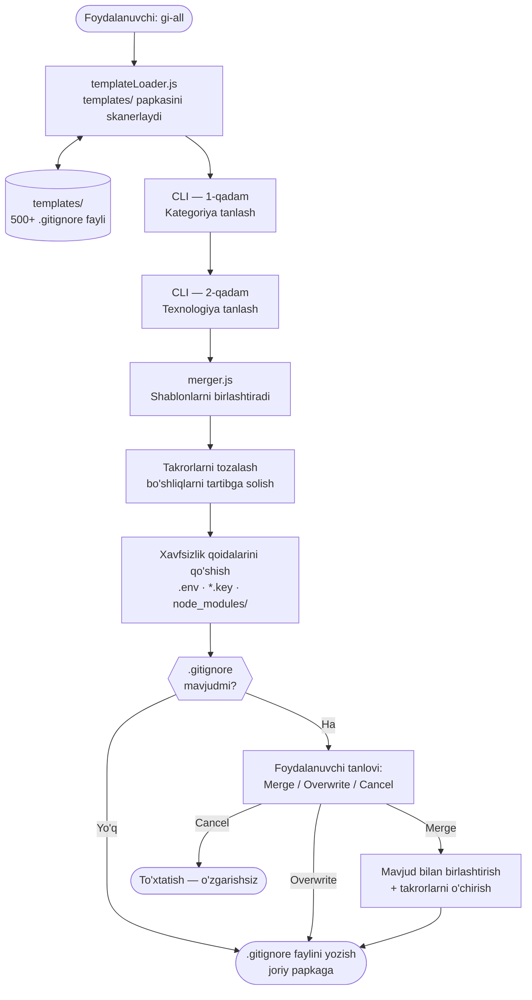

# gi-all

> **Ushbu README-ni o'z tilingizda o'qing:**  
> [English](../README.md) · [Türkçe](README.tr.md) · [Azərbaycan](README.az.md) · **O'zbekcha** · [Қазақша](README.kk.md) · [Кыргызча](README.ky.md) · [Türkmençe](README.tk.md) · [Deutsch](README.de.md) · [Français](README.fr.md) · [Español](README.es.md) · [Português](README.pt.md) · [Italiano](README.it.md) · [Română](README.ro.md) · [Nederlands](README.nl.md) · [Polski](README.pl.md) · [Русский](README.ru.md) · [Українська](README.uk.md) · [Svenska](README.sv.md) · [Tiếng Việt](README.vi.md) · [Bahasa Indonesia](README.id.md) · [ภาษาไทย](README.th.md) · [فارسی](README.fa.md) · [العربية](README.ar.md) · [हिन्दी](README.hi.md) · [বাংলা](README.bn.md) · [日本語](README.ja.md) · [한국어](README.ko.md) · [简体中文](README.zh.md)

## 🌟 Sizga kerak bo'ladigan yagona `.gitignore` generatori

`gi-all` — zamonaviy jamoalar va shaxsiy dasturchilar uchun mo'ljallangan **modulli, toifalarga asoslangan `.gitignore` generatori**.

Tartibsiz "mega.gitignore" fayli o'rniga, `gi-all` sizga **yuzlab maxsus shablonlardan iborat saralangan kutubxonani** (Angular, Unity, Android, Flutter, Node.js, Laravel, Docker va boshqalar) taqdim etadi va ularni bir necha soniyada o'z stekingizga moslab birlashtirish imkonini beradi.

[](https://www.npmjs.com/package/gi-all)
[](https://www.npmjs.com/package/gi-all)
[](https://github.com/qafaraz/gi-all/stargazers)
[](https://github.com/qafaraz/gi-all/commits)
[](https://github.com/qafaraz/gi-all/commits)
[](https://github.com/qafaraz/gi-all/blob/main/LICENSE)
[](https://badge.socket.dev/npm/package/gi-all/2.1.0)

---

## 💡 Nega gi-all?

- **Juda kichik**: Faqat bitta tilni tanlaysiz, lekin IDE sozlamalari, build chiqindilari yoki tizim keraksiz fayllari baribir repoga kirib ketadi.
- **Juda katta**: Internetdan tasodifiy "mega.gitignore" nusxalaysiz va tushunarsiz **minglab keraksiz qoidalarni** loyihangizga qo'shib olasiz.

`gi-all` butunlay boshqacha yondashuvni taklif qiladi:

- **Modulli dizayn** – Har bir texnologiya `templates/` papkasidagi o'zining maxsus `.gitignore` shablonida saqlanadi.
- **Dinamik indekslash** – CLI ishga tushganda `templates/` papkasini tekshiradi; **har bir shablon fayli avtomatik tarzda qo'llab-quvvatlanadi**. Yangi fayl qo'shganingizda, kod o'zgartirishsiz u darhol foydalanuvchilar uchun ochiq bo'ladi.
- **Kategoriyalarga asoslangan UX** – Avval umumiy yo'nalishlarni tanlaysiz (Frontend, Backend, Mobile, DevOps & Cloud, IDE & Editor, Database, Game & 3D, Data & Science, Other), keyin esa ushbu kategoriyalar ichidan foydalanadigan texnologiyalarni belgilaysiz.
- **Qo'lda birlashtirish shart emas** – O'z stekingizni tanlang (Angular + Node + Android + Unity + Docker + VS Code…), `gi-all` esa:
  - Tanlangan barcha `.gitignore` shablonlarini o'qiydi
  - Ularni bitta aqlli `.gitignore` fayliga birlashtiradi
  - Takroriy qatorlar va ortiqcha bo'sh joylarni tozalaydi
  - Umumiy maxfiy va ishonchli ma'lumotlar (credentials) fayllari uchun majburiy xavfsizlik qoidalarini qo'shadi

Natija: O'z stekingizga **moslashtirilgan, toza, ixcham va aniq** `.gitignore`.

---

## 🛠️ Katta shablonlar kutubxonasi (500+ shablon)

`gi-all` `templates/` ostida **yuzlab maxsus shablonlar** bilan yetkaziladi, jumladan (lekin bular bilan cheklanmagan):

- **Frontend & Web**: React, Next.js, Angular, Vue, Svelte, Astro, Remix, Gatsby, Webpack, Vite, Tailwind CSS, Storybook…
- **Mobile & Cross‑platform**: Android, iOS, React Native, Flutter, Ionic, Capacitor, NativeScript…
- **Backend & API**: Node.js, Express, NestJS, Django, Flask, Laravel, Symfony, Spring, Rails, FastAPI…
- **Game & 3D**: Unity, Unreal Engine, Godot, libGDX, FlaxEngine, MonoGame, PICO‑8…
- **Cloud & DevOps**: Docker, Kubernetes, Terraform, Ansible, Vagrant, Cloudflare, Snap/Snapcraft…
- **Tahrirlovchilar va IDE**: VS Code, JetBrains IDE-lari (WebStorm, Rider va b.), Vim, Emacs, Sublime, Xcode, Android Studio, NetBeans…
- **Ma'lumotlar bazalari**: Redis, PostgreSQL, MySQL, MongoDB, MSSQL…
- **Vositalar va bilimlar bazasi**: Obsidian/Notion eksportlari, ERP tizimlari, maxsus dasturlash tillari va vositalari…

Har bir texnologiya **o'z `.gitignore` fayliga** ega. CLI `templates/` ichidagi **har bir faylni** rekuriv indekslaydi, natijada hech qanday shablon kodda qotib qolmaydi va yangi shablonlar darhol aniqlanadi.

---

## 🛡️ Standart xavfsizlik qatlami

`.env` fayllarini yoki shaxsiy maxfiy kalitlarni ehtiyotsizlikdan Git-ga yuklash – qimmatga tushadigan xato. `gi-all` xavfsizlikni boshidanoq ta'minlaydi:

- `.env`, `.env.*`, `*.env` va boshqa muhit variantlari
- Maxfiy kalitlar va sertifikatlar: `*.key`, `*.pem`, `*.p12`, `*.cert`, `*.crt`, `*.pfx`, `id_rsa*`, `id_ed25519` va h.k.
- Dasturchi va bulut ma'lumotlari: `.envrc`, `.npmrc`, `.netrc`, `.aws/`, `credentials.json`
- Infratuzilma va mobil maxfiyliklari: `*.tfstate`, `*.tfvars`, `*.tfplan`, `*.mobileprovision`, `GoogleService-Info.plist`
- Umumiy maxfiy omborlar: `secrets.*`, `*.kdbx`, `serviceAccountKey.json`, `firebase-adminsdk*.json`
- `node_modules/` va umumiy debug jurnallari
- Tizim va tahrirlovchi fayllari: `.DS_Store` va b.

> `gi-all` maxfiy fayllarni tasodifan saqlash xavfini sezilarli darajada kamaytiradi, shunga qaramay loyihangizga xos ma'lumotlarni o'zingiz tekshirib chiqishingiz tavsiya etiladi.

---

## ⚙️ Qanday ishlaydi?

- **Skanerlash**: Ishga tushganda `gi-all` `templates/` papkasini rekuriv tekshirib, barcha `.gitignore` fayllarini topadi.
- **1-qadam – Kategoriyalarni tanlash**: Loyihangizda qaysi yo'nalishlar ishlatilishini belgilaysiz (Frontend, Backend, Mobile, DevOps & Cloud, IDE & Editor, Database, Game & 3D, Data & Science, Other).
- **2-qadam – Texnologiyalarni tanlash**: Tanlangan kategoriyalar bo'yicha aniq texnologiyalarni belgilaysiz.
- **Qayta ishlash**: Barcha shablonlarni o'qiydi, birlashtiradi, takrorlanishlarni o'chiradi va majburiy xavfsizlik qoidalarini qo'shadi.
- **Chiqarish**: Joriy ishchi papkangizda tayyor bitta `.gitignore` fayliga yozadi.
- **Ziddiyatlarni hal qilish:**
    - **Merge**: Mavjud qoidalarni saqlab, yangi qoidalarni qo'shish (takrorlanmaydi).
    - **Overwrite**: Mavjud `.gitignore` faylini butunlay yangisi bilan almashtirish.
    - **Cancel**: Hech qanday o'zgarishsiz chiqish.
  - Xavfsizlik maqsadida `gi-all` simvolik havolalar (symlink) yoki bir nechta qattiq havolalarga ega fayllarga yozishdan bosh tortadi.

---

## 📦 O'rnatish

Node.js `>=22.0.0` talab qilinadi (Node 22 yoki 24 LTS tavsiya etiladi).

### One‑shot

```bash
# npm
npx gi-all

# yarn
yarn dlx gi-all

# pnpm
pnpm dlx gi-all

# bun
bunx gi-all
```

### Global install

```bash
# npm
npm install -g gi-all

# yarn
yarn global add gi-all

# pnpm
pnpm install -g gi-all

# bun
bun add -g gi-all
```

```bash
gi-all
```

---

## 🧪 Foydalanish: Bir necha soniyada `.gitignore` tayyorlash

Loyihangizning asosiy papkasida ushbu buyruqni bajaring:

```bash
gi-all
```

1. **Kategoriyalarni tanlash** (Frontend, Backend, Mobile, DevOps & Cloud, IDE & Editor, Database, Game & 3D, Data & Science, Other)
2. Tanlangan kategoriyalar ichidan **texnologiyalarni tanlash**

`gi-all` quyidagi amallarni bajaradi:

1. `templates/` papkasidan tegishli shablonlarni o'qiydi
2. Qoidalarni birlashtiradi va takrorlanishlarni tozalaydi
3. Majburiy xavfsizlik qoidalarini qo'shadi
4. Natijani joriy papkadagi **`.gitignore`** fayliga yozadi

---

## Arxitektura



### Modul mas'uliyatlari

| Modul | Mas'uliyat |
|---|---|
| `src/cli.js` | Foydalanuvchi interfeysi. Ikki bosqichli interaktiv UI. Ziddiyatlarni boshqarish. |
| `src/core/templateLoader.js` | `templates/` papkasini tekshiradi. Har bir `.gitignore` faylini indekslaydi. Fayl nomiga qarab toifani aniqlaydi. |
| `src/core/merger.js` | Bir nechta shablonni birlashtiradi. Takroriy qatorlarni o'chiradi. Majburiy xavfsizlik qoidalarini qo'shadi. |

---

## 🤝 Hissa qo'shish

`gi-all` hamjamiyat bilan birgalikda rivojlanadigan **`.gitignore` ilg'or tajribalari katalogi** sifatida yaratilgan.

📚 Wiki: https://github.com/qafaraz/gi-all/wiki  
💬 Muhokamalar: https://github.com/qafaraz/gi-all/discussions

### Yangi shablon qo'shish

1. Repozitoriyni **Fork** qiling
2. `templates/` papkasida yangi `.gitignore` faylini yarating (Masalan: `templates/flutter.gitignore`, `templates/unity.gitignore` va b.)
3. Ushbu texnologiyaga xos aniq va sifatli qoidalarni yozing
4. Qisqacha tavsif bilan Pull Request oching

CLI `templates/` papkasini avtomatik ravishda tekshirgani uchun yangi faylingiz **darhol aniqlanadi**; `src/` kodiga o'zgartirish kiritish shart emas.

---

## 📜 Litsenziya

[MIT](../LICENSE) — ochiq kodli hamjamiyat uchun **[Qafar](https://github.com/qafaraz)** tomonidan yaratilgan.
