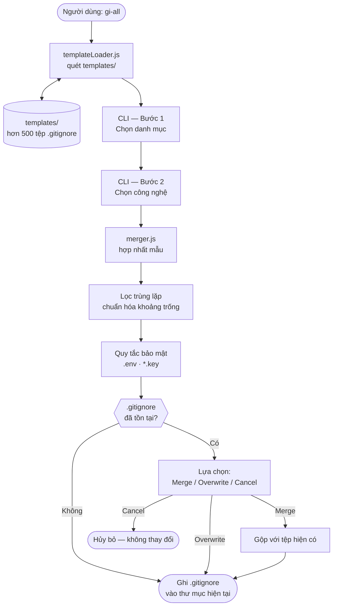

# gi-all

> **Đọc README này bằng ngôn ngữ của bạn:**  
> [English](../README.md) · [Türkçe](README.tr.md) · [Azərbaycan](README.az.md) · [O'zbekcha](README.uz.md) · [Қазақша](README.kk.md) · [Кыргызча](README.ky.md) · [Türkmençe](README.tk.md) · [Deutsch](README.de.md) · [Français](README.fr.md) · [Español](README.es.md) · [Português](README.pt.md) · [Italiano](README.it.md) · [Română](README.ro.md) · [Nederlands](README.nl.md) · [Polski](README.pl.md) · [Русский](README.ru.md) · [Українська](README.uk.md) · [Svenska](README.sv.md) · **Tiếng Việt** · [Bahasa Indonesia](README.id.md) · [ภาษาไทย](README.th.md) · [فارسی](README.fa.md) · [العربية](README.ar.md) · [हिन्दी](README.hi.md) · [বাংলা](README.bn.md) · [日本語](README.ja.md) · [한국어](README.ko.md) · [简体中文](README.zh.md)

## 🌟 Công cụ tạo `.gitignore` duy nhất bạn cần

`gi-all` là một **trình tạo .gitignore dạng mô-đun, dựa trên danh mục** dành cho các nhóm hiện đại và lập trình viên độc lập.

Thay vì một tệp "mega.gitignore" cồng kềnh, `gi-all` cung cấp cho bạn một **thư viện tuyển chọn gồm hàng trăm mẫu chuyên dụng** (Angular, Unity, Android, Flutter, Node.js, Laravel, Docker, v.v.) và giúp bạn tạo tệp `.gitignore` hoàn hảo chỉ trong vài giây.

[](https://www.npmjs.com/package/gi-all)
[](https://www.npmjs.com/package/gi-all)
[](https://github.com/qafaraz/gi-all/stargazers)
[](https://github.com/qafaraz/gi-all/commits)
[](https://github.com/qafaraz/gi-all/commits)
[](https://github.com/qafaraz/gi-all/blob/main/LICENSE)
[](https://badge.socket.dev/npm/package/gi-all/2.1.0)

---

## 💡 Tại sao chọn gi-all?

- **Quá sơ sài**: Bạn chỉ chọn một ngôn ngữ và cấu hình IDE hay rác hệ thống vẫn bị commit vào repo.
- **Quá cồng kềnh**: Bạn sao chép một tệp ngẫu nhiên trên mạng và kế thừa **hàng nghìn quy tắc không liên quan**.

`gi-all` áp dụng cách tiếp cận hoàn toàn khác biệt:

- **Thiết kế dạng mô-đun** – Mỗi công nghệ nằm trong tệp mẫu `.gitignore` riêng biệt trong `templates/`.
- **Lập chỉ mục động** – CLI tự động quét thư mục `templates/` khi chạy; mọi tệp mẫu mới đều được hỗ trợ ngay lập tức.
- **Trải nghiệm theo danh mục** – Chọn các mảng công nghệ chính, sau đó chọn công nghệ cụ thể bạn sử dụng.
- **Không cần gộp thủ công** – Chọn stack của bạn, `gi-all` sẽ tự động hợp nhất, loại bỏ trùng lặp và bảo vệ tệp nhạy cảm.
  - Đọc tất cả các mẫu `.gitignore` đã chọn
  - Hợp nhất thành một tệp `.gitignore` thông minh duy nhất
  - Loại bỏ các dòng trùng lặp và chuẩn hóa khoảng trống
  - Tự động thêm các quy tắc bảo mật bắt buộc cho khóa bí mật và thông tin xác thực

Kết quả: Một tệp `.gitignore` **gọn gàng, tối giản và chính xác** cho dự án của bạn.

---

## 🛠️ Thư viện mẫu khổng lồ (hơn 500 mẫu)

`gi-all` đi kèm với **hàng trăm mẫu chuyên dụng** trong thư mục `templates/`:

- **Frontend & Web**: React, Next.js, Angular, Vue, Svelte, Astro, Remix, Gatsby, Webpack, Vite, Tailwind CSS, Storybook…
- **Mobile & Cross‑platform**: Android, iOS, React Native, Flutter, Ionic, Capacitor, NativeScript…
- **Backend & API**: Node.js, Express, NestJS, Django, Flask, Laravel, Symfony, Spring, Rails, FastAPI…
- **Game & 3D**: Unity, Unreal Engine, Godot, libGDX, FlaxEngine, MonoGame, PICO‑8…
- **Cloud & DevOps**: Docker, Kubernetes, Terraform, Ansible, Vagrant, Cloudflare, Snap/Snapcraft…
- **Trình chỉnh sửa & IDE**: VS Code, JetBrains IDEs, Vim, Emacs, Sublime, Xcode, Android Studio, NetBeans…
- **Cơ sở dữ liệu**: Redis, PostgreSQL, MySQL, MongoDB, MSSQL…
- **Công cụ & Tri thức**: Xuất Obsidian/Notion, hệ thống ERP, ngôn ngữ và công cụ đặc thù…

Mỗi công nghệ đều có **tệp `.gitignore` riêng**. CLI lập chỉ mục đệ quy cho từng tệp.

---

## 🛡️ An toàn là trên hết

Để lộ tệp `.env` hoặc khóa bí mật lên Git là một sai lầm nghiêm trọng. `gi-all` tích hợp sẵn khả năng bảo vệ:

- `.env`, `.env.*`, `*.env` và các biến thể môi trường
- Khóa cá nhân & chứng chỉ: `*.key`, `*.pem`, `*.p12`, `*.cert`, `*.crt`, `*.pfx`, `id_rsa*`, `id_ed25519`, v.v.
- Thông tin xác thực: `.envrc`, `.npmrc`, `.netrc`, `.aws/`, `credentials.json`
- Hạ tầng & di động: `*.tfstate`, `*.tfvars`, `*.tfplan`, `*.mobileprovision`, `GoogleService-Info.plist`
- Kho lưu trữ bí mật: `secrets.*`, `*.kdbx`, `serviceAccountKey.json`, `firebase-adminsdk*.json`
- `node_modules/` và nhật ký gỡ lỗi (debug logs)
- Tệp rác hệ thống: `.DS_Store`, v.v.

> `gi-all` giúp giảm thiểu đáng kể nguy cơ vô tình commit tệp bí mật, tuy nhiên bạn vẫn nên kiểm tra lại các thông tin xác thực riêng của dự án.

---

## ⚙️ Cách hoạt động

- **Quét**: Khi khởi động, `gi-all` quét thư mục `templates/` để tìm tất cả các tệp `.gitignore`.
- **Bước 1 – Chọn danh mục**: Chọn các lĩnh vực liên quan đến dự án của bạn.
- **Bước 2 – Chọn công nghệ**: Đánh dấu các công cụ và thư viện bạn sử dụng.
- **Xử lý**: Đọc mẫu, hợp nhất nội dung, lọc trùng lặp và gắn thêm quy tắc bảo mật.
- **Xuất kết quả**: Ghi kết quả cuối cùng vào tệp `.gitignore` trong thư mục hiện tại.
- **Xử lý xung đột:**
    - **Merge**: Giữ lại các quy tắc cũ và thêm các mẫu của `gi-all`.
    - **Overwrite**: Thay thế hoàn toàn tệp `.gitignore` hiện tại.
    - **Cancel**: Hủy bỏ và không thay đổi gì.
  - Để đảm bảo an toàn, `gi-all` từ chối ghi đè lên các liên kết tượng trưng (symlinks) hoặc tệp đa liên kết.

---

## 📦 Cài đặt

Yêu cầu Node.js `>=22.0.0` (khuyến nghị Node 22 hoặc 24 LTS).

### One‑shot

```bash
# npm
npx gi-all

# yarn
yarn dlx gi-all

# pnpm
pnpm dlx gi-all

# bun
bunx gi-all
```

### Global install

```bash
# npm
npm install -g gi-all

# yarn
yarn global add gi-all

# pnpm
pnpm install -g gi-all

# bun
bun add -g gi-all
```

```bash
gi-all
```

---

## 🧪 Hướng dẫn sử dụng: Tạo `.gitignore` chỉ trong vài giây

Tại thư mục gốc của dự án, hãy chạy lệnh sau:

```bash
gi-all
```

1. **Chọn danh mục** (Frontend, Backend, Mobile, DevOps, IDE, Database, Game, Data, Other)
2. **Chọn công nghệ** trong các danh mục đó

`gi-all` sẽ thực hiện:

1. Đọc các mẫu tương ứng từ `templates/`
2. Hợp nhất và lọc trùng lặp quy tắc
3. Thêm các quy tắc bảo mật bắt buộc
4. Lưu kết quả vào **`.gitignore`** trong thư mục hiện tại

---

## Kiến trúc



### Trách nhiệm các mô-đun

| Mô-đun | Trách nhiệm |
|---|---|
| `src/cli.js` | Giao diện dòng lệnh tương tác hai bước và xử lý xung đột. |
| `src/core/templateLoader.js` | Quét thư mục `templates/` và lập chỉ mục từng tệp. |
| `src/core/merger.js` | Hợp nhất các mẫu và tự động thêm quy tắc bảo vệ. |

---

## 🤝 Đóng góp

`gi-all` được xây dựng như một **danh mục cộng đồng** về các thực hành tốt nhất cho `.gitignore`.

📚 Wiki: https://github.com/qafaraz/gi-all/wiki  
💬 Thảo luận: https://github.com/qafaraz/gi-all/discussions

### Thêm mẫu mới

1. **Fork** kho lưu trữ
2. Tạo tệp `.gitignore` mới trong thư mục `templates/`
3. Thêm các quy tắc tập trung và chuẩn xác
4. Mở Pull Request kèm mô tả ngắn gọn

CLI tự động nhận diện tệp mới trong `templates/`; không cần sửa mã nguồn trong `src/`.

---

## 📜 Giấy phép

[MIT](../LICENSE) — được phát triển cho cộng đồng mã nguồn mở bởi **[Qafar](https://github.com/qafaraz)**.
