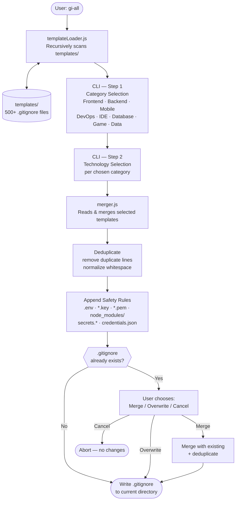

# gi-all

> **用您的语言阅读此 README：**  
> [English](../README.md) · [Türkçe](README.tr.md) · [Azərbaycan](README.az.md) · [O'zbekcha](README.uz.md) · [Қазақша](README.kk.md) · [Кыргызча](README.ky.md) · [Türkmençe](README.tk.md) · [Deutsch](README.de.md) · [Français](README.fr.md) · [Español](README.es.md) · [Português](README.pt.md) · [Italiano](README.it.md) · [Română](README.ro.md) · [Nederlands](README.nl.md) · [Polski](README.pl.md) · [Русский](README.ru.md) · [Українська](README.uk.md) · [Svenska](README.sv.md) · [Tiếng Việt](README.vi.md) · [Bahasa Indonesia](README.id.md) · [ภาษาไทย](README.th.md) · [فارسی](README.fa.md) · [العربية](README.ar.md) · [हिन्दी](README.hi.md) · [বাংলা](README.bn.md) · [日本語](README.ja.md) · [한국어](README.ko.md) · **简体中文**

## 🌟 您永远需要的唯一 `.gitignore` 生成器

`gi-all` 是一个**模块化的、基于类别的 `.gitignore` 生成器**，专为现代团队和雄心勃勃的独立开发者设计。

与其使用一个臃肿的"厨房水槽"文件，`gi-all` 为您提供**数百个精心策划的专注模板库**（Angular、Unity、Android、Flutter、Node.js、Laravel、Docker 等众多技术），让您在几秒钟内构建完美的 `.gitignore`。

[](https://www.npmjs.com/package/gi-all)
[](https://www.npmjs.com/package/gi-all)
[](https://github.com/qafaraz/gi-all/stargazers)
[](https://github.com/qafaraz/gi-all/commits)
[](https://github.com/qafaraz/gi-all/commits)
[](https://github.com/qafaraz/gi-all/blob/main/LICENSE)
[](https://badge.socket.dev/npm/package/gi-all/2.1.0)

---

## 💡 为什么选择 gi-all？

大多数 `.gitignore` 生成器会陷入以下两个陷阱之一：

- **太小**：您选择一种语言，但仍然会提交 IDE 配置、构建产物或平台垃圾。
- **太大**：您从互联网复制随机的"mega.gitignore"，并继承了**数千条不相关的规则**，您根本不理解它们。

`gi-all` 采取了不同的方法：

- **模块化设计** – 每种技术都在 `templates/` 中拥有自己的专用模板文件。
- **动态索引** – CLI 在运行时扫描 `templates/` 文件夹，因此**每个模板文件都自动受支持**。
- **基于类别的用户体验** – 首先选择高级领域（Frontend、Backend、Mobile、DevOps & Cloud、IDE & Editor、Database、Game & 3D、Data & Science、Other），然后选择确切的技术。
- **零手动合并** – 选择您的技术栈，`gi-all` 将：
  - 读取所有选定的 `.gitignore` 模板
  - 将它们合并成一个智能的 `.gitignore`
  - 删除重复行和多余空白
  - 为常见的密钥和凭证文件添加强制安全规则

您将获得**干净、最小化且精确**的 `.gitignore`，专为您的技术栈量身定制。

---

## 🛠️ 庞大的模板库（500+ 模板）

`gi-all` 在 `templates/` 下附带**数百个专用模板**，包括：

- **前端 & Web**：React、Next.js、Angular、Vue、Svelte、Astro、Remix、Gatsby、Webpack、Vite、Tailwind CSS、Storybook…
- **移动端 & 跨平台**：Android、iOS、React Native、Flutter、Ionic、Capacitor、NativeScript…
- **后端 & API**：Node.js、Express、NestJS、Django、Flask、Laravel、Symfony、Spring、Rails、FastAPI…
- **游戏 & 3D**：Unity、Unreal Engine、Godot、libGDX、FlaxEngine、MonoGame、PICO‑8…
- **云 & DevOps**：Docker、Kubernetes、Terraform、Ansible、Vagrant、Cloudflare、Snap/Snapcraft…
- **编辑器 & IDE**：VS Code、JetBrains IDEs（WebStorm、Rider 等）、Vim、Emacs、Sublime、Xcode、Android Studio、NetBeans…
- **数据库**：Redis、PostgreSQL、MySQL、MongoDB、MSSQL…
- **工具 & 知识**：Obsidian/Notion 导出、ERP 系统、特殊语言…

---

## 🛡️ 安全第一

意外将 `.env` 文件或私钥提交到 Git 是代价高昂的错误。

`gi-all` 默认内置安全性：

- `.env`、`.env.*`、`*.env` 和常见的环境变量
- 私钥和证书：`*.key`、`*.pem`、`*.p12`、`*.cert`、`*.crt`、`*.pfx`、`id_rsa*`、`id_ed25519` 等
- 开发者和云凭证：`.envrc`、`.npmrc`、`.netrc`、`.aws/`、`credentials.json`
- 基础设施和移动端密钥：`*.tfstate`、`*.tfvars`、`*.tfplan`、`*.mobileprovision`、`GoogleService-Info.plist`
- 通用密钥存储：`secrets.*`、`*.kdbx`、`serviceAccountKey.json`、`firebase-adminsdk*.json`
- `node_modules/` 和常见调试日志
- OS/编辑器噪音如 `.DS_Store`

---

## ⚙️ 工作原理

- **扫描**：启动时，`gi-all` 动态扫描 `templates/` 文件夹并构建目录。
- **步骤 1 – 类别**：CLI 询问您的项目使用哪些领域。
- **步骤 2 – 技术**：对于所选类别，您选择确切的技术。
- **处理**：读取、合并、去重、添加安全规则。
- **输出**：将结果写入**当前工作目录**中的单个 `.gitignore` 文件。
- **冲突**：如果 `.gitignore` 已存在，`gi-all` 询问：**Merge**、**Overwrite** 或 **Cancel**。

---

## 📦 安装

需要 Node.js `>=22.0.0`（推荐 Node 22 或 24 LTS）。

### 一次性使用（推荐）

```bash
npx gi-all
```

### 全局安装

```bash
npm install -g gi-all
```

然后简单运行：

```bash
gi-all
```

---

## 🧪 使用方法

从项目根目录：

```bash
gi-all
```

系统将引导您选择类别和技术。`gi-all` 读取对应模板，合并它们，添加安全规则并写入 `.gitignore` 文件。

---

## Architecture



### Module Responsibilities

| Module | Responsibility |
|---|---|
| `src/cli.js` | User-facing entry point. Two-step interactive UI (categories → technologies). Conflict resolution. |
| `src/core/templateLoader.js` | Scans `templates/` recursively. Indexes every `.gitignore` file. Assigns category by filename. |
| `src/core/merger.js` | Merges multiple templates. Deduplicates lines. Appends mandatory safety rules. |

---

## 🤝 贡献

`gi-all` 被设计为 `.gitignore` 最佳实践的**社区驱动目录**。

📚 Wiki: 
https://github.com/qafaraz/gi-all/discussions
### 添加新模板

1. **Fork** 仓库
2. 在 `templates/` 下创建新的 `.gitignore` 文件
3. 为该技术添加专注的高质量规则
4. 打开 pull request 并附上简短描述

---

## 📜 许可证

[MIT](../LICENSE) — 由 **[Qafar](https://github.com/qafaraz)** 为开源社区精心打造。
